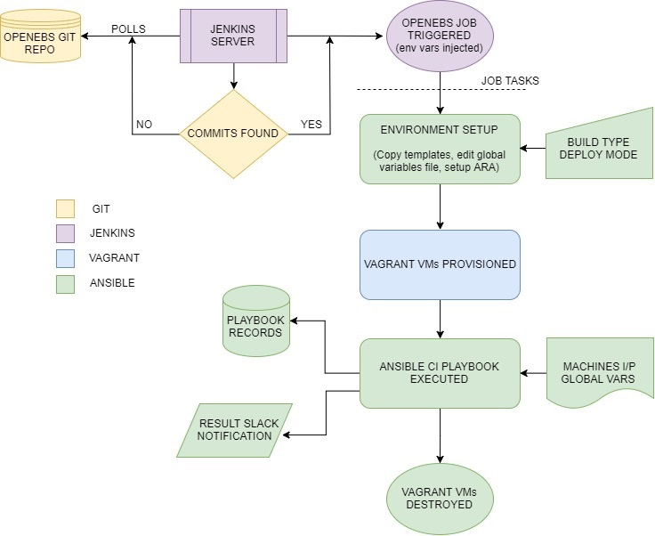

# Introduction to OpenEBS e2e

OpenEBS e2e is focused on the workload simulation and application deployment on the OpenEBS storage predominantly in a Kubernetes environment. In its current state, it includes application workflow tests, basic compliance, and resiliency tests. The scope of the said tests is expected to evolve over time to include performance and security tests as well.

e2e is mostly written in Ansible, that is, as Ansible playbooks with Docker used for test images (these include standard application images from DockerHub as well as custom-built images stored in openebs/test-storage).

Since the tests are performed in a Kubernetes environment, the test images are typically deployed as "pods" and "jobs". Therefore they are accompanied by the respective YAML specification files.

## Building Blocks of OpenEBS CI

OpenEBS Continuous Integration (CI) has two distinct parts:

- Travis is used to run unit tests, build code, and push images to DockerHub (in case of repositories where the image is a build artifact).
- Jenkins pulls these images, creates the Kubernetes-based test environment and executes the e2e. It is also used to run tests on commits that change application specifications or OpenEBS Kubernetes deployment specifications.

While you can run OpenEBS e2e as a standalone application suite, the priority is to run them on the commits done on core OpenEBS Github repositories such as [openebs/openebs](https://github.com/openebs/openebs), [openebs/mayaserver](https://github.com/openebs/mayaserver), and [openebs/jiva](https://github.com/openebs/jiva). This part of the continuous integration is built around a dedicated Jenkins server. On detecting commits via a polling mechanism, Jenkins launches VMs using Vagrant and runs the Ansible playbooks to setup the environment and execute e2e tests. The openebs/e2e project focuses on this part of the CI.

The following schema illustrates the workflow:

## Contributing to e2e and OpenEBS CI

Contributions are welcome. But, before starting, read the project documentation at [https://docs.openebs.io/](https://docs.openebs.io/). This step is highly recommended. Please raise a Github issue for any questions you may have on the project in general or with e2e or CI in particular.

You can post questions on the [OpenEBS Slack channel](http://slack.openebs.io/) as well.

You can contribute to any of the following areas:

- Submit proposals to add new tests to e2e.
- Create new application specification YAMLs.
- Create Ansible playbooks to execute test workflows.
- Submit changes to fix bugs or improve e2e tests.
- Raise/fix issues on the CI framework.
- Raise/fix issues on the e2e and CI documentation.

## General Contribution Guidelines

Here are some general contribution guidelines:

- Submit an Issue describing your proposed change. Or pick an existing issue tagged as [kind/e2e and area/ci](https://github.com/openebs/openebs/issues?q=is%3Aopen+is%3Aissue+label%3Akind%2Fe2e+label%3Aarea%2Fci).
- Create your development branch.
- Commit your changes.
- Submit your Pull Request.
- Submit an issue to update the User Documentation.

### Adding new tests/test-categories

To add new tests, please raise an issue describing the objective, prerequisites, test steps, expected results, and cleanup routines.

In case of proposals to add new test categories, add a generic description explaining the purpose and value addition.

Once accepted, the issue can be assigned to interested contributors who can make relevant changes with a pull request.

### Create new application YAML

To add new applications to e2e, please consider the points made here, if applicable: 

- [https://kubernetes.io/docs/concepts/configuration/overview/](https://kubernetes.io/docs/concepts/configuration/overview/)
- [https://www.mirantis.com/blog/introduction-to-yaml-creating-a-kubernetes-deployment/](https://www.mirantis.com/blog/introduction-to-yaml-creating-a-kubernetes-deployment/)
- [https://kubernetes.io/docs/tutorials/stateful-application/basic-stateful-set/](https://kubernetes.io/docs/tutorials/stateful-application/basic-stateful-set/)

These can be placed here: [https://github.com/openebs/openebs/tree/master/k8s/demo](https://github.com/openebs/openebs/tree/master/k8s/demo)

### Create Ansible playbooks to execute test workflows

The test playbooks can be placed in e2e/ansible/playbooks/<test-category>
Here are some considerations.

- Each test playbook is recommended to be constructed with the following template.

  The main test playbook, statistically "includes" following files:

  - Test variables YAML
  - Prerequisite tasks YAML
  - Cleanup tasks YAML
  
  Auxiliary scripts that are invoked in the test playbook can be placed in the same directory.

 You can view a sample test playbook [here](https://github.com/openebs/openebs/tree/master/e2e/ansible/playbooks/hyperconverged/test-k8s-percona-mysql-pod).

- Test playbooks that deploy applications are recommended to include steps to generate application-specific workloads that
  will exercise the OpenEBS storage volume.
  
- Here are some Ansible best practices while constructing playbooks:

  - [https://www.jeffgeerling.com/blog/yaml-best-practices-ansible-playbooks-tasks](https://www.jeffgeerling.com/blog/yaml-best-practices-ansible-playbooks-tasks)
  
  The OpenEBS Ansible environment setup procedure is provided [here](https://github.com/openebs/openebs/blob/master/e2e/ansible/openebs-on-premise-deployment-guide.md).
  
### Submit changes to fix bugs or improve e2e tests

Explain the fix in detail and add the verbose test playbook output that you have run with the fixes (Run the playbook with a `-v` option for this). Also, consider the general Ansible playbook best practices referenced in the previous section.

### Raise or fix issues on the CI framework

As with other issues, please mention the bug/enhancements in detail with logs/references if possible.

The Jenkins configuration used to setup OpenEBS e2e can be found [here](https://github.com/openebs/openebs/blob/master/e2e/jenkins/README.md).

### Raise or fix issues on the e2e, CI documentation

Getting Documentation Right is Hard! Please raise a PR with your proposed changes to the READMEs, tutorials, and deployment guides in openebs/e2e.

If you need any help with git, refer to this [git cheat sheet](./git-cheatsheet.md) and go back to the [**contributing to OpenEBS Documentation**](../CONTRIBUTING.md) guide to proceed.

**Happy Testing!**
