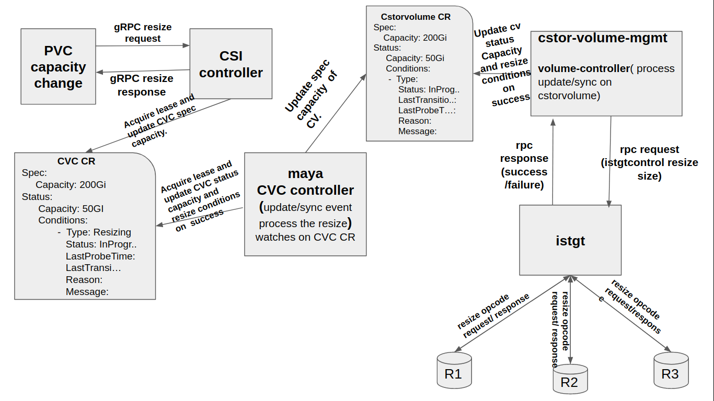

# cStor Volume Resize

## Table of Contents

- [cStor Volume Resize](#cstor-volume-resize)
  - [Table of Contents](#table-of-contents)
  - [Summary](#summary)
  - [Motivation](#motivation)
    - [Goals](#goals)
  - [Proposal](#proposal)
    - [User Stories](#user-stories)
      - [Resize cStor Volume:](#resize-cstor-volume)
    - [Implementation Details](#implementation-details)
      - [Current Implementation -- Volume Resize](#current-implementation----volume-resize)
      - [Custom Resources used to resize cStor volume](#custom-resources-used-to-resize-cstor-volume)
        - [cStorVolumeClaim](#cstorvolumeclaim)
        - [cStorVolume](#cstorvolume)
  - [High Level cStor Volume Resize Workflow](#high-level-cstor-volume-resize-workflow)
  - [Drawbacks](#drawbacks)
  - [Alternatives](#alternatives)

## Summary

This proposal charts out the design details to implement resize workflow on cStor CSI Volumes.

## Motivation

### Goals

- Ability to resize a cStor volume by changing the capacity in the PVC spec.

## Proposal

### User Stories

#### Resize cStor Volume:
As an application developer I should be able to resize a volume on
fly(when application consuming volume).

Steps To Be Performed By User:
1. Edit the pvc spec capacity using `kubectl edit pvc <pvc_name>`.

Consider following PVC as example for CSI cStor Volume resize
```yaml
apiVersion: v1
kind: PersistentVolumeClaim
metadata:
  annotations:
    kubectl.kubernetes.io/last-applied-configuration: |
      {"apiVersion":"v1","kind":"PersistentVolumeClaim","metadata":{"annotations":{},"name":"csi-vol-claim","namespace":"default"},"spec":{"accessModes":["ReadWriteOnce"],"resources":{"requests":{"storage":"5Gi"}},"storageClassName":"openebs-csi-sc"}}
    pv.kubernetes.io/bind-completed: "yes"
    pv.kubernetes.io/bound-by-controller: "yes"
    volume.beta.kubernetes.io/storage-provisioner: cstor.csi.openebs.io
  creationTimestamp: "2019-12-23T13:11:33Z"
  finalizers:
  - kubernetes.io/pvc-protection
  name: csi-vol-claim
  namespace: default
  resourceVersion: "1387"
  selfLink: /api/v1/namespaces/default/persistentvolumeclaims/csi-vol-claim
  uid: a91e400f-ff9b-44ec-b447-bc7bfcfccd80
spec:
  accessModes:
  - ReadWriteOnce
  resources:
    requests:
      storage: 5Gi
  storageClassName: openebs-csi-sc
  volumeMode: Filesystem
  volumeName: pvc-a91e400f-ff9b-44ec-b447-bc7bfcfccd80
status:
  accessModes:
  - ReadWriteOnce
  capacity:
    storage: 5Gi
  phase: Bound
```

After updating spec.capacity in above PVC --- then PVC will look following:
```yaml
piVersion: v1
kind: PersistentVolumeClaim
metadata:
  annotations:
    kubectl.kubernetes.io/last-applied-configuration: |
      {"apiVersion":"v1","kind":"PersistentVolumeClaim","metadata":{"annotations":{},"name":"csi-vol-claim","namespace":"default"},"spec":{"accessModes":["ReadWriteOnce"],"resources":{"requests":{"storage":"5Gi"}},"storageClassName":"openebs-csi-sc"}}
    pv.kubernetes.io/bind-completed: "yes"
    pv.kubernetes.io/bound-by-controller: "yes"
    volume.beta.kubernetes.io/storage-provisioner: cstor.csi.openebs.io
  creationTimestamp: "2019-12-23T13:11:33Z"
  finalizers:
  - kubernetes.io/pvc-protection
  name: csi-vol-claim
  namespace: default
  resourceVersion: "7804"
  selfLink: /api/v1/namespaces/default/persistentvolumeclaims/csi-vol-claim
  uid: a91e400f-ff9b-44ec-b447-bc7bfcfccd80
spec:
  accessModes:
  - ReadWriteOnce
  resources:
    requests:
      storage: 10Gi
  storageClassName: openebs-csi-sc
  volumeMode: Filesystem
  volumeName: pvc-a91e400f-ff9b-44ec-b447-bc7bfcfccd80
status:
  accessModes:
  - ReadWriteOnce
  capacity:
    storage: 5Gi
  conditions:
  - lastProbeTime: null
    lastTransitionTime: "2019-12-23T13:59:08Z"
    message: Waiting for filesystem resize.
    status: "True"
    type: FileSystemResizePending
  phase: Bound
```
In the above PVC spec capacity is updated to 10Gi but status capacity is 5Gi(Which
means resize is in progress).

### Implementation Details

The sections below can be assumed to be specific to `cStor` unless mentioned
otherwise.

#### Current Implementation -- Volume Resize

- CSI controller will get gRPC resize request from kubernetes-csi external-resizer
  controller(when pvc storage field is updated).
- CSI controller acquire lease and checks is there any ongoing resize on requested
  volume if yes then CSI controller will return error. If volume size is upto
  date (i.e cvc.spec.capacity == cvc.status.capacity) then CSI controller updates
  CVC spec capacity with latest size.
  Example status: status of CVC when resize request is in progress.
```yaml
      Status:
        capacity:
          storage: 5Gi
        Conditions:
          - Type: Resizing
            Status: InProgress
            LastProbeTime: date
            LastTransitionTime: (update only when there is a change in size)
            Reason: Capacity changed
            Message: Resize pending
```
   Note: Please refer [cStorVolumeClaim](#cStorVolumeClaim) under Custom Resources used to resize cStor volume section for entier CVC.
- Based on the status capacity of CVC CSI will respond to the gRPC request(request
  is from kubernetes-csi).
- CVC controller present in maya-apiserver will get update event on corresponding
  CVC CR. Update event will process below steps
  - Check is there any ongoing resize on cstorvolume(CV) if so return.
    Example status: CV status when resize is in progress
```yaml
      Status:
        capacity: 5Gi
        Conditions:
          - Type: Resizing
            Status: InProgress
            LastProbeTime: date
            LastTransitionTime: (update value by picking it from CVC LastTransitionTime)
            Reason: Capacity changed
            Message: Resize pending
```
   Note: Please refer [cStorVolume](#cStorVolume) under Custom Resources used to resize cStor volume section for entier CV.
  - Check if there is any increased changes in capacity of CV and CVC object if
    so update spec capacity field of CV object with latest size.
  - During reconciliation time Check is there any resize is pending on CVC if
    so check corresponding CV resize status if it is success take a lease and
    check is there any capacity difference in CV and CVC if there is no change
    then update CVC status condition as resize success and release the lease.
    If capacity change is noticed after taking lease, repeat this step after
    releasing lease(left as is reconciliation will do rework).

    Example status: CVC status when resize is success
```yaml
      Status:
        capacity: 10Gi
        Conditions:
          - Type: Resizing
            Status: Success
            LastProbeTime: date
            LastTransitionTime: (update while updating resize condition status)
            Reason: Capacity changed
            Message: Resize Success
```
   Note: Please refer [cStorVolumeClaim](#cStorVolumeClaim) under Custom Resources used to resize cStor volume section for entier CVC.

- Cstor-volume-mgmt container as a target side car which is already having a
  volume-controller watching on CV object will get update event (if event is missed
  volume controller will process during sync event) then volume-controller will process
  the request with following steps
    - Volume-controller will executes `istgtcontrol resize <size_unit>`
      command(rpc call) if there is any resize status is pending on that
      volume(based on resize status condition).
    - If above rpc call success volume-controller will updates istgt.conf file
      alone but not CVR capacity[why? CVR capacity is treated initial volume
      capacity and maintaining initial capacity will be helpful in ephemeral
      case]. If volume controller succeed in updating istgt.conf file then update
      status capacity and success status for resize condition on CV.
    - If it is a failure response from rpc then generate kubernetes events and
      do nothing just return(reconciliation will take care of doing the above
      process again).
- When cstor-istgt get a resize request it will trigger a resize request to replica
  and return a success response to cstor-volume-mgmt[why? cstor-istgt will not concern
  whether resize request is success or failure. If resize request succeed then
  there is no problem. If resize request fails and if replica gets IO greater
  than it's size then IO will be failed on that replica and cstor-istgt will
  disconnect IO failure replica. As part of replica's data connection, target
  will exchange the size information with replica. During data connection replica
  checks if it is single replica volume then it will resize main volume else it
  will resize the internal rebuild clone volume].
  Note: Processing `istgtcontrol resize` is a blocking call.

- zfs will receives the resize request, it will resize the corresponding volume
  and sent back the response to cstor-istgt(aka target).

Once resize operation is succeed at OpenEBS side CSI node plugin(/kubelet) will
trigger resize operation on filesystem level as part of online resizing.

#### Custom Resources used to resize cStor volume

##### cStorVolumeClaim

Sample CVC yaml when resize is in progress
```yaml
 apiVersion: openebs.io/v1alpha1
  kind: CStorVolumeClaim
  metadata:
    annotations:
      openebs.io/volumeID: pvc-a91e400f-ff9b-44ec-b447-bc7bfcfccd80
    creationTimestamp: "2019-12-23T13:11:33Z"
    finalizers:
    - cvc.openebs.io/finalizer
    generation: 5
    labels:
      openebs.io/cstor-pool-cluster: cstor-sparse-cspc
    name: pvc-a91e400f-ff9b-44ec-b447-bc7bfcfccd80
    namespace: openebs
    resourceVersion: "7781"
    selfLink: /apis/openebs.io/v1alpha1/namespaces/openebs/cstorvolumeclaims/pvc-a91e400f-ff9b-44ec-b447-bc7bfcfccd80
    uid: c4e3dfe5-e103-4d8a-8447-a827b710de1c
  publish:
    nodeId: 127.0.0.1
  spec:
    capacity:
      storage: 10Gi
    cstorVolumeRef:
      apiVersion: openebs.io/v1alpha1
      kind: CStorVolume
      name: pvc-a91e400f-ff9b-44ec-b447-bc7bfcfccd80
      namespace: openebs
      resourceVersion: "1483"
      uid: d277113c-8ded-451b-bae6-7c49aa2e346d
    replicaCount: 1
  status:
    capacity:
      storage: 5Gi
    condition:
    - lastTransitionTime: "2019-12-23T13:59:03Z"
      message: "Resizing cStor volume"
      reason: ""
      type: Resizing
    phase: Bound
  versionDetails:
    autoUpgrade: false
    desired: 1.4.0
    status:
      current: 1.4.0
      dependentsUpgraded: true
      lastUpdateTime: null
      state: ""
```

##### cStorVolume

Sample cstorvolume yaml when resize is in progress
```yaml
 apiVersion: openebs.io/v1alpha1
  kind: CStorVolume
  metadata:
    creationTimestamp: "2019-12-23T13:12:05Z"
    generation: 101
    labels:
      openebs.io/persistent-volume: pvc-a91e400f-ff9b-44ec-b447-bc7bfcfccd80
      openebs.io/version: 1.5.0
    name: pvc-a91e400f-ff9b-44ec-b447-bc7bfcfccd80
    namespace: openebs
    ownerReferences:
    - apiVersion: openebs.io/v1alpha1
      blockOwnerDeletion: true
      controller: true
      kind: CStorVolumeClaim
      name: pvc-a91e400f-ff9b-44ec-b447-bc7bfcfccd80
      uid: c4e3dfe5-e103-4d8a-8447-a827b710de1c
    resourceVersion: "7838"
    selfLink: /apis/openebs.io/v1alpha1/namespaces/openebs/cstorvolumes/pvc-a91e400f-ff9b-44ec-b447-bc7bfcfccd80
    uid: d277113c-8ded-451b-bae6-7c49aa2e346d
  spec:
    capacity: 10Gi
    consistencyFactor: 1
    desiredReplicationFactor: 1
    iqn: iqn.2016-09.com.openebs.cstor:pvc-a91e400f-ff9b-44ec-b447-bc7bfcfccd80
    nodeBase: iqn.2016-09.com.openebs.cstor
    replicaDetails: {}
    replicationFactor: 1
    status: ""
    targetIP: 10.0.0.243
    targetPort: "3260"
    targetPortal: 10.0.0.243:3260
status:
  phase: ""
  capacity: 5Gi
  Conditions:
    - Type: Resizing
       Status: InProgress
       ##Last time we probed the condition
       LastProbeTime:
       ##Last time the condition transitioned from one status to another
       LastTransitionTime:
       Reason: Resize is in progress
       Message:

```
When resize is in progress spec and status capacity will vary. Resize conditions
will be available to know the status of resize.


## High Level cStor Volume Resize Workflow
  

## Drawbacks

NA

## Alternatives

NA
