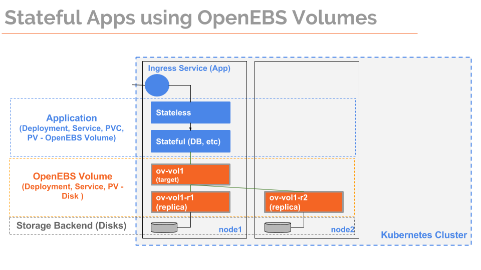

# Overview

OpenEBS is a open source storage platform delivering containerized block storage for containers. 

Yes! The storage controller functionality is itself, delivered as containers. An OpenEBS Volume comprises of one or more containers working as a clustered microservice, providing block storage to other containers. This micro-services based architecture for storage controller functionality - where data for each volume is served by its own set of containers as against a single monolithic storage controller serving multiple volumes. This is what differentiates OpenEBS from traditional storage appliances..

OpenEBS Storage Controller functionality comprises of serveral micro-services (or containers) that can be classified into two broad categories: 
- OpenEBS Data Plane - that serves the data to the applications and 
- OpenEBS Control Plane - that manages the OpenEBS Volume Containers
If you notice this classification, resembling a typical Container Orchestrator (CO), it is because OpenEBS Volumes are delivered through containers and these containers are better managed by COs! Hence OpenEBS Control Plane services work in conjunction with the CO - schedulers, apiserver, and so on.
 
## OpenEBS Volume Container (aka jiva, aka data plane)

*openebs/jiva* containers are at the heart of the OpenEBS Volume's storage functionality. OpenEBS Volumes are fully isolated user space storage engines that present the block storage via iSCSI and persist the data onto the storage attached to Nodes (aka Docker Hosts). The storage attached to the docker hosts can either be directly attached disks or cloud volumes (like EBS, GPD, and so on) depending on where the Container Cluster is deployed. 

OpenEBS Volumes provide persistent storage for containers, with resiliency against system failures, faster access to the storage, snapshot and backup capabilities. In addition, it provides a mechanism for monitoring the usage and enforcing QoS policies. 

The Disks where data is persisted are called as *Storage Backends*, which can be either host directories, attached block devices or remote disks. Each OpenEBS Volume comprises of an iSCSI Target Container (represented as openebs-vol1 in the above diagram) and one or more Replica Containers (openebs-vol1-R1 and openebs-vol1-R2).

The application pods will access the storage via the iSCSI Target Container, which replicates the data to all its replica's. In the event of node failure, the iSCSI Target Container starts on one of the remaining online nodes, and will serve the data by connecting to the available Replica containers.

### Source Code

- [openebs/jiva](https://github.com/openebs/jiva) Storage Controller functionality includes the replication logic 
- [openebs/gotgt](https://github.com/openebs/gotgt) iSCSI Target functionality used by *openebs/jiva*.

## OpenEBS Control Plane (aka OpenEBS Storage Orchestration, aka maya)

OpenEBS Control Plane - auguments the functionality provided by the Container Orchestrator, with storage specific orchestration capabilities, via a set of services. OpenEBS control plane can hook into any of the container orchestrators like Kubernetes, Docker Swarm, Nomad, etc., making it possible to run OpenEBS hyper-converged with Container Orchestrators. 

OpenEBS Control Plane is also delivered as micro-services, where the services built can be classified as follows:
- Plugins into Container Orchestrotors, which augument the functionality by hooking into the framework provided like:
  - K8s Dynamic Provisioners - [openebs-provisioner](https://github.com/openebs/external-storage/tree/master/openebs)
  - Kube Dashboard - [openebs-dashboard](https://github.com/openebs/dashboard)
  - Extended Schema - like CRDs in case of Kubernetes to store the OpenEBS specific configuration related data
- Cluster Services, provides OpenEBS specific storage intelligence like:
  - maya-apiserver - includes the API for performing Volume operations that can translate requests into CO specific operations
  - maya-mulebot - uses the information gathered to suggest optimized placement and event handling tips
  - maya-connect - allows to upload the monitoring data to maya-cloud for further storage access pattern analysis
- Node Services, provides OpenEBS specific storage intelligence running along-side kubelet like:
  - maya-agent - includes storage management functionality 

Monitoring and Tracing capabilities are added by instrumenting the above services with prometheus, heapster, grafana and jaegar. 

*Note: In case of K8s, the monitoring aspects like heapster can be changed in future, depending on the outcome from sig-instrumention design proposals*

### Source Code

- [openebs/maya](https://github.com/openebs/maya) The code for all binaries that are specific (non-plugins) are stored in this repository - like maya-apiserver, maya-agent, maya-mulebot, maya-connect, mayactl and so on.
- [openebs-dashboard](https://github.com/openebs/dashboard) A fork of the Kubernetes dashboard project, that is extended with storage functionality.
- [openebs-provisioner](https://github.com/openebs/external-storage/tree/master/openebs) is the OpenEBS K8s Provisioner forked from Kubernetes Incubator project. 

*Note: In future, OpenEBS can also be deployed as a storage service (non hyperconverged) like the traditional software defined storage, and can be connected via the storage plugins.*
