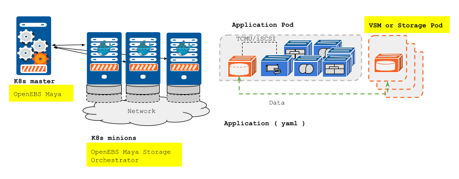

#OpenEBS Design and Architecture

##Overview

OpenEBS is a open source storage platform delivering containerized block storage for containers. OpenEBS aims at making storage instrastructure programmable, easy-to-use, consumed by applications via self-service. OpenEBS takes storage software upgrade seriously.

The storage is containerized through concept called VSM or "Virtual Storage Machine". VSMs are fully isolated user space storage engines that present the block storage at the front end through iSCSI, NBD or TCMU protocol and consume raw storage from a local OpenEBS host or remote storage. OpenEBS uses maya, a storage orchestration engine that helps in managing local and remote storage, integrate into the container orchestrators like Kubernetes, Docker Swarm, Nomad etc., manages QoS policies for VSMs.

##Architecture

In the following diagram, we use Kubernetes as an example, but the concepts applies to other orchestration engines as well. 

OpenEBS, being container native, seamlessely integrates easily into the container orchestartors via OpenEBS VSM and OpenEBS Maya. 

### VSM ( aka storage containers or storage pods )

VSMs are the heart of the OpenEBS - enterprise storage functionality delivered in containers. VSMs provide persistent storage for containers, with resliency against system failures via a distrubuted architecture, faster access to the storage, snapshot and backup capabilities. In addition, provides mechanism for monitoring the usage and enforcing QoS policies. 

VSMs are scheduled onto the container hosts using Orchestration Engines. VSMs consume the disk storage from the local host or  remote storage using volume plugins (k8s flexvolumes). 

VSMs are described in yaml files, just like application pods. The VSMs can be deployed through K8s Pods, Deployments, Services, StatefulSets etc., 

### Maya ( aka storage orchestrator )

Maya builds on top of the orchestration engines capabilities in terms of container runtime, scheduling, monitoring etc., and extends the capabilities of the orchestration engines to orchestarte and manage storage. Maya is a set of storage utilities, orchestration plugins and services, that integrate into the container orchestration engines like kubernetes, docker swarm, nomad etc.,

Maya makes the storage infrastructure programmable via yaml files that the DevOps can define and commit, just like the container clusters or containerized applications. Maya services monitor, learn and provide storage metrics to the container schedulers for better placements of pods as well as storage migration between hosts within/across cluster(s).

OpenEBS Maya comprises of the following: 
- maya ( a cli )
- maya-apiserver
- maya-stg-interface
- maya-sml-engine
- maya-stg-analytics
- maya-plugins-k8s
- maya-plugins-docker
- maya-plugins-nomad
- maya-plugins-mesos
- maya-ui

OpenEBS can also be deployed in the dedicated environment like the traditial software defined storage, and can be connected via the storage plugins. 

##Detailed Design Documents

The following tables contains the details about the OpenEBS components - their design, design status, implementation status, code repositories, etc., 

| Document | Status | Implementation Repository |
|----------|--------|---------------------------|
| [Jiva/VSM](./jiva.md) | WIP | [jiva](https://github.com/openebs/jiva) |
| [Maya Server](./maya-server.md) | WIP | [mayaserver](https://github.com/openebs/mayaserver) |
| [Maya CLI](./maya.md) | WIP |[maya](https://github.com/openebs/maya) |
