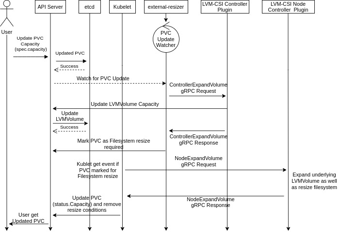

# LocalPV-LVM Volume Expansion

## Table of Contents

- [LocalPV-LVM Volume Expansion](#lvm-localpv-volume-expansion)
  - [Table of Contents](#table-of-contents)
  - [Summary](#summary)
  - [Motivation](#motivation)
    - [Goals](#goals)
    - [Non-Goals](#non-goals)
  - [Proposal](#proposal)
    - [User Stories](#user-stories)
    - [Implementation Details](#implementation-details)
        - [Controller Expansion](#controller-expansion)
        - [Filesystem Expansion](#filesystem-expansion)
    - [Steps to perform volume expansion](#steps-to-perform-volume-expansion)
    - [High level Sequence Diagram](#high-level-sequence-diagram)
    - [Test Plan](#test-plan)
  - [Graduation Criteria](#graduation-criteria)
  - [Drawbacks](#drawbacks)
  - [Alternatives](#alternatives)

## Summary

This proposal charts out the design details to implement expansion workflow on LocalPV-LVM Volumes.

## Motivation

### Goals

- As a user, I should be able to resize the volumes provisioned via LocalPV-LVM by updating the size
  on PersistentVolumeClaim(PVC).

### Non-Goals

- Support for volume expansion when underlying volume has lvm snapshots.

## Proposal

### User Stories

As an application developer, I should be able to resize volume on the fly(When application consuming volume).

Steps To Be Performed By User:
1. Update the PVC capacity using `kubectl edit pvc <pvc_name>`

Note: StorageClass should allow expanding the volume(i.e allowVolumeExpansion field must be set to true).

### Implementation Details

LVM volume expansion is a two-step process(controller expansion & filesystem expansion) and
it gets triggered upon updating PVC capacity.

##### Controller Expansion

- External-resizer is a sidecar in `openebs-lvm-controller` pod which watches for PVC capacity
  updates. Once it receives the event external-resizer will make a `ControllerExpandVolume` gRPC request
  to LVM-CSI controller plugin.
- LVM-CSI controller plugin is another container in the same pod where external-resizer is running.
  Once the controller plugin receives the `ControllerExpandVolume` gRPC request it does the following steps:
  - List active snapshots on resizing volume, if there are any snapshots plugin will return an error as
    a response to the request since LVM does not support online resizing of volume if snapshot(s) exist.
  - If there are no snapshots then the plugin will update the desired capacity on corresponding LVMVolume
    resource and return success response to the request.
- Once external-resizer gets success response it will mark PVC pending for filesystem expansion else
  it will retry until it receives success response.

Note: `ControllerExpandVolume` gRPC request returns an error if volume has snapshots.

##### Filesystem Expansion

- Container Orchestrator(CO)[kubelet] will send `NodeExpandVolume` gRPC request to LVM-CSI node driver
  once it observes the PVC marked for filesystem expansion.
- LVM-CSI node driver receives the `NodeExpandVolume` gRPC request and it will expand the lvm volume
  using lvextend cli and trigger filesystem expansion. If expansion is successful it will return
  success gRPC response.

  Note: Kubelet will send requests only when the volume is published on a node.

### Steps to perform volume expansion

1. Edit PVC and update capacity to desired value. In below example updated
   the PVC capacity from 4Gi to 8Gi.

```sh
kubectl patch pvc csi-lvmpv -p '{"spec":{"resources":{"requests":{"storage":"8Gi"}}}}'
persistentvolumeclaim/csi-lvmpv patched
```

2. User can observe the resize related events by describing PVC

```sh
kubectl describe pvc csi-lvmpv
...
...
Events:
  Type     Reason                      Age   From                                                                                Message
  ----     ------                      ----  ----                                                                                -------
  Normal   Provisioning                11m   local.csi.openebs.io_openebs-lvm-controller-0_b4700a50-b7cd-4de5-bc26-d3dd832ac9eb  External provisioner is provisioning volume for claim "default/csi-lvmpv"
  Normal   ExternalProvisioning        11m   persistentvolume-controller                                                         waiting for a volume to be created, either by external provisioner "local.csi.openebs.io" or manually created by system administrator
  Normal   ProvisioningSucceeded       11m   local.csi.openebs.io_openebs-lvm-controller-0_b4700a50-b7cd-4de5-bc26-d3dd832ac9eb  Successfully provisioned volume pvc-f532e80d-b39b-4801-837b-57a47ae08ea8
  Normal   Resizing                    95s   external-resizer local.csi.openebs.io                                               External resizer is resizing volume pvc-f532e80d-b39b-4801-837b-57a47ae08ea8
  Warning  ExternalExpanding           95s   volume_expand                                                                       Ignoring the PVC: didn't find a plugin capable of expanding the volume; waiting for an external controller to process this PVC.
  Normal   FileSystemResizeRequired    95s   external-resizer local.csi.openebs.io                                               Require file system resize of volume on nod
```

3. Once the filesystem expansion is succeeded then success events will
   be generated and status of PVC also will be updated to latest capacity.
```sh
kubectl describe pvc csi-lvmpv

 Normal   FileSystemResizeSuccessful  21s   kubelet                                                                             MountVolume.NodeExpandVolume succeeded for volume "pvc-f532e80d-b39b-4801-837b-57a47ae08ea8"
```

### High level Sequence Diagram

Below is high level sequence diagram for volume expansion workflow



### Test Plan
A test plan will include following test cases:
- Test volume expansion operation on all supported filesystems(ext3, ext4, xfs, btrfs)
  and verify expansion of volume from application.
- Test volume expansion while previous expansion of the volume is already in progress
  and verify expansion of volume to latest desired size.
- Restart of node LVM-Node-CSI-driver while filesystem expansion is in progress and after
  recovery filesystem should be expanded.
- Test volume expansion while an application is not consuming the volume(It should succeed
  only after application mounts the volume).
- Shutdown the node while filesystem expansion is in progress and after recovering volume
  expansion should be succeeded.
- Test volume expansion on statefulset applications with multiple replicas and verify
  expansion of volume from multiple replicas.
- Test volume expansion of thin provisioned volume and verify expansion volume from application.
- Test volume expansion with snapshot(s) and verify volume should remain in same size
- Test volume expansion of thick provisioned volume group by increasing volume size greater than
  underlying vg size and verify volume should remains in same size
- Simulate failures in volume expansion workflow and verify the accessibility of volume as
  well as data integrity checks.
- Test volume expansion of raw block volume and verify modified capacity of raw block volume from application.
- Deletion of volume while volume expansion is in progress and verify volume should get deleted.
- Provision multiple application instances by enabling shared volume property then perform volume expansion
  on shared volume and change should be visible from all the pods.

## Graduation Criteria

All testcases mentioned in [Test Plan](#test-plan) section need to be automated

## Drawbacks
NA

## Alternatives
NA
