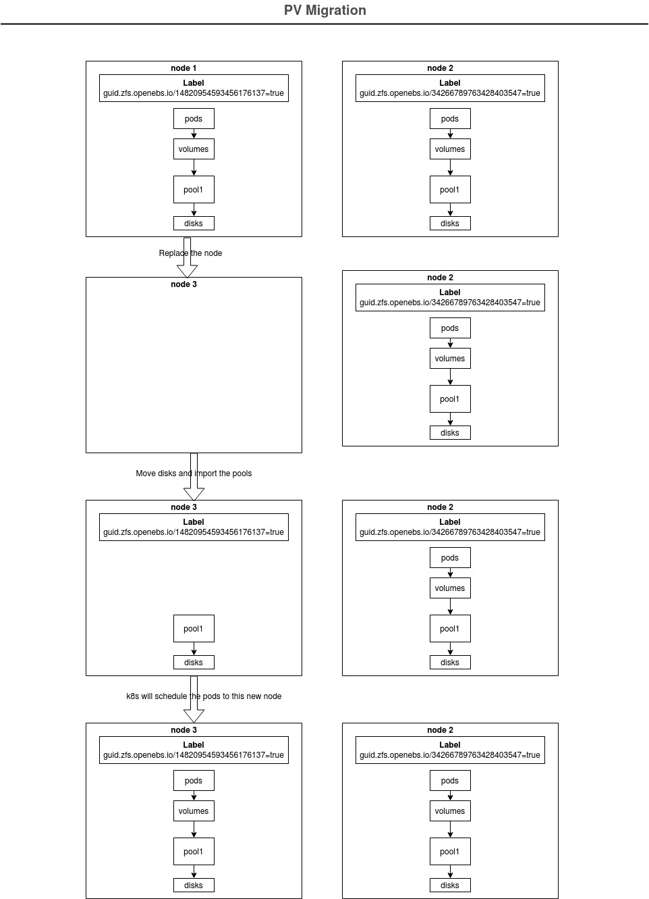

# Volume Migration for LocalPV-ZFS

## Table of Contents

* [Table of Contents](#table-of-contents)
* [Summary](#summary)
* [Problem](#problem)
* [Current Solution](#current-solution)
* [Proposal](#proposal)
    * [Keys Per ZPOOL](#keys-per-zpool)
    * [Migrator](#migrator)
    * [Workflow](#workflow)
* [Upgrade](#upgrade)
* [Implementation Plan](#implementation-plan)
* [Test Plan](#test-plan)
* [GA Criteria](#ga-criteria)

## Summary

This is a design proposal to implement a feature for migrating a volume from one node to another node. This doc describes how we can move the persistence volumes and the application to the other node for LocalPV-ZFS CSI Driver. This design expects that the administrators will move the disks to the new node and will import the pool there as part of replacing the node. The goal of this design is volume and the pod using the volume should be moved to the new nodes. This design also assumes that admins are not having large number of ZFS POOLs configured on a node.

## Problem

The problem with the LocalPV is, it has the affinity set on the PersistenceVolume object. This will let k8s scheduler to schedule the pods to that node as data is there only. LocalPV-ZFS driver uses nodename to set the affinity which creates the problem here as if we are replacing a node, the node name will change and k8s scheduler will not be able to schedule the pods to the new node even if we have moved the disks there.

## Current Solution

Current solution depends on `openebs.io/nodeid` node label. Admin has to set the same label to the replaced node which allows the k8s scheduler to automatically schedule the old pods to this new node. We can read more about the solution [here](https://github.com/openebs/zfs-localpv/blob/master/docs/faq.md#8-how-to-migrate-pvs-to-the-new-node-in-case-old-node-is-not-accessible).

The problem with the above approach is we can not move the volumes to any existing node as we can set only one label on the node for a given key. So, for any existing node in a cluster, label `openebs.io/nodeid` will already be set so, we can not update it to a new value as the pods already running on it will not able to get scheduled here.


## Proposal

### Keys Per ZPOOL

We are proposing to have a key dedicated to ZFS POOL. This key will be used by the LocalPV-ZFS driver to set the label on the nodes where it is present. In this way we can allow the ZFS POOLs to move from any node to any other node as the key is tied to the ZFS POOL as opposed to keeping it per node. We are proposing to have a `guid.zfs.openebs.io/<pool-guid>=true` label on the node where the pool is present. Assuming admins do not have large number of pools on a node, there will be not much label set on a node.

### Migrator

ZFS POOL name should be same across all the nodes for LocalPV-ZFS. So, we have to rename the ZFS POOLs if we are moving it to any existing node. We need a Migrator workflow to update the POOL name in the ZFSVolume object. This will find all the volumes present in a ZFS POOL on that node and updates the ZFSVolume object with the correct PoolName.

**Note:** We can not edit PV volumeAttributes with the new pool name as it is immutable field.

The migrator will look for all the volumes for all the pools present on the node and will look for corresponding ZFSVolume object and will update it with the correct poolname and ownernodeId field.

### Workflow

- user will setup all the nodes and setup the ZFS pool on each of those nodes.
- the LocalPV-ZFS CSI driver will look for all the pools on the node and will set the `guid.zfs.openebs.io/<pool-guid>=true` label for all ZFS POOLs that is present on that node. Let's say node-1 has two pools(say pool1 with guid as 14820954593456176137 and pool2 with guid as 16291571091328403547) present then the labels will be like this :
```
$ kubectl get node pawan-node-1 --show-labels
NAME           STATUS   ROLES    AGE    VERSION   LABELS
node-1   Ready    worker   351d   v1.17.4   beta.kubernetes.io/arch=amd64,beta.kubernetes.io/os=linux,kubernetes.io/arch=amd64,kubernetes.io/hostname=node-1,kubernetes.io/os=linux,node-role.kubernetes.io/worker=true,openebs.io/nodeid=node1,openebs.io/nodename=node-1,guid.zfs.openebs.io/14820954593456176137=true,guid.zfs.openebs.io/16291571091328403547=true
```
- If we are moving the pool1 from node1 to node2, then there are two cases here :-

#### 1. if node2 is a fresh node

- we can simply import the pool and restart the LocalPV-ZFS driver to make it aware of that pool to set the corresponding node topology
- the LocalPV-ZFS driver will look for `guid.zfs.openebs.io/14820954593456176137=true` and will remove the label from the nodes where pool is not present
- the LocalPV-ZFS driver will update the new node with `guid.zfs.openebs.io/14820954593456176137=true` label
- the migrator will look for ZFSVolume resource and update the OwnerNodeID with the new node id for all the volumes.
- the k8s scheduler will be able to see the new label and should schedule the pods to this new node.

#### 2. if node2 is existing node and Pool of the same name is present there

- here we need to import the pool with the different name and restart the LocalPV-ZFS driver to make it aware of that pool to set the corresponding node topology
- the LocalPV-ZFS driver will look for `guid.zfs.openebs.io/14820954593456176137=true` and will remove the label from the nodes where the pool is not present
- the LocalPV-ZFS driver will update the new node with `guid.zfs.openebs.io/14820954593456176137=true` label
- the migrator will look for ZFSVolume resource and update the PoolName and OwnerNodeID for all the volumes.
- the k8s scheduler will be able to see the new label and should schedule the pods to this new node.

Below is workflow for volume migration


## Upgrade

With this feature, the ZFS driver will start using the new key (for e.g. `guid.zfs.openebs.io/<pool name>=true`) to set the affinity on the PV. This should not impact the old volumes, the old pods should be running without any issues. Here, we need to make sure that nodes should have the old labels. The ZFS node driver should support the old topology keys in order to make the upgrade seamless. The driver needs to support following topology keys along with the `guid.zfs.openebs.io/<pool guid>=true`

1. openebs.io/nodename
2. openebs.io/nodeid

`openebs.io/nodename` should be same as nodename and for `openebs.io/nodeid`, if user has labelled the node using this key, then it should have the same value, otherwise it should be nodename only.

## Implementation Plan

### Phase 1
1. Implement replacement with fresh node

### Phase 2
1. Implement replacement with existing node (implement Migrator).

## Test Plan

- move the disks to new node and restart the ZFS Driver node daemon set running on that node if already running, the application pods should move to this node.
- move the disks to any existing node and restart the node daemon set running on that node, the pods using this zfs pool should move to this node.
- have 2 pools on a node and move one pool to the other node, only the pod using that pool should move to other node.
- verify the node labels are set accordingly where the pool is present.
- verify the ZFS volume CR has the updated OwnerNodeId and ZFS Pool information once migration is done.
- verify the snapshot CR has the updated OwnerNodeId and ZFS Pool information once migration is done.
- verify that PV affinity has the key `guid.zfs.openebs.io/<pool guid>`.

## GA Criteria

Once all the test cases are part of e2e pipeline and running without any failure, this feature can be released as GA.
