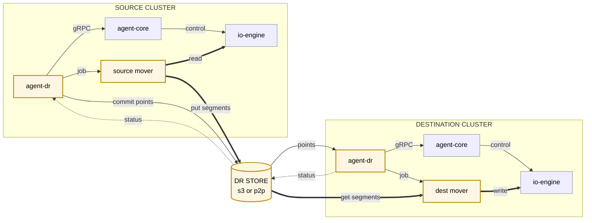
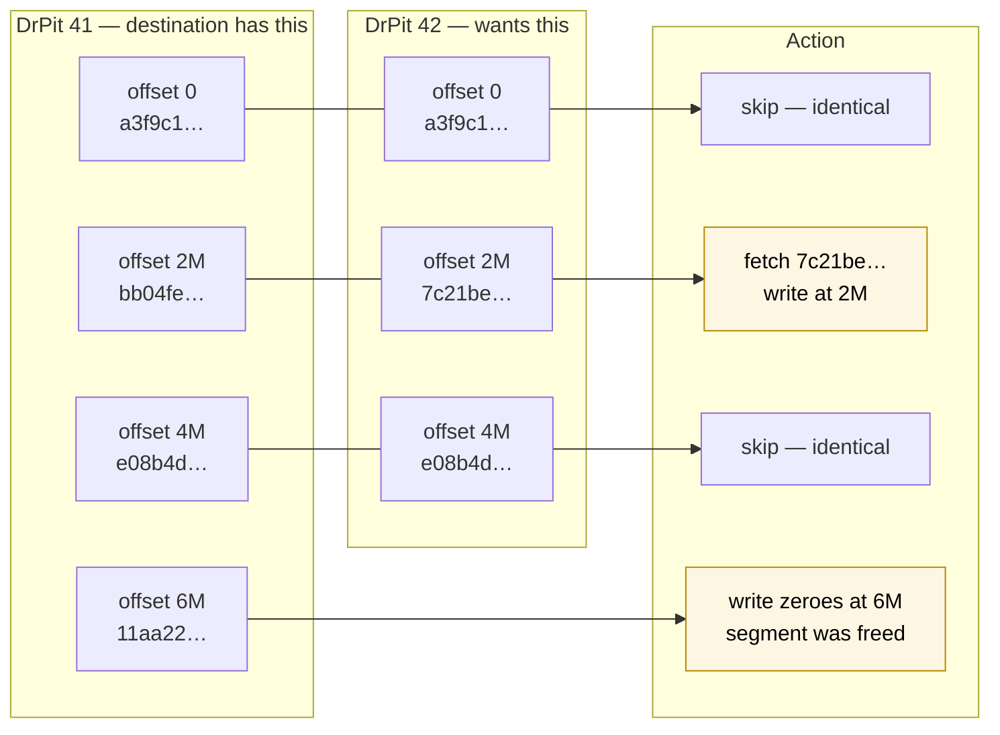
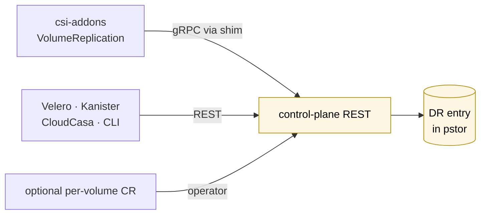
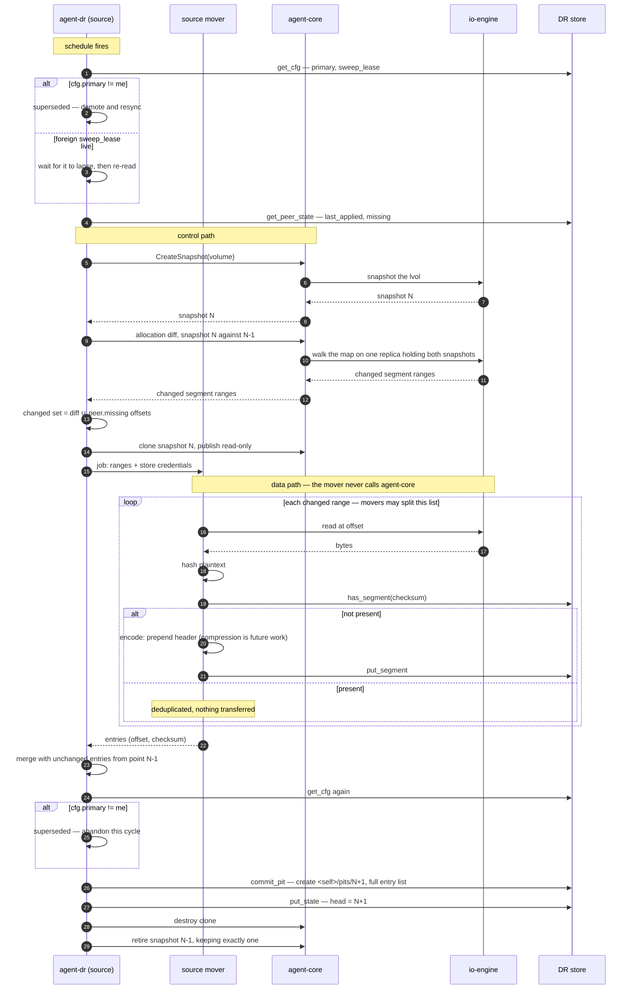
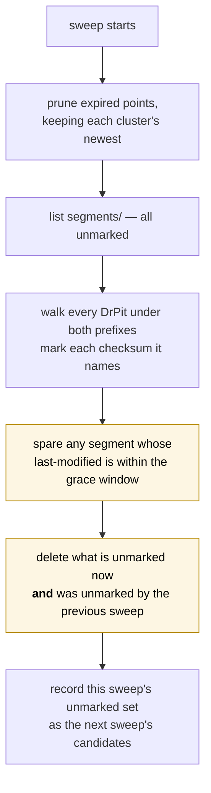
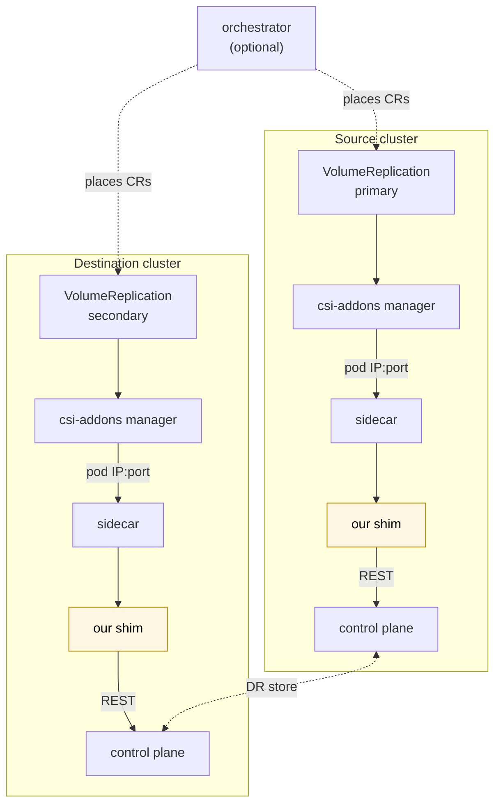

# Asynchronous Disaster Recovery for OpenEBS Mayastor

## Table of Contents

* [Summary](#summary)
* [Motivation](#motivation)
  * [Goals](#goals)
  * [Non-Goals](#non-goals)
* [Proposal](#proposal)
  * [Architecture](#architecture)
  * [Concepts](#concepts)
  * [The DR store](#the-dr-store)
  * [How convergence works](#how-convergence-works)
  * [The `DrStore` interface](#the-drstore-interface)
  * [Control-plane objects](#control-plane-objects)
  * [The replication cycle](#the-replication-cycle)
  * [Discovery](#discovery)
  * [Failover and failback](#failover-and-failback)
  * [Retention and garbage collection](#retention-and-garbage-collection)
  * [Integration with csi-addons](#integration-with-csi-addons)
  * [User Stories](#user-stories)
  * [Implementation Details](#implementation-details)
    * [Future improvements](#future-improvements)
  * [Risks and Mitigations](#risks-and-mitigations)
* [Graduation Criteria](#graduation-criteria)
* [Implementation History](#implementation-history)
* [Drawbacks](#drawbacks)
* [Alternatives](#alternatives)
* [Infrastructure Needed](#infrastructure-needed)

---

## Summary

This OEP proposes **asynchronous disaster recovery** for Mayastor: continuous,
incremental replication of a volume from one Kubernetes cluster to another, with
controlled failover and failback.

Replication is driven by a new control-plane agent, `agent-dr`, deployed on both
clusters. On a schedule, the source snapshots a protected volume, determines which
regions changed using the snapshot's allocation map, and copies only those regions to
a shared **DR store** — object storage today, with direct peer-to-peer behind the
same interface.
The destination discovers the new recovery point, applies the difference to
its own volume, snapshots to mark the position, and publishes its progress back
through the store.

The design has two defining properties:

- **Every recovery point is independently restorable.** A point records the complete
  layout of the volume at that instant, even though only changed data is uploaded. A
  destination can therefore converge from any point to any other in a single step,
  with no ordering constraints and nothing to replay in sequence.
- **Data is addressed by content.** A segment of volume data is stored under the hash
  of its own bytes, so identical data is stored once, transfers are skipped when the
  data is already present, and every download is verifiable on arrival.

Orchestration remains someone else's job. `agent-dr` exposes a control-plane API that
Velero, Kanister, Ramen, CloudCasa or an operator of our own can drive, and a
csi-addons shim makes Mayastor usable by anything speaking the standard
`VolumeReplication` API.

## Motivation

Mayastor replicates synchronously *within* a cluster: a volume's replicas live on
different nodes and every write lands on all of them. This protects against node and
disk failure. It does not protect against the loss of the cluster, the rack, or the
site.

Users running Mayastor in production ask for a second copy somewhere else, kept
reasonably current, that can be brought into service when the primary is gone. That
is asynchronous DR: bounded data loss (an RPO measured in minutes) in exchange for
tolerating an arbitrarily distant, intermittently connected, bandwidth-constrained
destination.

Every DR orchestrator in the ecosystem delegates the data plane to the storage system.
They decide *when* to replicate and *what else* to move — Kubernetes objects, hooks,
scheduling — and then call the storage driver to move the bytes. Mayastor currently has
nothing to call. Whatever orchestration layer is eventually chosen, this engine is the
part that must exist.

### Goals

- Replicate a Mayastor volume to a second cluster, incrementally and on a schedule,
  transferring only data that has changed.
- Support a **store-mediated** topology over object storage that requires no network
  path between clusters and no firewall exceptions, and keep direct peer-to-peer
  available behind the same interface.
- Recover cheaply when the destination has been unreachable: catch-up cost must depend
  on how much data changed, not on how many cycles were missed.
- Survive a destination that loses its data entirely, without requiring the source to
  re-upload the whole volume.
- Support planned failover, forced failover, and failback.
- Provide a control-plane API — REST and gRPC — usable by any orchestrator, and a
  csi-addons shim so Mayastor works with tools that speak `VolumeReplication`.
- Verify data integrity on arrival at the destination.

### Non-Goals

- **Synchronous or near-synchronous replication.** This is asynchronous DR with a
  bounded RPO, not a stretched cluster.
- **Orchestrating Kubernetes objects.** Moving PVCs, Deployments, ConfigMaps and
  Secrets between clusters belongs to a backup or DR orchestrator. This OEP covers
  volume data and the API to drive it.
- **Application-consistent snapshots.** Crash consistency is what the storage layer
  can offer. Quiescing an application before a snapshot is the orchestrator's job,
  through its own pre- and post-hooks.
- **Multi-volume consistency groups.** Snapshots are per-volume. Group support is
  discussed under [Risks](#risks-and-mitigations) and the API is shaped so it can be
  added without a breaking change, but it is not delivered here.
- **More than one destination per volume.** Fan-out to multiple DR sites is a natural
  extension and the store layout permits it, but a single relationship per volume is
  what this OEP specifies.
- **Replicating between volumes of different cluster sizes.** The segment is the
  cluster, so both volumes in a relationship must have the same cluster size. Bridging
  two sizes would mean re-chunking on one side; see
  [compression and integrity](#compression-and-integrity).

## Proposal

### Architecture

`agent-dr` is a new agent alongside `agent-core`, `agent-ha` and `agent-jsongrpc`. The
same binary runs on both clusters and behaves differently according to each volume's
role.



Thick edges are the **data path**, thin edges control, dotted the status channel. The
`DrClusterPair` operator is omitted for clarity — it reconciles the CRD onto the
control-plane REST API and does not sit in either path. Four things to note:

1. **Control and data are separate.** `agent-dr` calls `agent-core` over the existing
   internal gRPC to snapshot, clone, publish and create volumes. The movers never talk
   to `agent-core` at all — they read and write volume data against **io-engine**,
   over NVMe-oF or an attached block device.
2. **Nothing crosses at the Kubernetes layer.** Neither cluster holds credentials for
   the other's API server. The only cross-cluster path is the DR store.
3. **`agent-dr` never moves bytes.** It decides what to copy and hands a
   fully-specified job to a mover. This keeps the mover a dumb executor and lets the
   mover implementation change without renegotiating anything.
4. **The store is bidirectional but not symmetric.** The primary writes data and
   recovery points; the secondary writes only its status.

### Concepts

| Term | Meaning |
|---|---|
| **Segment** | A fixed-size slice of a volume's address space, equal to the **volume's cluster size** — 4 MiB by default (`DEFAULT_CLUSTER_SIZE`, `io-engine/src/lvs/lvs_store.rs:52`) — and fixed for the life of a relationship. The unit that is hashed, stored and transferred |
| **Checksum** | The SHA-256 of a segment's *uncompressed* contents. It is simultaneously the segment's identity, its storage location, and its integrity check |
| **DrPit** | A *DR point-in-time*: the complete layout of a volume at one instant, as a list of `(offset, checksum)` |
| **Relationship (`dr-id`)** | The pairing of a source volume with a destination volume, minted when DR is enabled. It outlives any particular direction |
| **DR store** | Where segments and DrPits live. Object storage, or a peer `agent-dr` |

### The DR store

#### Layout

```text
<prefix>/dr/<dr-id>/
    dr.cfg                              the relationship's facts: which cluster is primary, the epoch,
                                        the sweep lease; the ONE object both clusters write, always by CAS
    segments/<aa>/<bb>/<checksum>       content-addressed, immutable; the same bytes are the same key
    <cluster>/state.json                this cluster's progress: head, what it has applied, what it could not
    <cluster>/pits/<seq:016d>           the DrPits this cluster wrote, complete; created once, at commit
<prefix>/clusters/<cluster>/cluster.cfg reserved: a per-cluster heartbeat, written only by its owner
```

**Each cluster writes only under its own name — with one exception.** `<cluster>` is
the identifier the administrator gives each side in `DrClusterPair`; that CR is the
handshake — it tells each cluster the other's name, which is all it needs to *read*
the peer's keys. Every key under `<cluster>/` has exactly one writer, so those writes
need no precondition and nothing there is contended. `segments/` is shared only in the
sense that both clusters put into the same pool: the key is the hash of the content, so
the same bytes are the same object and a second writer changes nothing. The exception
is `dr.cfg`: it holds the facts the two clusters must *agree* on, so either may write
it, and every write to it is a compare-and-swap on the object's ETag — see
[the relationship configuration](#the-relationship-configuration). Credentials follow
the layout: `Put` on `<self>/`, `segments/` and `dr.cfg`, read on the rest.

**Two documents carry everything the peer needs.** `dr.cfg` says who is primary;
`<peer>/state.json` says how far the peer has got. The primary publishes the sequence
of its newest point; the secondary publishes what it has applied and what it could
not. Each side polls those two objects and nothing else — a `GET` each, or a
conditional `GET` on the ETag that returns 304 when nothing has changed.

Points and segments are written exactly once. A cycle uploads its segments, *commits*
by creating `<self>/pits/<seq>` with the complete entry list, and only then advances
`head` in its state; until the create succeeds the point does not exist, and until the
state is updated the peer does not look for it. There is no in-progress marker in the
store — a point is either absent or complete.

The prefix is keyed on the **relationship**, not on either volume, so it does not move
when the direction of replication does. Each cluster's control plane maps its own
volume UUID to the `dr-id`; **the two volumes have different UUIDs**, because they are
distinct objects in distinct control planes.

That has a consequence for anything that carries a volume identity across clusters. A
PV's `volumeHandle` *is* the Mayastor volume UUID — the CSI controller derives it from
the PVC — so a PV restored on the destination by an orchestrator names the *source*
volume, and so does every csi-addons RPC issued against it. The DR entry therefore
records **both** UUIDs — its own volume and the peer's — and the REST API and the
csi-addons shim resolve a volume UUID they do not own through that mapping before
rejecting it. Each cluster's `state.json` carries its own volume UUID, so either side
can populate the mapping from the store alone. Creating the destination volume *with
the source's UUID* would make the mapping unnecessary and is worth evaluating; the
mapping is the design because it works whether or not that turns out to be possible.

The two sides share one prefix because that prefix *is* the communication channel.
Consistency is not at risk: the primary writes `<self>/pits/`, `<self>/state.json` and
`segments/`; the secondary writes only `<self>/state.json`; and the single object both
may write, `dr.cfg`, is never written blind.

#### The relationship configuration

```rust
/// `dr.cfg`. The facts both clusters must agree on. Read by everyone; written by
/// either cluster, always with a compare-and-swap on the ETag it last read.
struct DrConfig {
    dr: DrId,
    clusters: [ClusterId; 2],       // the two names from DrClusterPair
    segment_size: u64,              // the volume's cluster size; fixed for the relationship

    primary: ClusterId,             // which cluster holds the role — THE fact
    epoch: u64,                     // raised by each promotion; never by anything else
    promotions: Vec<Promotion>,     // { epoch, cluster, forced, at } — history, for operators

    /// Held by the cluster currently running the retention sweep; see
    /// [the sweep lease](#the-sweep-lease). `renewals` exists because a renewal that
    /// changes nothing else would leave the object's bytes — and so its ETag — unchanged.
    sweep_lease: Option<SweepLease>,  // { holder, ttl_secs, renewals: u64 }
}
```

**Every write to `dr.cfg` is a read-modify-write loop against the store's ETag:**

```text
loop {
    (cfg, etag) = GET dr.cfg
    if cfg already satisfies what I want          -> done          (someone did it for me)
    if cfg's precondition for my change is false  -> stop, report  (I lost; do not retry)
    cfg' = cfg with my change applied
    PUT dr.cfg  If-Match: <etag>  body: cfg'
    200 -> done
    412 | 409 -> continue                          (someone wrote in between; re-read)
}
```

The loop terminates because every failed iteration means another writer made progress.
The object is created by the side that enables DR, with `If-None-Match: *`, so two
clusters enabling the same relationship concurrently also resolve to one winner. This
is the only conditional write in the design; everything else has one writer.

> **A role is a belief; `dr.cfg` is the fact.** Each cluster's DR entry carries a
> `role`, and its `state.json` echoes it, but neither is authoritative: they record
> what that cluster *currently believes*. Two clusters may believe they are primary at
> the same time — after a forced failover, indefinitely, until the old primary next
> reads the store — and the store is not harmed by it. What the protocol requires is
> only that every *action on the store* be conditioned on a fresh read of `dr.cfg`.
> See [forced failover and split-brain](#forced-failover-and-split-brain).

#### A cluster's state

```rust
/// `<cluster>/state.json`. The one object a cluster rewrites; the peer reads it.
struct ClusterState {
    cluster: ClusterId,
    dr: DrId,
    volume: VolumeId,             // this cluster's volume — populates the peer mapping
    role: Role,                   // Primary | Secondary | Resyncing — what this cluster believes; dr.cfg decides

    // as primary
    head: Option<u64>,            // sequence of the newest point under <self>/pits/

    // as secondary
    last_applied: Option<PitId>,  // None until the first point is applied
    cycle: Option<CycleProgress>, // the in-flight convergence, if any
    /// Entries the destination could not apply — a 404 or a hash mismatch on the
    /// segment. The primary treats these offsets as changed in its next cycle; see
    /// retention and garbage collection for why the report is necessary.
    missing: Vec<SegmentRef>,

    observed_at: Timestamp,       // when this was written
}
```

#### A DrPit

```rust
/// Names a point: the cluster that wrote it and its sequence under that cluster.
struct PitId {
    writer: ClusterId,
    seq: u64,
}

struct DrPit {
    id: PitId,
    dr: DrId,                 // the relationship
    epoch: u64,               // the writer's epoch when it committed this point
    volume_size: u64,         // grows on resize; the destination grows to match
    segment_size: u64,        // the volume's cluster size; equal on both sides
    /// Sorted by offset. One entry per allocated segment.
    segments: Vec<SegmentRef>,
}

struct SegmentRef {
    offset: u64,
    checksum: Hash,   // names the stored object
    changed: bool,    // differs from the writer's previous point, or from the point it was activated from
}
```

A DrPit lists **every allocated segment**, not only the changed ones — but only
changed segments are ever uploaded. That combination is what makes each point
independently restorable while keeping transfers incremental.

> The entry list is **state, not history**. It describes the volume *as of this
> point*, so a segment that was written earlier and has since been trimmed is absent.
> Accumulating "everything ever changed" would resurrect freed data on a full rebuild
> and defeat thin provisioning.

The `changed` flag lets one list serve both jobs:

| Use | Selection |
|---|---|
| Full rebuild, or a jump across any distance | every entry |
| Consecutive replay | entries where `changed` |

#### Addressing

A segment's location is **computed from its checksum**, never looked up:

```text
s3://<bucket>/<prefix>/dr/<dr-id>/segments/<c[0..2]>/<c[2..4]>/<checksum>
                                            └ two-level fan-out, 65536 prefixes ┘
```

Bucket and prefix come from the `DrClusterPair`, the `dr-id` from the local DR entry,
and the rest from the checksum itself. So `(dr-id, checksum)` yields an exact key with
no index and no round trip.

Note what is **not** in the path: the offset. The checksum says *what the bytes are*;
the DrPit entry says *where they go*. Identical content at different offsets, or in
different points, is one object.

#### Compression and integrity

**The checksum is over uncompressed data.** If it were over the compressed form, the
address would depend on the codec and level: identical data compressed two ways would
get two names, deduplication would break, and the codec could never change without
orphaning everything.

Compression is therefore an encoding applied *beneath* the address, and each stored
object says how it was encoded:

```text
segments/<aa>/<bb>/<checksum>
  ┌────────┬─────┬──────┬───────────┬─────────┐
  │ magic  │ ver │ algo │ plain_len │ payload │
  └────────┴─────┴──────┴───────────┴─────────┘
```

Three consequences worth stating:

- **Changing codec needs no migration.** The key is the plaintext hash, so an existing
  object is found and skipped whatever its encoding. Old segments keep theirs forever;
  new ones use the new codec.
- **`none` is a first-class algorithm.** Already-compressed or encrypted payloads do
  not shrink; the source measures and stores raw rather than spending CPU to grow the
  object.
- **Verification is free.** Because the name *is* the hash, the destination re-hashes
  everything it downloads. Store corruption and truncated transfers are detected
  rather than silently applied.

> **Phase 1 writes every segment with `algo: none`.** The header is present from the
> first release, but no codec is implemented. This is deliberate: compression is pure
> CPU on the source, which is already the heavier side, and deferring it removes a
> tuning problem from the initial release without costing anything later — precisely
> because the header makes adopting a codec a no-migration change. See
> [Future improvements](#future-improvements).

**The segment size is not a free parameter — it is the volume's cluster size.** The
allocation walk reports allocated *clusters*, so a smaller segment would ask for a
granularity the map cannot express, and a larger one would force uploading several
clusters because one of them changed. Mayastor already requires every replica pool of
a volume to share one cluster size, so a volume has exactly one. The relationship fixes
`segment_size` to the source volume's cluster size when DR is enabled, and discovery
creates the destination volume with `cluster_size` pinned to the same value —
`CreateVolumeBody` already accepts it and restricts placement to matching pools. A
destination with no pool of that cluster size cannot host the relationship, and
discovery must report that rather than create a volume that can never converge. A pool
created with a non-default cluster size (configurable up to `MAX_CLUSTER_SIZE`, 1 GiB)
simply gets segments to match, which is why `segment_size` is recorded in every DrPit
rather than assumed — and why a DrPit whose `segment_size` differs from the destination
volume's cluster size is rejected outright. Because the destination volume is created
to match, a failover does not change the segment size either. Replicating between
volumes of *different* cluster sizes would require re-chunking on one side and is a
[non-goal](#non-goals).

**The cluster is also the floor on write amplification.** A snapshot records change at
cluster granularity — a 4 KiB write into an untouched cluster copies and allocates the
whole 4 MiB — so no sub-cluster change information exists to exploit, and a changed
segment is uploaded whole however little of it the application wrote. A workload with
scattered small writes uploads many times what it wrote. This is inherent to the
mechanism rather than a tuning problem: a smaller cluster size trades amplification for
object count, and compression ([future improvements](#future-improvements)) shrinks the
bytes but not the count. It is listed under [risks](#risks-and-mitigations).

Hash length, by contrast, is a deliberate choice: 256-bit, un-truncated. A collision
means silently serving the wrong bytes, which is the worst failure available to a DR
system, and the 32 bytes per entry are noise against 4 MiB payloads.

### How convergence works

This is the core of the design, so it is worth walking through concretely.

The destination holds DrPit 41. The source has committed DrPit 42. Converging is a
**merge join over two sorted lists**:



Two small documents are read; **one 4 MiB segment is transferred**. The rest of the
volume is already correct and is never touched.

Three properties fall out of this, and they are the reason for the format:

**Any two points can be joined directly.** Because each list is absolute rather than
relative, going from point 41 to point 91 is the same single merge join as 41 to 42 —
it simply yields a larger result. A destination that has been unreachable for a week
pays for *what changed*, not for *how many cycles it missed*.

**There is no ordering requirement.** Nothing must be replayed in sequence, so there
are no sequence gaps to detect and no in-order application to enforce. The sequence
number in the key exists only so that "latest" is answerable by listing.

**Freed space propagates for free.** The fourth row above — an offset present in the
old list and absent from the new — means the segment was trimmed, and the diff emits a
zero write. Holes are distinguished from zeroes structurally rather than by carrying
extra metadata.

And because each point lists everything, **a destination that has lost its data can
restore from any single surviving point**, downloading only what it does not already
have. The source is not involved.

**Volume growth propagates through `volume_size`.** A resized source simply has a
longer allocation map, and the entries beyond the old size are new, so they appear as
changed. Before applying a point the destination compares its `volume_size` with its
own volume and **grows the volume first** when the point is larger, so a point is never
applied to a volume too small to hold it. Mayastor does not shrink volumes, so a point
*smaller* than the destination volume is an error rather than a resize.

### The `DrStore` interface

Everything above `DrStore` is unaware of the transport. The methods are concrete
operations, grouped so the caller is evident:

```rust
#[async_trait]
trait DrStore {
    // ---- the relationship configuration: shared, written only by compare-and-swap ----
    async fn get_cfg(&self, dr: &DrId) -> Result<Option<(DrConfig, Etag)>>;            // GET dr.cfg, conditional on ETag
    async fn put_cfg(&self, dr: &DrId, cfg: &DrConfig, when: Precondition) -> Result<Etag, PutCfgError>;
    //   Precondition::Absent  -> PUT If-None-Match: *     (create)
    //   Precondition::Etag(e) -> PUT If-Match: <e>        (replace)
    //   PutCfgError::Conflict is distinct from every other error: it means "re-read and decide again"

    // ---- the state documents: each cluster writes its own, reads the peer's ----
    async fn put_state(&self, dr: &DrId, s: &ClusterState) -> Result<()>;           // PUT <self>/state.json
    async fn get_peer_state(&self, dr: &DrId) -> Result<Option<ClusterState>>;      // GET <peer>/state.json, conditional on ETag

    // ---- written by the primary ----
    async fn has_segment(&self, dr: &DrId, hash: &Hash) -> Result<bool>;
    async fn put_segment(&self, dr: &DrId, hash: &Hash, data: Bytes) -> Result<()>;
    async fn commit_pit(&self, dr: &DrId, pit: &DrPit) -> Result<()>;                // create <self>/pits/<seq>
    async fn delete_pit(&self, dr: &DrId, id: &PitId) -> Result<()>;

    // ---- read by the secondary ----
    async fn get_pit(&self, dr: &DrId, id: &PitId) -> Result<DrPit>;
    async fn get_segment(&self, dr: &DrId, hash: &Hash) -> Result<Bytes>;
    async fn list_relationships(&self) -> Result<Vec<DrId>>;                         // discovery only
}
```

Two documents are all either side ever *polls*. `dr.cfg` answers "who is primary?"
and "is a sweep in progress?" for both roles. The peer's `ClusterState` answers, for
the secondary, "is there a new point?" (`head` moved) and, for the primary, "what did
the destination make of my last point?" (`last_applied`, `missing`). Two small
objects, two conditional requests, both roles.

Two implementations sit behind the trait:

| | `s3` | `p2p` |
|---|---|---|
| Transport | HTTPS to an object store | gRPC to the peer `agent-dr` |
| Firewall between clusters | **none required** | required |
| Freshness of status | poll interval | immediate |
| Storage cost | a bucket | none |
| Phase | 1 | 3 |

`s3` is the design target. `p2p` is simply *"the peer is the store"* — the same trait
served by the counterpart's `agent-dr` from its own volumes, with no object store
involved. It trades the firewall exception for lower latency and no bucket to pay for,
and nothing above the trait changes; `put_cfg`'s compare-and-swap is a mutex around
one struct on the serving side.

The trait exists so that this remains a deployment choice rather than an architectural
one. Other object stores — GCS, Azure Blob — are the same implementation with a
different client.

> **Where this abstraction can leak:** latency. A `p2p` `get_peer_state` answers in
> microseconds; the `s3` one is only as fresh as the peer's last publish plus the poll
> interval. No consumer may assume promptness, which is why `ClusterState` carries
> `observed_at` and why the volume's DR state includes an explicit `Unknown`.

#### One document per side keeps listing off the hot path

**`LIST` is the expensive operation and the design avoids it in every repeated path.**
It is billed with the PUT-class requests — roughly 12.5x a GET on S3 — has higher and
more variable latency because it is served from the metadata index rather than the
object path, and is where prefix-level throttling appears first.

So nothing is discovered by listing in the steady state. Each side reads `dr.cfg` and
the other's `state.json`, and everything else it needs is a key it can construct from
those two documents:

| Repeated question | How it is answered | Cost |
|---|---|---|
| Either: who is primary? Is a sweep holding the lease? | `GET dr.cfg` — `primary`, `sweep_lease` | one GET, 304 when unchanged |
| Destination: is there a new point? | `GET <peer>/state.json` — `head` moved | one GET, 304 when unchanged |
| Destination: fetch it | `GET <peer>/pits/<head>` | one GET |
| Primary: what did the destination report? | the same `GET <peer>/state.json` — `last_applied`, `missing` | the same request |
| Primary: what is the next point number? | its own `head`, plus one | free |

Listing appears in exactly two places, both off the hot path:

- **Discovery**, enumerating relationships the destination has not seen. New
  relationships are rare, so this runs on its own slow timer rather than per
  convergence poll.
- **The reachability sweep**, which must enumerate segments by definition. It is
  scheduled, infrequent, and already the expensive operation.

#### Object storage semantics relied upon

- **`PUT` and `GET` of whole objects**, with read-after-write consistency: once a
  `PUT` has returned, a `GET` of that key from anywhere sees it.
- **Atomic overwrite of a single object.** `state.json` and `dr.cfg` are rewritten; a
  reader sees the old document or the new one, never a mix.
- **Conditional `PUT`** (`If-Match: <etag>`, `If-None-Match: *`) on **one object**,
  `dr.cfg`, evaluated atomically against the object's current version so that two
  concurrent writers with the same ETag produce one success and one `412`. This is a
  requirement: it is what makes promotion resolve to a single winner and what fences
  the sweep.
- **Conditional `GET`** (`If-None-Match: <etag>`), so polling an unchanged document
  costs a 304 rather than a transfer. An optimisation, not a requirement.
- **Listing a prefix**, off the hot path as above.

Nothing else. No server-side locking and no transactions: one object is written
conditionally, and every other key has exactly one writer, so there is nothing else to
guard. Conditional `PUT` is now common to the stores this design targets:

| Store | Conditional overwrite | Note |
|---|---|---|
| AWS S3 | `If-Match` since November 2024; `If-None-Match: *` since August 2024 | concurrent conditional writes to one key may also return `409 ConditionalRequestConflict`; treated as a retry |
| Google Cloud Storage | `x-goog-if-generation-match` | long-standing |
| Azure Blob | `If-Match` | long-standing |
| Ceph RGW | `If-Match` / `If-None-Match` on `PUT` | long-standing |
| MinIO | `If-Match` / `If-None-Match` on `PUT` and multipart, checked under a per-object lock | releases of late 2024 skip the check when the object's metadata cannot be read to quorum, so on a *degraded* MinIO a CAS can become a blind write; fixed in later releases. The split-brain guarantee holds while the store itself is healthy |

A store without conditional `PUT` is not a supported target. `p2p` has no such
concern: the peer serving `dr.cfg` compares in memory.

**Exactly two kinds of object are ever rewritten:** each cluster's `state.json`, and
the relationship's `dr.cfg`. Every point and every segment is written once and never
modified, which is what lets them sit under WORM retention — see
[a compromised cluster and the store](#a-compromised-cluster-and-the-store).

### Control-plane objects

#### `DrClusterPair` — the only CRD

Cluster-scoped, created by an administrator on both clusters, and the only Kubernetes
object this design requires.

```yaml
apiVersion: openebs.io/v1alpha1
kind: DrClusterPair
metadata:
  name: dr-west
spec:
  cluster: east                 # this cluster's name in the store; it writes only under <cluster>/
  peer: west                    # the other cluster's name; it reads the peer's keys under <peer>/
  transport:
    kind: s3                    # s3 | p2p
    s3:
      endpoint: https://s3.example.com
      bucket: mayastor-dr
      prefix: prod
      credentialsSecret: dr-store-creds
  discovery:                    # bounds what the destination may auto-create
    namespace: production
    storageClass: mayastor-3
    maxVolumeSize: 2Ti
status:
  reachable: true               # can the store be read and written
  lastChecked: "..."            # when that was last confirmed
  message: ""                   # why not, when reachable is false
```

With `s3` the two clusters never communicate; they simply agree on a location and on
each other's names. The two names are the whole handshake: each cluster writes under
its own, knows where to read the other's, and both know where `dr.cfg` is.
The operator reconciles this onto the control plane's REST API, following the pattern
already established by `operator-diskpool`: `create_or_import` semantics so a CR
adopts an object created via REST rather than duplicating it, `AlreadyExists` treated
as success so every write is idempotent, and finalizers so CR deletion drives cleanup.

#### Per-volume DR entry

DR intent is a **persisted control-plane entry keyed by volume UUID**, alongside the
volume rather than inside it:

```yaml
# desired
volume: 8c1f2a3b-...
dr: 4f2e1a90-...       # the relationship id
pair: dr-west
role: primary          # primary | secondary | resync
autoResync: false
schedule: 15m
ttl: 24h               # how long recovery points are kept
```

```yaml
# observed
state: InSync          # Enabling | InSync | Degraded | Resyncing | Unknown
lastUploaded: { pit: 0000000000000042, at: "..." }
lastApplied:  { pit: 0000000000000041, at: "..." }
reportedAt: "..."
lag: 3m12s
```

**Why a separate entry rather than a field on `VolumeSpec`.** Cycle progress and
`lastApplied` update every few seconds. Putting them on the volume object would place
continuous DR churn on the volume's own write path in etcd, contending with its
reconciler for something unrelated to it. The cost is that volume deletion must also
delete the DR entry — ordinary work, since the delete path already cleans up related
objects.

**Why uploaded and applied are separate fields.** They answer different questions.
`lastUploaded` is what the source committed and is always known locally. `lastApplied`
is what the destination has actually converged to, and arrives only via the peer's `state.json`.
Reporting one as though it were the other would mean a destination that has been down
for a week still looks healthy.

**Why `reportedAt` is first-class.** A stale report and a caught-up destination are
indistinguishable without it. If `reportedAt` falls too far behind the schedule, the
state becomes `Unknown` — never `InSync`.

`autoResync` governs what happens when a demoted side is found to have diverged:
`false` (the default) stops and waits for an operator; `true` discards the
un-replicated writes automatically. It is destructive, hence the default.

#### How intent arrives



All three doors land on the same object, so there is one store of record and no
ambiguity about which surface is authoritative. REST is the substrate; the CRD path
is a thin layer above it and can be added later without redesign.

### The replication cycle



**Only metadata is read to decide what to copy.** The allocation diff comes from the
snapshot's own allocation map, so identifying the changed set costs no data reads.

**The allocation map is per replica, not per volume.** A volume snapshot is a set of
replica snapshots, and each replica's blob has its own cluster map. The diff therefore
runs on **one replica that holds both N-1 and N** as valid, non-discarded snapshots;
every replica of a healthy volume records the same writes, so any one will do. When no
replica qualifies — one was skipped or discarded during either snapshot (`skip`,
`discarded_snapshot`), or was added or rebuilt between them — the cycle falls back to
walking **every** allocated cluster of snapshot N on any replica that holds it. That
costs a read-and-hash pass over the allocated volume, not a full upload: `has_segment`
still deduplicates everything that did not change. Choosing the replica and presenting
the result per volume is control-plane work, listed under
[the changed-segment set](#the-changed-segment-set).

**Checksums are discovered by reading**, which is why the point is written last:
nothing knows the names of the segments being uploaded until the movers return. There
is no in-progress record in the store — the primary knows locally that a cycle is
running, the destination has no use for the fact, and the sweep does not rely on it
(see [retention](#retention-and-garbage-collection)).

**Progress lives in the segments, not in the point.** Each segment is its own
write-once object, so the upload iterates without touching `pits/` at all; the point is
assembled in memory from the movers' `(offset, checksum)` results and the inherited
entries, and written once, complete, at step 26. The sequence number is the primary's
own `head` plus one, known locally; the key is under its own prefix, so nothing else
can have written it. Only after the point exists does `head` advance (step 27), so the
peer never looks for a point that is not there.

**A crashed cycle needs no rollback.** Segments are content-addressed and immutable,
so a partial upload simply leaves reusable segments; the retry re-derives the changed
set, finds them present through `has_segment`, and skips them. A crash between steps 26
and 27 leaves a complete point the peer does not yet know about; the retry finds it
under its own prefix and advances `head`. `head` is what the destination follows, so a
half-finished cycle is invisible to it.

**The cycle reads `dr.cfg` twice and never writes it.** Once at the start, to learn
whether it still holds the role and whether the peer's sweep is holding the lease — a
cycle does not begin its `has_segment` pass while a foreign lease is live, for the
reason given under [the sweep lease](#the-sweep-lease) — and once more immediately
before `commit_pit`. Between those two reads it may have been superseded; that window
is bounded and its consequence is one orphaned point, examined under
[forced failover and split-brain](#forced-failover-and-split-brain).

#### Convergence on the destination

```mermaid
sequenceDiagram
    autonumber
    participant ST as DR store
    participant AD as agent-dr (destination)
    participant MV as destination mover
    participant AC as agent-core
    participant IO as io-engine

    loop poll (store) or on notification (p2p)
        AD->>ST: get_cfg — conditional GET; still secondary?
        AD->>ST: get_peer_state — conditional GET, 304 until head moves
    end
    AD->>ST: get_pit(peer.head)
    AD->>AD: diff against last_applied
    AD->>MV: job: entries to fetch

    Note over MV,IO: data path — the mover never calls agent-core
    loop each entry to fetch
        MV->>ST: get_segment(checksum)
        MV->>MV: read header, decompress, verify hash matches the key
        MV->>IO: write at offset
        MV->>ST: record sub-cycle checkpoint
    end
    MV-->>AD: complete

    AD->>AC: CreateSnapshot named for the PitId
    AC->>IO: snapshot the lvol
    Note over AD,IO: the snapshot carries the position
    AD->>ST: put_state — last_applied, missing
```

#### What the destination persists

Two different things, deliberately kept in different places:

| What | Where | Why there |
|---|---|---|
| **The relationship binding** — volume UUID, `dr-id`, role, schedule | pstor, in the DR entry | Without it a restarted `agent-dr` does not know this volume is the secondary for that relationship |
| **The applied position** — which point the volume has converged to | **the snapshot itself**, named for its `PitId` | It cannot disagree with the data, and is recoverable from the volume alone |

Snapshots already carry `snapshot_name`, `entity_id` and `txn_id`, so the destination
names each one after the point it represents. It keeps exactly one: the previous
position's snapshot is retired once the new one exists, so the destination's snapshot
overhead is bounded the same way as the source's.

`lastApplied` in the DR entry's observed state is therefore **derived** from the
snapshot list on reconcile rather than written as a fact of record. The distinction
matters: a position written to pstor separately from the snapshot can disagree with it
— the snapshot succeeds and the write fails, or the reverse — whereas a position
carried by the snapshot is the same fact as the data it describes.

Ordering is what makes this safe. The snapshot is taken only after the mover reports
every entry applied, so **a snapshot existing implies its point is fully applied**. If
the snapshot itself fails, no snapshot exists for that point and the next reconcile
converges it again, writing the same bytes to the same offsets.

Sub-cycle progress is separate and advisory: losing it costs a redo, not
correctness.

### Discovery

**The source declares; the destination discovers.** There is no per-volume action on
the secondary at all.

`agent-dr` on the destination lists relationships in the store. A relationship whose
`dr.cfg` names the peer as `primary`, whose peer `state.json` has a `head`, and that
it has not seen before, causes it to create a volume, create a DR entry with
`role: secondary`, and begin converging on that head. `segment_size` is read from
`dr.cfg` and the volume is created to match; a mismatch with the storage class's pools
is a refusal, not a conversion.

This is load-bearing rather than a convenience: **discovery is the only thing in the
design that creates destination volumes.** An orchestrator that restores PVCs and PVs
is restoring *Kubernetes objects* — the PV it lands carries a `volumeHandle` naming a
Mayastor volume that something else must have created.

Auto-creation is bounded by the `discovery` envelope on `DrClusterPair` — namespace,
storage class, size cap. Outside it, nothing is created.

### Failover and failback

Failover is expressed as a role change on both sides. There is no dedicated operation.

```mermaid
stateDiagram-v2
    direction LR
    [*] --> Primary
    Primary --> Secondary: demote<br/>(requires volume unpublished)
    Secondary --> Primary: promote<br/>(drain, verify replicas, activate)
    Secondary --> Resyncing: resync (force)
    Resyncing --> Secondary: ready
    note right of Primary
        writes <self>/pits/, segments/,
        <self>/state.json; dr.cfg for the lease
    end note
    note right of Secondary
        writes <self>/state.json;
        dr.cfg only to promote
    end note
```



**Promote is not a flag flip.** It begins with a compare-and-swap on `dr.cfg`: read
it, require `primary == peer` (or already `== self`, which makes the call idempotent),
write `primary = self`, `epoch + 1` and a new `promotions` entry with `If-Match` on
the ETag just read. A `412` means the object moved underneath — re-read; if the peer
has meanwhile promoted itself the call reports that and stops, and if anything else
changed it retries. Only once the CAS has succeeded does the destination drain any
remaining points, verify its replicas are healthy, and activate. `POST /promote` must
therefore be able to answer *not ready* and be polled. Promote never waits on the sweep
lease: the lease fences deletion, not the role.

**Demote never writes `primary`.** It releases the sweep lease if this cluster holds
it, drains, unpublishes and flips the local belief; the fact was already moved by the
other side's promote. A graceful failover is therefore promote-then-demote with the
store in between, and a forced one is promote alone.

**Failover is continuous, not a fresh start.** The new primary's first cycle finds
almost every segment it would upload already present in the store — they are the
segments it just downloaded — so `has_segment` skips them. The relationship prefix does
not move when the direction does.

#### Forced failover and split-brain

When the original primary is unreachable, promotion is forced. This accepts data loss
and the possibility of two clusters *believing* they are primary — that is what `force`
means. What must *not* happen is the store becoming unreadable, and a returning
primary must be able to find out that it lost.

**Belief and fact are different things, and only the fact is shared.** Each cluster's
DR entry says what role it is playing; `dr.cfg` says who holds it. After a forced
failover those disagree on the old primary, and may go on disagreeing for as long as it
stays cut off. That is fine. The store does not care what a cluster believes; it cares
what the cluster *does*, and every action on the store is conditioned on a fresh read:

```text
dr.cfg    { primary: B, epoch: 2, promotions: [{1, A, false, ...}, {2, B, true, ...}] }
<A>/state.json    { role: primary, head: 43 }     <- A's belief; stale
<B>/state.json    { role: primary, head: 44 }     <- B's belief; matches dr.cfg
```

The whole protocol is the read each side already does:

| | How | When |
|---|---|---|
| Am I still primary? | `get_cfg`; superseded iff `cfg.primary != self` | start of every cycle, every reconcile, and once more immediately before `commit_pit` |
| Promote | CAS on `dr.cfg`: `primary = self`, `epoch + 1`, precondition `primary == peer` | `POST /promote` |

A primary that finds itself superseded demotes: it reverts to the snapshot of its last
committed point and converges on `<peer>/pits/`.

> **Rule: nothing changes `primary` or `epoch` except an explicit promotion.** Not
> startup, not reconcile, not a "re-assert my role" path. A cluster that finds itself
> superseded demotes; it never reclaims. And `dr.cfg` is never cached in pstor — a
> returning primary must read before it writes.

**Why a compare-and-swap and not two documents.** If each cluster merely *stated* its
role, two statements could both say `primary` and a reader would need a tie-break.
With one object written by CAS there is nothing to break: two concurrent promotions
read the same ETag, and the store accepts exactly one of the writes. The loser learns
it lost *before* it activates anything. `epoch` is kept because a point records the
epoch it was committed under, which lets a reader tell a stale primary's orphaned
points from the live lineage's; `promotions` keeps the history for operators; neither
is consulted to decide who is primary — `primary` is.

**What is not atomic.** Read-`dr.cfg`-then-write-points is two operations with a gap.
Object storage has no transaction across keys. So a primary that is mid-cycle when
superseded may commit **at most one** more point before it notices, narrowed to the
interval between the pre-commit read and the `PUT`. A cluster that was cut off entirely
writes nothing during the outage — it cannot reach the store to read *or* write — and
reads `dr.cfg` first when it returns. Either way the stale writes are harmless to the
store:

| What the stale primary writes | Collides with the new primary's? |
|---|---|
| `segments/<checksum>` | **No** — content-addressed; the same bytes are the same object |
| `<self>/pits/<seq>`, `<self>/state.json` | **No** — under its own prefix; the new primary writes under its own |
| `dr.cfg` | **No** — its precondition `primary == self` is false, so the CAS fails |

The worst outcome is orphaned points under the stale cluster's prefix that age out
under TTL. **Deletion is the one real hazard** — a stale primary's sweep must not
remove the new lineage's segments — and it is what the sweep lease in `dr.cfg` exists
for; see [the sweep lease](#the-sweep-lease).

**One limit worth stating plainly.** All of this fences the *store*. It does not
prevent both clusters serving the volume to workloads at the same time; only fencing
at the orchestration layer can do that. A stale primary whose application keeps
writing is producing a branch that will be discarded when it learns the truth and
rolls back to resync — which is why demotion snapshots the divergent state before
reverting, and why `autoResync` defaults to waiting for an operator.

#### Failback

Failback does **not** require a common ancestor — any two points can be diffed
directly. What it requires is a description the returning side's disk provably
matches.

> **The returning side first reverts its volume to the local snapshot of its last
> committed point.** Its state then *is* that point by construction, and the ordinary
> diff-and-apply is sound. The writes that were never replicated are discarded, which
> is correct: they were lost when the failover happened.

Before any of that, the returning side reads `dr.cfg`. That read is what tells it it
was superseded; nothing local can, because locally it still believes it is primary.

Two retention requirements follow:

| Requirement | Where | Why |
|---|---|---|
| The returning side keeps its last committed point's local snapshot | source cluster | Otherwise it cannot establish its position except by re-reading and re-hashing the whole volume |
| The store keeps the pre-failover head point | DR store | Otherwise the returning side has no description to diff from, even though its data is intact |

With both in place, failback costs only the difference between the two heads.

### Retention and garbage collection

Each DrPit carries a TTL and is prunable when it expires, subject to one rule:

> **The newest point under each cluster's prefix always survives.** For the primary
> that is the current head; for a demoted cluster it is the pre-failover head that
> failback diffs from. Older points describe states the destination may no longer be
> able to reach.

Deleting a point leaves its segments in place if any surviving point still references
them. The sweep is **mark-and-sweep over the store**, not reference counting: nothing
is stored per segment, and the roots are the surviving points themselves.



**Roots are writer-agnostic.** Every point under both prefixes is a root,
not only the sweeping cluster's own. This matters after a forced failover: a cluster
that has not yet noticed it was superseded still runs the sweep, and must not delete
the segments belonging to the cluster that replaced it.

**A cycle in flight puts two kinds of segment at risk, and they need different
protection.** Nothing in the store names them yet: the point is written only at commit,
because the checksums of the segments being uploaded are discovered by reading them,
and the entries it will inherit are already named by the previous point, which is a
root. So **an in-flight cycle contributes nothing to reachability**, and the protection
has to come from elsewhere.

- **Segments the cycle uploads** are new objects that nothing names until the point
  commits. The **grace window** covers them: a segment younger than the window — sized
  above the longest plausible cycle — is never deleted.
- **Segments the cycle deduplicates against** are old objects that `has_segment` found
  already present, so the mover never touched them. Their `last-modified` is whenever
  they were first uploaded, and the window does *not* cover them. If the only Committed
  points naming such a segment expire and are pruned between the `has_segment` call and
  `commit_pit`, a single-pass sweep deletes it — and the point then commits naming an
  object that is gone. Three rules close this:
  1. **The primary serialises its sweep with its cycles.** A sweep never runs while a
     cycle is between its first `has_segment` and `commit_pit`. Both are driven by the
     same `agent-dr`, so this is a local matter — see
     [ownership of retention](#ownership-of-retention).
  2. **Segment deletion is two-phase.** A sweep deletes only segments that were
     unmarked by *both* it and the previous sweep. A segment first found unreferenced
     becomes a candidate and is deleted only if the next sweep — rooting from every
     point committed in between — still finds nothing naming it. Point pruning stays
     single-pass; only segment deletion is deferred by one sweep.
  3. **The sweep runs under a lease in `dr.cfg`.** Rule 1 cannot reach a cycle or a
     sweep running on the *other* cluster — and after a forced failover, the other
     cluster may not yet know it is no longer primary. So the sweep's delete pass is
     fenced by a lease both clusters can see, described under
     [the sweep lease](#the-sweep-lease); rule 2 covers the interval a lapsed lease
     admits, provided the sweep interval exceeds the longest cycle.

Together: the window protects what a cycle *writes*, serialisation and two-phase
deletion protect what it *reuses*, writer-agnostic roots protect what the *other
cluster* wrote, and the lease keeps a cluster that has not yet noticed it was
superseded from deleting at all.

A window is a weaker guarantee than an interlock: it is a duration, not mutual
exclusion, and a cycle that outruns it is unprotected. What makes that acceptable is
that **every failure it admits degrades to redo, never to corruption** — which is also
what makes the sweep lease below safe to lapse rather than needing a recovery path:

| If | Then |
|---|---|
| A cycle is interrupted after uploading some segments | They are content-addressed and immutable, so the retry finds them present and skips them. Nothing to roll back |
| The point a destination is converging is pruned mid-flight | It re-targets to the current head and diffs against that instead. Points are absolute, so switching target mid-convergence is safe and costs only re-fetching what differs |
| The window is undersized and a segment is swept mid-cycle | The destination gets a 404 or a hash mismatch on that segment. The cycle **fails loudly** and the destination reports the entry in `missing`; the source's next cycle treats that offset as changed, re-reads it from its retained snapshot, finds `has_segment` false, and re-uploads |

That last row is the honest cost of the choice: size the window below the longest real
cycle and a committed point can reference a segment that is gone. The result is a
failed convergence, detected immediately and repaired by the next cycle — not silent
data loss. Size it generously; it costs only deferred reclamation.

**The repair depends on the report.** `has_segment` is only ever asked about segments
in the *changed* set. An offset that did not change between two snapshots is never
read, never hashed, and its entry is carried forward from the previous point
unexamined — the store is never asked whether that segment still exists. Without the
report, a missing segment at a cold offset would be inherited by every subsequent
point indefinitely, and would be re-uploaded only if the application happened to
rewrite that offset. Hence `missing` in the secondary's state: the destination lists every entry it
could not fetch or verify, and the primary adds those offsets to its next changed set
unconditionally. It holds the data — the retained snapshot of its last committed point
— so the re-read is local and the re-upload is exactly the segments that are gone.

The sweep is an operation in its own right, invocable and schedulable, not a side
effect of deletion. That matters because segments orphaned by a crashed cycle would
otherwise persist until an unrelated deletion happened to reclaim them.

#### The sweep lease

Deletion is the one store operation a stale primary can perform that the new primary
cannot tolerate: a cluster that has not yet read `dr.cfg` since being superseded could
sweep away segments the new lineage has uploaded but not yet committed in a point. Two
reads of `dr.cfg` — before and after the mark phase — narrow that window but do not
close it, because a `DELETE` has no precondition in S3 and the gap between the last
read and the last delete is real.

The sweep therefore holds a **lease**, recorded in `dr.cfg` and written by the same
compare-and-swap as everything else in that object:

| Step | Operation | Precondition asserted in the CAS |
|---|---|---|
| Acquire | `sweep_lease = { holder: self, ttl, renewals: 0 }` | `primary == self` and `sweep_lease` absent or lapsed |
| Renew | `renewals += 1` | `primary == self` and `sweep_lease.holder == self` |
| Release | `sweep_lease = None` | `sweep_lease.holder == self` |

Because every acquire and renew asserts `primary == self`, **promotion invalidates the
lease implicitly**: the moment the peer's promote CAS lands, the holder's next renewal
returns `412`, it re-reads, sees it is no longer primary, and stops deleting. No
separate probe is needed.

**The lease is a duration, not a deadline, and no clock is shared.** Each side counts
against its own monotonic clock from the moment it *acted*:

- The **holder** notes local time $t_s$ *before sending* the acquire or renew CAS. It
  must issue no `DELETE` after $t_s + \text{ttl} - \text{margin}$ unless a later CAS
  has succeeded first. Measuring from the send, not the response, is what makes this
  conservative: nobody can have seen the lease earlier than that.
- A **contender** — the other cluster, deciding whether it may start a cycle's
  `has_segment` pass, or its own sweep — notes local time $t_o$ when it *receives* a
  read showing the lease. It treats the lease as lapsed only at $t_o + \text{ttl}$,
  and only if no renewal has been observed in between (a changed `renewals` or ETag
  restarts the wait). A read showing no lease ends the wait immediately.

Since $t_s \le t_{\text{write}} \le t_o$, the holder's deadline always precedes the
contender's, whatever either wall clock says. Both clusters only ever subtract their
own timestamps.

**What it assumes, plainly.** Two things, both standard for a lease and neither about
clock synchronisation: that the two monotonic clocks drift in *rate* by a bounded
amount (parts per million; a margin of a few percent of the ttl covers it), and that a
`DELETE` issued at the holder's deadline *lands* before the contender's expiry — that
is, holder-side latency is bounded. A long GC pause or a frozen VM on the holder can
violate the second. The margin makes that unlikely, not impossible, and when it happens
the failure is the one already described: the destination reports the entry in
`missing`, the next cycle re-uploads it. Redo, not corruption.

**Why cycles respect the lease but do not take it.** A cycle's `has_segment` result is
only trustworthy if no sweep deletes between that call and `commit_pit`. On the same
cluster rule 1 guarantees it. On the other cluster — relevant only in the window
after a forced failover, when the old primary may still be sweeping — the new primary
waits for the lease to lapse before its first cycle starts uploading. It does not need
the lease itself: its own cycles and its own sweep are serialised locally, and the old
primary cannot *acquire* a lease because `primary != self`.

**Consequences.** A holder that dies pauses the sweep for at most one ttl; nothing
else is blocked and nothing needs recovery — the lease simply lapses. A *graceful*
demote releases the lease, so a planned failover waits for nothing. A *forced* failover
may find a live lease held by the unreachable primary; promote itself does not wait,
but the new primary's first cycle waits for that lease to lapse — at most one ttl of
added DR-protection lag, which is the honest price of not being able to ask.

The parameters are operator-tunable and the design fixes only their relationships: the
ttl must comfortably exceed one delete batch, renewals must come well inside the ttl,
and the margin must cover drift plus the longest pause the holder is expected to
suffer. As an illustration only, a ttl of ten minutes renewed every three with a
one-minute margin would be unremarkable; the grace window on segments is a separate
knob and is unaffected.

> **Alternative considered: per-cluster segment ownership.** Give each cluster its own
> `<cluster>/segments/` and require a point under `<cluster>/pits/` to reference only
> segments under the same cluster's prefix. Deletion then never crosses a prefix, the
> sweep computes liveness from its own points alone, and the stale-primary hazard is
> removed *structurally* rather than by timing — no lease, no drift or latency
> assumptions. The cost is that the two clusters no longer share a pool: the first
> point after a failover must be self-contained under the new primary's prefix, which
> means a *claim pass* — `CopyObject` from the peer's prefix into its own for every
> segment of the last applied point, falling back to an upload from local disk when a
> copy 404s — and duplicated storage for everything claimed. Server-side copy makes
> that a request per segment rather than a byte per byte, but it is still a full walk
> of the volume's allocation on every direction change, and cross-cluster
> deduplication is lost for good. The lease was chosen because it keeps the single
> pool and its failure mode is redo; the ownership layout remains available should the
> timing assumptions prove uncomfortable in some deployment. It changes only the key
> layout and the sweep's root set; nothing above `DrStore` would notice.

#### Ownership of retention

The primary owns retention: it writes `<self>/pits/` and `segments/`, and it runs the
sweep. But **primary is a role, not a cluster** — failover moves it. Over the life of a
relationship either cluster may hold it, so the sweep's delete cannot be granted to one
cluster and withheld from the other. A forced failover happens precisely when the peer
is unreachable, which is the worst possible moment to depend on re-issuing credentials.

Both clusters therefore hold delete on the relationship prefix, and **which of them is
currently allowed to write points and run the sweep is a protocol invariant maintained
by `agent-dr`, not something the object store enforces**. What credentials bound is the
blast radius *between* relationships and *between* the two clusters' own prefixes —
and, with the split described under
[a compromised cluster and the store](#a-compromised-cluster-and-the-store), *which
component* within a cluster can delete at all:

| Invariant | Enforced by |
|---|---|
| A cluster cannot touch another relationship's data | Credentials scoped to `<prefix>/dr/<dr-id>/` |
| A cluster cannot write under the other cluster's prefix | Credentials: `Put` only on `<self>/`, `segments/` and `dr.cfg` |
| Only the current primary writes points | `dr.cfg.primary`, read fresh at the start of every cycle and before every commit |
| Only the current primary deletes | The sweep lease in `dr.cfg`, whose every write asserts `primary == self` |
| Only the current secondary writes status | Same reads |

The fresh read is what makes the middle rows hold without store enforcement, and it is
worth being precise that for *points* this is **detection, not prevention**: a
superseded primary finds out on its next read of `dr.cfg` and stops, and may commit one
point before it does. For *deletion* the lease turns detection into prevention with a
bounded window: a superseded holder's next renewal fails, and until then the new
primary does not upload. The window in which both sides believe they are primary, and
why it is survivable, is covered in
[Forced failover and split-brain](#forced-failover-and-split-brain).

Deletion still cannot orphan the live lineage even inside that window, because the
sweep's roots are [writer-agnostic](#retention-and-garbage-collection) and segment
deletion is deferred by one sweep.

Within one cluster, the cycle-versus-sweep race is **internal to a single `agent-dr`**,
so a local mutex or the control plane's existing per-volume leader election suffices —
that is what implements the serialisation rule under
[retention and garbage collection](#retention-and-garbage-collection).

#### A compromised cluster and the store

The invariants above bound what a *correct* `agent-dr` does. They say nothing about a
cluster that is not behaving — ransomware in the primary, a hostile administrator,
leaked credentials — and that case deserves stating plainly, because **an off-site copy
exists precisely for the scenario in which the primary cannot be trusted.** With both
clusters holding read-write-delete on the prefix, whoever controls either cluster can
delete every recovery point in the relationship, and the sweep's protocol rules are no
obstacle to a caller that does not run them.

**None of what follows is load-bearing.** The protocol is correct without it; these
are deployment-time hardenings, each independently optional, that a bucket owner can
apply without any change to `agent-dr`. The design's only obligation is not to
preclude them — which is why every point and segment is written once and never
rewritten, and the two documents that are rewritten are small and hold no recovery
data.

| Layer | Measure | What it buys |
|---|---|---|
| Bucket | **Versioning**, with a lifecycle rule that expires non-current versions no sooner than the longest `ttl` in use | A `DELETE` from either cluster becomes a delete marker. Every point and segment stays recoverable by the bucket owner for at least the retention period — and the bucket owner's credentials live in neither cluster |
| Bucket | **Object Lock**, bucket default retention in governance mode of at least `ttl` | Deletion inside the retention period is refused rather than reversed after the fact. Retention is per object version and dates from its own write, so a segment deduplicated against long after upload is covered only by versioning unless the cycle extends it. Rewriting `state.json` or `dr.cfg` under a lock is fine: with versioning it creates a new version and the old one stays |
| Credentials | **Two identities per cluster.** The cycle and convergence paths get `Get`, `Put`, `Head` and `List` with **no `Delete`**; the sweep gets `Delete`, from a separate secret | Compromise of a mover or of the cycle path cannot delete anything. The sweep credential can be withheld, rotated or revoked on its own, and a relationship runs indefinitely without it at the cost of deferred reclamation |
| Credentials | Neither cluster holds bucket-level permissions — no lifecycle, versioning, policy or lock configuration | Nothing in either cluster can weaken the rows above |
| Store | `<cluster>/state.json` and `dr.cfg` are never deleted, and with versioning every past version is retained | Every promotion, every lease and every status the peer ever reported survive the loss of either cluster |

> **Integrity is not authenticity.** The hash guarantees a segment's bytes are what its
> name says, and that a DrPit was not corrupted in transit. It does not tell the
> destination *who wrote it*: anyone with write access to a cluster's prefix can author
> a DrPit under it naming existing segments, and anyone with write access to `dr.cfg`
> can promote a cluster of their choosing, and the peer will act on it. Per-cluster prefixes and `Put` scoped to `<self>/` make this a
> matter of which cluster's credential leaked rather than a free-for-all, but a leaked
> credential still speaks with that cluster's voice. Signing DrPits and promotion
> records with a per-cluster key would let a reader reject anything not written by a
> known peer. This design does not propose it: the two clusters never communicate, so
> key distribution would need a channel of its own, and write access to a prefix is
> already the trust boundary the credential model draws. It is stated so that the
> boundary is explicit — **a writer to a cluster's prefix is that cluster**.

### Integration with csi-addons

csi-addons is a **per-cluster volume-replication API**. It has no concept of another
cluster: no peer field in the proto, no kubeconfig for a peer, and every RPC local to
the cluster its sidecar runs in. Two independent installations exist, and the
cross-cluster coupling comes from the orchestrator above and the storage layer below.



The shim is a gRPC server implementing the csi-addons `Controller` service, running in
the Mayastor CSI controller pod where the sidecar can reach it. It holds no state; it
translates to control-plane REST.

**The two sides receive different calls**, which is not obvious from the proto and
shapes the implementation. `EnableVolumeReplication` is issued only by the side
entering the *primary* role, and only on transition:

| Role | RPCs that arrive | Shim action |
|---|---|---|
| Primary | `EnableVolumeReplication` → `PromoteVolume` | Create the DR entry with `role: primary`; then `POST /promote` |
| Secondary | `DemoteVolume`, then `ResyncVolume` on **every** reconcile — `force` is set from the CR's `autoResync`, it does not gate the call | **Create-or-update** the entry with `role: secondary`; answer `ready` from the DR entry's state |
| Either | `DisableVolumeReplication`, on CR deletion | Delete the DR entry |

> **`DemoteVolume` is the secondary's entry point and must not assume a prior
> `EnableVolumeReplication`.** It is the call that establishes the relationship on that
> side, not a transition out of an enabled one.

`primary` and `secondary` are **roles, not transitions**: the reconciler is
level-triggered and drives the volume to match the declared state, so every RPC must
be idempotent — which the specification requires in any case.

Two further requirements the specification imposes:

- **`force` on promote, demote and resync**, and `ready` returned from resync so it can
  be polled. Force-promote is the forced-failover case above.
- **`GetVolumeReplicationInfo` is primary-only.** The source answers it from `dr.cfg`
  and the destination's `state.json` — the role it holds and how far the peer has
  applied — which is an independent reason the reverse channel must exist.

**One gRPC status code is load-bearing.** The csi-addons controller treats
`FailedPrecondition` from `PromoteVolume` as a *known* error and **retries the call
with `force: true`** of its own accord. A shim that answered *not ready — still
draining* with `FailedPrecondition` would turn every planned promotion into a forced
one, silently discarding the very points it was about to drain. The shim must return
`FailedPrecondition` **only** when promotion genuinely cannot proceed without force —
the peer's last point cannot be reached and an operator must accept the loss — and
must answer *not ready, poll again* with a retryable code, `Unavailable`, which the
controller requeues without escalating. A `412` on the promote compare-and-swap falls
in the same bucket: the shim re-reads and retries, or reports `Unavailable`; it is
never a reason to force. The REST `POST /promote` should distinguish the cases
explicitly so the shim is a translation and not a judgement.

The parameters needed per volume — schedule, pair reference — arrive through
`VolumeReplicationClass.parameters`. Note that `volumeReplicationClass` is immutable,
so a volume cannot be re-targeted to a different pair through this door without
recreating the CR; the REST door has no such restriction.

### User Stories

#### Story 1 — protecting a database across regions

An operator runs PostgreSQL on a Mayastor volume in `eu-west` and wants a recoverable
copy in `eu-north`. They create a `DrClusterPair` on both clusters pointing at an S3
bucket, and enable DR on the volume with a 15-minute schedule.

Every 15 minutes the source snapshots, uploads what changed, and commits a recovery
point. The destination creates its volume automatically, converges, and reports
progress. `kubectl mayastor get volume` on the source shows `InSync` with a lag of a
few minutes.

No firewall rule is opened between the clusters; neither holds credentials for the
other's API server.

#### Story 2 — losing a region

`eu-west` goes offline. The operator promotes the volume in `eu-north` with `force`,
accepting the loss of anything written since the last recovery point. `agent-dr`
drains the points already in the store, verifies replicas, and activates the volume.
The workload is restarted against it by whatever orchestrator is in use.

`eu-north` is now primary and begins uploading its own recovery points. Its first
cycle transfers almost nothing, because the segments are already in the store.

#### Story 3 — coming back

`eu-west` returns. Its `agent-dr` lists the recovery points, finds points written by
`eu-north`, and concludes it has been superseded. It demotes, reverts its volume to
its last committed point, and converges on the current head — transferring only what
actually differs.

The operator later reverses the roles again during a maintenance window, this time as
a planned switchover with no data loss.

#### Story 4 — driving it from an existing tool

A user already running a DR orchestrator that speaks csi-addons enables replication by
creating a `VolumeReplication` CR. The orchestrator's hub places the matching CR on
the destination. Neither the user nor the orchestrator knows that Mayastor's engine is
doing the work.

### Implementation Details

#### The movers

Two movers exist, mirroring each other. `agent-dr` drives both and never moves bytes
itself.

| Step | Source mover | Destination mover |
|---|---|---|
| 1 | read segment at offset | `get_segment(checksum)` |
| 2 | hash plaintext | read header, decompress |
| 3 | `has_segment` — skip if present | verify hash matches the key |
| 4 | prepend header — see [future improvements](#future-improvements) for compression | write at offset |
| 5 | `put_segment` | record checkpoint |

Three asymmetries shape the choice of implementation:

- **Reads are shareable, writes are not.** Several source movers can split the range
  list; the destination cannot, since writes into one volume need coordination. Upload
  parallelism is free, which matters because the WAN is usually the bottleneck.
- **CPU load is heavier on the source**, which both hashes *and* compresses.
- **Attaching a snapshot costs more on the source**, which must clone and publish,
  where the destination's volume already exists.

Because of these, **the implementation is chosen per side, independently.**

#### Reading a snapshot on the source

Snapshots are not published, so the data is reached either through a clone or from
inside the engine. Both pieces exist:

```text
PUT /snapshots/{snapshot_id}/volumes/{volume_id}   clone the snapshot into a volume
PUT /volumes/{volume_id}/target                    publish it; returns deviceUri
```

| | A — CSI Job | B — SPDK mover | C — in io-engine |
|---|---|---|---|
| How the data is reached | PV + PVC + `volumeMode: Block`, attached by csi-node | userspace NVMe-oF initiator against the published target | the local lvol, opened directly |
| Kubernetes objects per cycle | 4–5 | 0 | 0 |
| Clone and attach | both | clone only | neither |
| Hashing and compression run | in a Job pod | in a dedicated SPDK app | **on an io-engine reactor thread** |
| New code | least | an SPDK application | one `RebuildTaskCopier` impl |

**A** uses a Kubernetes **Job**, not a Deployment: the work runs to completion and
stops, so `restartPolicy: Never` and a `backoffLimit` give retry and completion
tracking for free.

**C** is smaller than it appears. `SnapshotRebuildJob`
(`io-engine/src/rebuild/snapshot_rebuild.rs`) already opens a local snapshot directly
via `Bdev::lookup_by_uuid_str`, and `io-engine/src/rebuild/rebuilders.rs` already
defines a `RebuildTaskCopier` trait with a per-segment method. A store copier
implements that trait; the job lifecycle, bitmap-driven iteration, byte progress and
uuid-keyed idempotency are all reused.

**Recommendation: A first**, because it proves the whole path with the least new code.
B or C follow, and the choice between them is really *where hashing and compression
should run* rather than how much there is to build.

> A privileged pod running `nvme connect` against the published target is explicitly
> **not** proposed. It mutates host NVMe state outside csi-node's control, leaks
> connections when the pod dies, and needs `CAP_SYS_ADMIN` for what is otherwise an
> ordinary workload. If the attach is to be skipped, it should be skipped properly —
> that is option B.

#### The changed-segment set

Identifying what changed rests on a snapshot's allocation map reporting **only its own
clusters**, not those inherited from its parent. `snapshot-rebuild.proto` describes the
bitmap as segments *"allocated and therefore need to be transferred from the source to
rebuild"*, which is coherent only under that reading — otherwise a chain rebuild would
re-transfer the entire ancestry each time.

The primitive is specified; the plumbing is not yet complete:

| Gap | Where |
|---|---|
| Safe wrapper for the allocation walk, and snapshot-to-snapshot diff producing a `SegmentMap` | `io-engine/src/lvs/`, `io-engine/src/core/segment_map.rs` |
| The map is per replica. Choosing a replica that holds both snapshots as valid and non-discarded, falling back to a walk of every allocated cluster when none does, and presenting the result per volume | `control-plane/agents/src/bin/core/` |
| `bitmap` is rejected (`"BitMap not supported"`); `use_bitmap`, `resume` and `error_policy` ignored; `persisted_checkpoint` hardcoded `0` | `io-engine/src/grpc/v1/snapshot_rebuild.rs` |
| An explicit predecessor link on snapshots — `SnapshotInfo` has `source_uuid` and `discarded_snapshot` but no parent pointer; order is inferable only from `timestamp` | `io-engine/src/lvs/` |
| Control-plane REST for snapshot rebuild — only the internal gRPC client exists | `control-plane/` |

`spdk_blob_get_next_allocated_io_unit` and its unallocated counterpart are already
FFI-bound through the `^spdk.*` allowlist in `spdk-rs/build.rs` and currently unused;
they walk a blob's allocation map in O(extents) with no data reads.

#### Code locations

| Component | Location |
|---|---|
| `agent-dr` | `control-plane/agents/src/bin/dr/`, beside `core`, `ha`, `jsongrpc` |
| `DrClusterPair` CRD and reconciler | `k8s/operators/src/dr/`, mirroring `src/pool/` |
| Segment codec — hash, compress, header | a shared library, so movers and the in-engine copier use one implementation |
| Movers | two binaries sharing that codec, differing only in direction |
| csi-addons shim | alongside the CSI controller |

#### Phasing

| Phase | Delivers |
|---|---|
| 1 | Allocation-walk plumbing; `agent-dr`; `s3` store; mover option A; REST API; `DrClusterPair`; discovery; planned failover. Segments stored uncompressed |
| 2 | csi-addons shim; forced failover and failback; the reachability sweep and TTL retention |
| 3 | Mover option B or C; `p2p` transport; and the improvements below |

#### Future improvements

Each of these is **additive**: the store format, the `DrStore` interface and the
control-plane API are unchanged by all of them, which is why none needs to land in the
first release.

**Segment compression.** The object header already carries an algorithm field, so
enabling a codec is a matter of implementing one and choosing it per relationship.
Because the address is the plaintext hash, existing segments stay readable and are
still deduplicated against — there is no migration and no flag day. The source should
measure and fall back to `none` when a segment does not shrink, so incompressible data
costs CPU but never space. Worth noting the interaction with the mover choice: this is
the work that makes the in-engine mover least attractive, since it lands on a reactor
thread that also serves live volume I/O.

**Segment packing.** Batch many segments into one pack object with an index mapping
checksum to (pack, offset, length), which collapses object count for volumes with
large contiguous change. The DrPit format is untouched; only segment *resolution*
changes, behind the `DrStore` boundary.

**Partial convergence.** Today a destination that has lost some of its data falls back
to a full rebuild. Because segments are content-addressed, it could instead hash what
it still holds and fetch only what is genuinely missing — turning the cost of a
partial loss into the cost of the loss rather than the cost of the volume.

**Encryption at rest in the store.** The same header shape carries an encryption
algorithm. Note the hash must remain over plaintext for deduplication to work at all,
which has a known confirmation-attack property, so this needs its own analysis rather
than falling out for free.

**Fan-out to multiple destinations.** The store layout already keys on a relationship,
so a second relationship for the same source volume is a second prefix. What is
missing is control-plane support for more than one DR entry per volume.

**Automatic failover.** Promotion today is an operator's or an orchestrator's decision,
per volume, through `POST /promote` or csi-addons. A cluster-level judgement — *the
primary has been silent for long enough* — needs something the per-volume `dr.cfg`
does not carry: a heartbeat written by each cluster as a whole, under
`<prefix>/clusters/<cluster>/cluster.cfg`, which the layout reserves for this. A peer,
or a third-party arbiter with read access to the bucket, reads it to decide; the
promotion it triggers is the same compare-and-swap on each volume's `dr.cfg` as a
manual one, so the split-brain argument is unchanged. Whether the judgement may be
made by the peer alone or must involve an arbiter is a policy question this OEP does
not settle; the path is reserved so that settling it later changes no key that exists
today.

### Risks and Mitigations

| Risk | Mitigation |
|---|---|
| **Object count.** At the default 4 MiB cluster size a fully-allocated TiB is ~262,000 objects, with request cost and per-object latency | Concurrency in the mover hides latency, and a pool created with a larger cluster size reduces the count proportionally. Segment packing ([future improvements](#future-improvements)) collapses it further, additively |
| **Metadata size.** A point lists every allocated segment: roughly 25,600 entries for a 100 GB-allocated volume at 4 MiB | A fixed-width binary encoding of the entry list — 8-byte offset, 32-byte hash, packed flags — is close to 1 MB at that size and parses without a JSON decoder. The format stays self-describing and hand-readable with a trivial decoder |
| **Write amplification.** Change is tracked at cluster granularity, so a 4 KiB write uploads a 4 MiB segment; a workload with scattered small writes uploads many times what it wrote each cycle | Inherent: snapshots copy-on-write whole clusters, so no sub-cluster change information exists. A smaller cluster size on the pools reduces it at the cost of object count; compression reduces bytes, not count; a longer schedule does not help, since a cluster touched once or a thousand times in a cycle costs the same. Sizing guidance must state it — see [compression and integrity](#compression-and-integrity) |
| **Pool capacity.** Retaining the snapshot of the last committed point pins every cluster it references that the live volume has since overwritten, and the snapshot in progress pins a second set; a thin pool can therefore run out of space because of DR alone, and a pool at `ENOSPC` faults its replicas | Exactly one retained snapshot per volume plus one in flight, so the overhead is bounded by two cycles' worth of overwrites. Pools must be provisioned for it, on both sides — the destination keeps one snapshot per volume for its position. The DR entry should surface the retained snapshot's allocated size so it can be monitored |
| **Split-brain after forced failover** | Who is primary is a single field in one object, `dr.cfg`, changed only by compare-and-swap on its ETag; two concurrent promotions read the same ETag and the store accepts exactly one, so the loser learns it lost *before* it activates. A primary re-reads `dr.cfg` before every cycle and again before committing. A bounded, self-healing window remains between reading and committing — see [forced failover](#forced-failover-and-split-brain). Force explicitly accepts divergence in the data; this keeps the store interpretable |
| **Deletion of recovery points by a cluster not holding the primary role.** Credentials cannot prevent this, because failover moves the role and both clusters must be able to write | The sweep deletes only under a lease in `dr.cfg` whose every acquire and renewal asserts `primary == self`, so a superseded holder's next renewal fails and the new primary does not upload until the lease has lapsed; the sweep also roots from every point under both prefixes and defers segment deletion by one pass. Credentials still bound the blast radius to one relationship's prefix — see [the sweep lease](#the-sweep-lease) and [ownership of retention](#ownership-of-retention) |
| **Lease timing assumptions.** The sweep lease is a duration measured on two unsynchronised clocks; it assumes bounded rate drift and that the holder's last `DELETE` lands before the contender's expiry | Holder measures from the *send* of its CAS, contender from the *receipt* of its read, so the ordering holds without a shared clock; a margin covers drift and pauses. A violation is the failure mode the design already survives: a `404` on convergence, reported in `missing`, re-uploaded next cycle. Per-cluster segment ownership removes the assumption entirely at the cost of cross-cluster deduplication and is documented as the fallback |
| **Store lacks conditional PUT.** `dr.cfg` correctness rests on `If-Match` / `If-None-Match` being honoured | Not a supported target; the pairing handshake should probe for it. All major providers and current MinIO and Ceph support it; the one known caveat — MinIO releases of late 2024 skipping the check under read-quorum loss — is listed in [object storage semantics](#object-storage-semantics-relied-upon) |
| **Deletion of recovery points by a compromised or hostile cluster.** Protocol rules bind only a correct `agent-dr`; ransomware or leaked credentials in either cluster can wipe the relationship | Bucket versioning or Object Lock keeps every deletion reversible or refused for at least `ttl`, under credentials held in neither cluster; the delete permission is confined to the sweep's own identity, so the cycle and convergence paths cannot delete at all. All optional hardening, none of it required for correctness — see [a compromised cluster and the store](#a-compromised-cluster-and-the-store) |
| **Compression codec drift** | Each stored object declares its own encoding, so a codec change needs no migration and cannot produce an unreadable object |
| **Hash collision** | 256-bit hashes, un-truncated |
| **Reactor contention** if the in-engine mover is adopted | Options A and B keep hashing, compression and TLS out of the io-engine entirely. This is the main argument for not starting with option C |
| **No consistency groups.** Related volumes snapshot independently | `NexusCreateSnapshotRequest` already carries `entity_id` and `txn_id`, which are the right correlation metadata for a future group: N snapshots sharing a `txn_id`. The DR entry should carry a `group` field from the start so the API is group-capable in shape even while the implementation rejects groups. Note `affinity_group` on `VolumeSpec` is replica *placement* and must not be reused for this |
| **Stale status read as healthy** | `reportedAt` is first-class and the state machine carries an explicit `Unknown`; `InSync` is never reported from a stale observation |

## Graduation Criteria

**Provisional → implementable**

- The allocation-walk behaviour is confirmed by test: create an lvol, write a pattern,
  snapshot, write a disjoint pattern, snapshot, and assert the second snapshot reports
  only the second pattern's extents.
- The REST API and `DrClusterPair` schema are reviewed and agreed.

**Implementable → implemented (phase 1)**

- A volume replicates between two clusters on a schedule, with only changed data
  transferred, verified by comparing transferred bytes against known change.
- A destination that has been stopped for several cycles catches up in a single
  convergence, with cost proportional to change rather than to cycles missed.
- Planned failover activates the destination with data matching the last committed
  point.
- Every integrity check passes: each downloaded segment re-hashes to its key.
- The engine is exercised end to end without Kubernetes, through REST and the
  existing `deployer`-based test harness.

**General availability**

- Forced failover and failback demonstrated, including a returning primary correctly
  detecting that it was superseded.
- Retention and the sweep run for an extended period without leaking segments or
  deleting referenced ones.
- The csi-addons shim passes against a stock csi-addons deployment.
- Documented RPO characteristics under representative change rates and link
  bandwidths.

## Implementation History

- 2026-09-22: OEP drafted as `provisional`.

## Drawbacks

**It adds a new agent and a new storage format.** Both must be maintained, versioned
and supported. The format in particular becomes a compatibility surface: once
customers have recovery points in a bucket, it cannot change incompatibly.

**A point's metadata scales with the volume, not with the change.** A frequently
scheduled, rarely modified volume writes a proportionally large entry list each cycle.
The binary encoding keeps this to a few MB, but it is a real cost that a
delta-referencing format would not have.

**Object count is high at the default cluster size.** Roughly 262,000 objects per
fully-allocated TiB. Mitigated by packing in a later phase, and by pools created with
a larger cluster size, but present initially.

**Deduplication is scoped to one relationship.** A volume cloned from another
re-uploads content already in the store under a different relationship. A global
segment namespace would fix this but would make volume deletion a sweep rather than a
prefix drop, and widen the blast radius of a sweep defect.

## Alternatives

**Delta points referencing their predecessor.** Each point stores only what changed
and names its parent. Metadata is small and proportional to change. The costs are
severe for DR specifically: convergence must replay every intermediate point in order,
so a destination that missed fifty cycles pays fifty times; the source must pin the
base point the destination last acknowledged and cannot prune it, so a long outage
either exhausts the source pool or forces a full re-upload of the volume; and ordering
becomes load-bearing, requiring sequence tracking and gap detection. These costs all
concentrate in exactly the scenario DR exists to serve.

**Periodic full uploads with deltas in between.** Bounds the replay chain, but pays a
full volume transfer on a schedule over the constrained link the design is meant to
economise on.

**Replicate at the nexus, writing to both clusters synchronously.** Simple to reason
about, and unsuitable: it makes write latency a function of inter-cluster RTT and
turns a WAN partition into an availability incident for the primary.

**Use an existing backup tool as the data path.** Several tools can already copy a
volume's contents to object storage. They operate at filesystem or whole-volume
granularity and have no access to the allocation map, so they cannot identify changed
regions cheaply — which is the property that makes a short RPO affordable.

**A global segment namespace shared by all relationships.** Would deduplicate across
clones and common-source volumes. Rejected for phase 1 because volume deletion would
require a sweep rather than a prefix drop, every sweep would consider every
relationship, and a sweep defect could affect unrelated volumes.

**Per-cluster segment ownership instead of a sweep lease.** Each cluster keeps its
own `<cluster>/segments/`, a point may only reference segments under its writer's
prefix, and deletion never crosses a prefix. The stale-primary deletion hazard
disappears structurally, with no timing assumptions at all. Not chosen for phase 1
because it gives up the single shared pool: every failover must first claim the last
applied point's segments into the new primary's prefix — a server-side copy per
segment, an upload from local disk where the copy 404s — and cross-cluster
deduplication is lost. The lease keeps the pool and fails to redo. The two are
interchangeable below `DrStore`, and the ownership layout is retained as the fallback
should the lease's assumptions prove uncomfortable — see
[the sweep lease](#the-sweep-lease).

**Role in each cluster's own state, ordered by epoch, instead of one shared object.**
Each side would write `role` and `epoch` under its own prefix, and a reader would take
the higher epoch as the truth. It keeps every key single-writer, but two documents
that both say `primary` at the same epoch — a restored bucket, an operator's hand edit
— need a tie-break, and a promote cannot know it has *won* until the peer has been
observed to lose. The compare-and-swap on `dr.cfg` costs one conditional write and
removes the tie-break: the store picks the winner, and the loser learns before it
activates.

## Infrastructure Needed

- A GitHub tracking issue, to assign this OEP its number.
- CI capable of standing up two clusters and an object store. The existing
  `deployer`-based harness plus a single-pod MinIO is sufficient; a second cluster can
  be a second `deployer` instance, since the two sides communicate only through the
  store.
- No new repositories. `agent-dr` and the operator live in the existing control-plane
  tree; the movers are new binaries in it.
