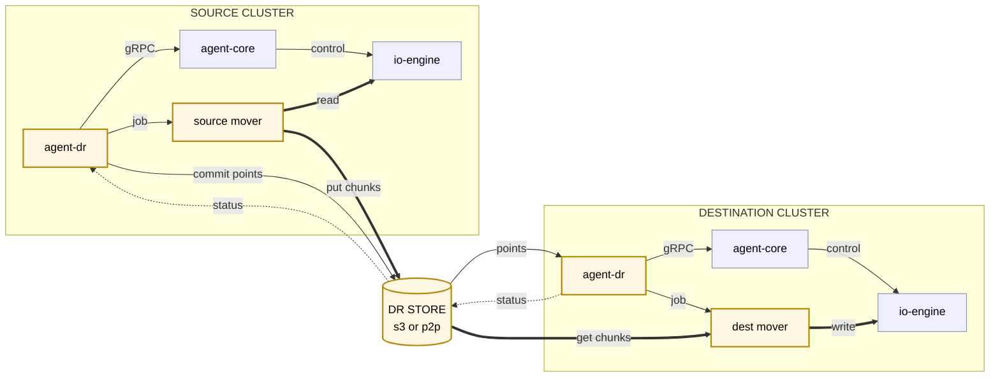
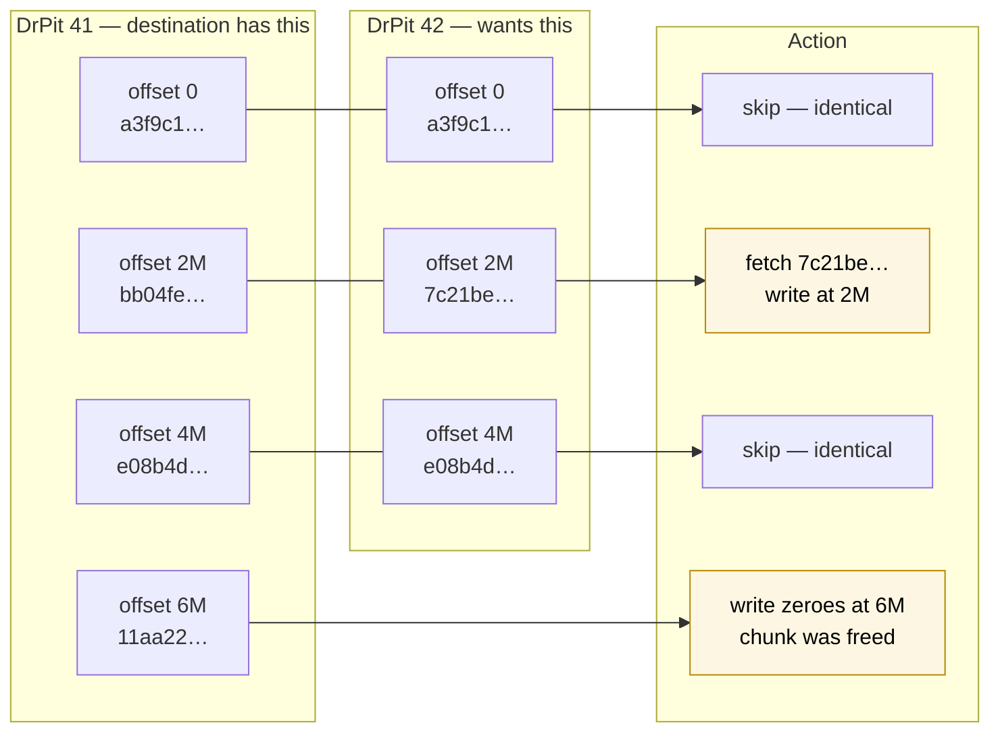
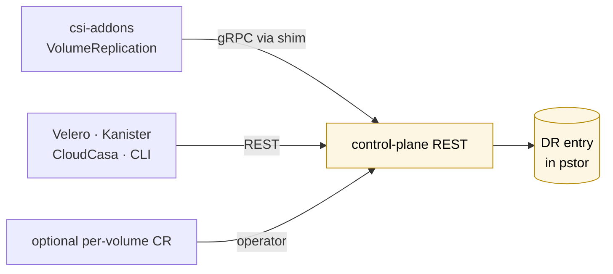
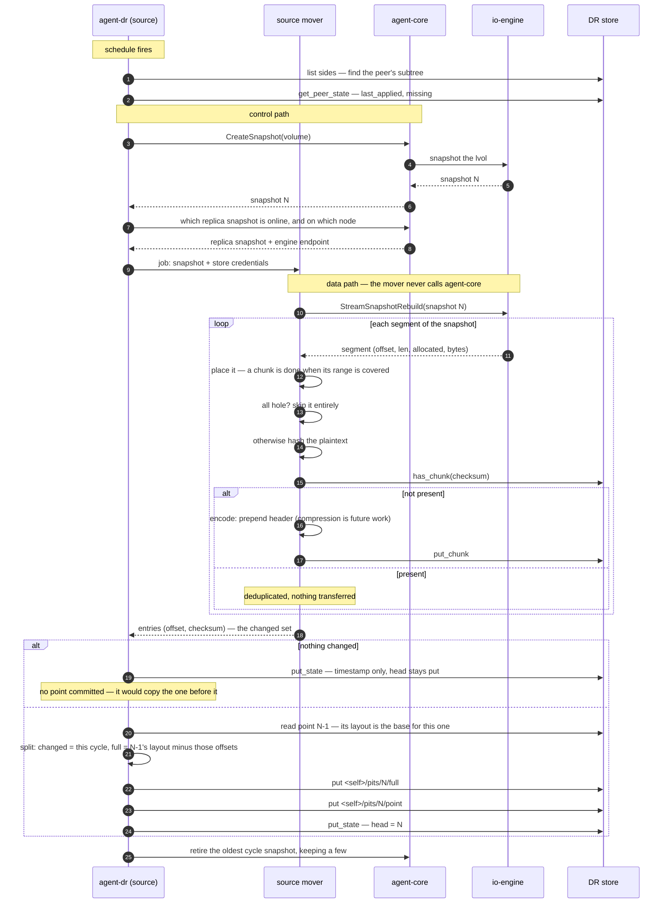
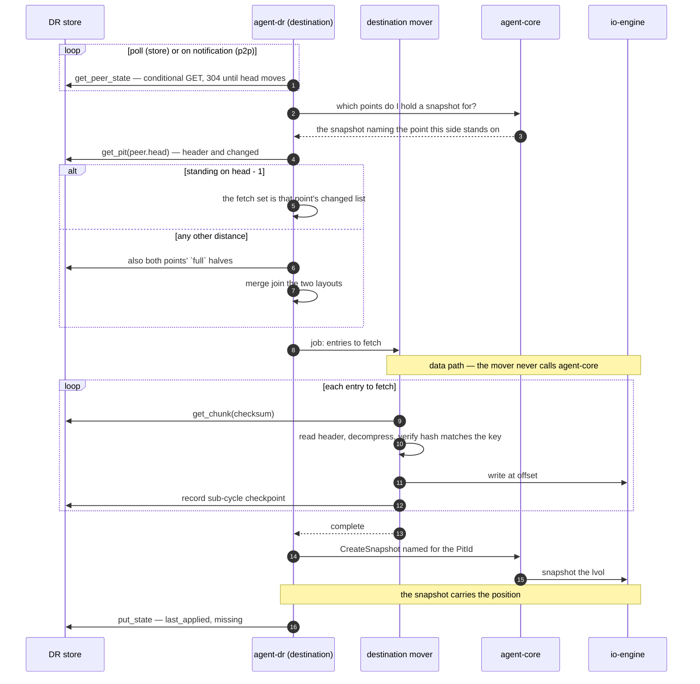
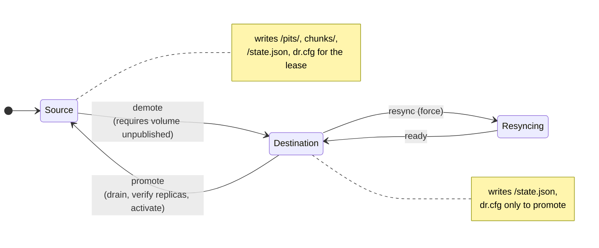
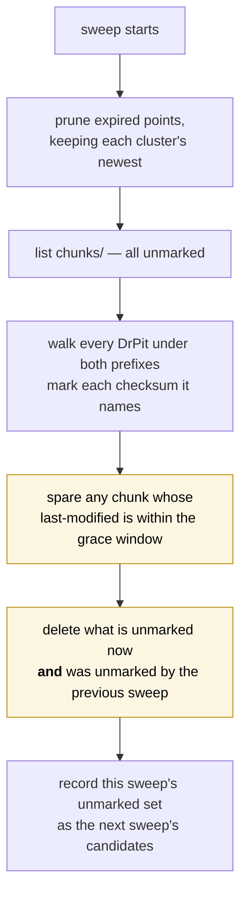
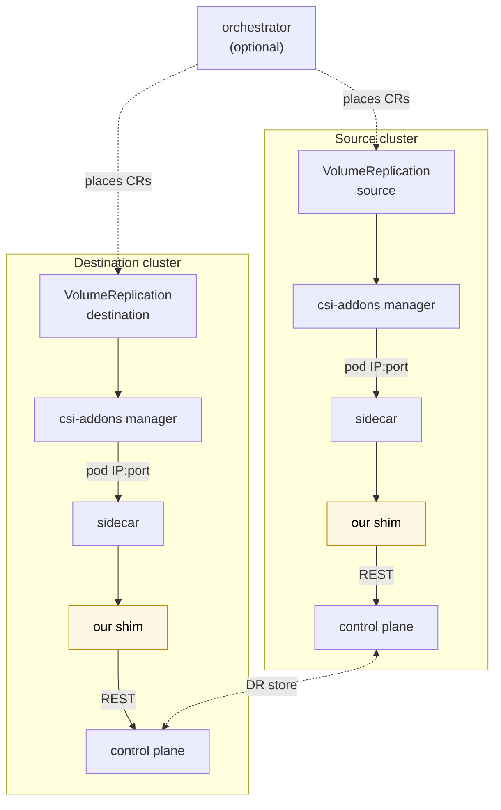

# Asynchronous Disaster Recovery for OpenEBS Mayastor

## Table of Contents

* [Summary](#summary)
* [Motivation](#motivation)
  * [Goals](#goals)
  * [Non-Goals](#non-goals)
* [Proposal](#proposal)
  * [Architecture](#architecture)
  * [Concepts](#concepts)
  * [The DR store](#the-dr-store)
  * [How convergence works](#how-convergence-works)
  * [The `DrStore` interface](#the-drstore-interface)
  * [Control-plane objects](#control-plane-objects)
  * [The replication cycle](#the-replication-cycle)
  * [Degradation and backpressure](#degradation-and-backpressure)
  * [Discovery](#discovery)
  * [Failover and failback](#failover-and-failback)
  * [Retention and garbage collection](#retention-and-garbage-collection)
  * [Integration with csi-addons](#integration-with-csi-addons)
  * [User Stories](#user-stories)
  * [Implementation Details](#implementation-details)
    * [Future improvements](#future-improvements)
  * [Risks and Mitigations](#risks-and-mitigations)
* [Graduation Criteria](#graduation-criteria)
* [Implementation History](#implementation-history)
* [Drawbacks](#drawbacks)
* [Alternatives](#alternatives)
* [Infrastructure Needed](#infrastructure-needed)

---

## Summary

This OEP proposes **asynchronous disaster recovery** for Mayastor: continuous,
incremental replication of a volume from one Kubernetes cluster to another, with
controlled failover and failback.

Replication is driven by a new control-plane agent, `agent-dr`, deployed on both
clusters. On a schedule, the source snapshots a protected volume, determines which
regions changed using the snapshot's allocation map, and copies only those regions to
a shared **DR store** — object storage today, with direct peer-to-peer behind the
same interface.
The destination discovers the new recovery point, applies the difference to
its own volume, snapshots to mark the position, and publishes its progress back
through the store.

The design has two defining properties:

- **Every recovery point is independently restorable.** A point records the complete
  layout of the volume at that instant, even though only changed data is uploaded. A
  destination can therefore converge from any point to any other in a single step,
  with no ordering constraints and nothing to replay in sequence.
- **Data is addressed by content.** A chunk of volume data is stored under the hash
  of its own bytes, so identical data is stored once, transfers are skipped when the
  data is already present, and every download is verifiable on arrival.

Orchestration remains someone else's job. `agent-dr` exposes a control-plane API that
Velero, Kanister, Ramen, CloudCasa or an operator of our own can drive, and a
csi-addons shim makes Mayastor usable by anything speaking the standard
`VolumeReplication` API.

## Motivation

Mayastor replicates synchronously *within* a cluster: a volume's replicas live on
different nodes and every write lands on all of them. This protects against node and
disk failure. It does not protect against the loss of the cluster, the rack, or the
site.

Users running Mayastor in production ask for a second copy somewhere else, kept
reasonably current, that can be brought into service when the source is gone. That
is asynchronous DR: bounded data loss (an RPO measured in minutes) in exchange for
tolerating an arbitrarily distant, intermittently connected, bandwidth-constrained
destination.

Every DR orchestrator in the ecosystem delegates the data plane to the storage system.
They decide *when* to replicate and *what else* to move — Kubernetes objects, hooks,
scheduling — and then call the storage driver to move the bytes. Mayastor currently has
nothing to call. Whatever orchestration layer is eventually chosen, this engine is the
part that must exist.

### Goals

- Replicate a Mayastor volume to a second cluster, incrementally and on a schedule,
  transferring only data that has changed.
- Support a **store-mediated** topology over object storage that requires no network
  path between clusters and no firewall exceptions, and keep direct peer-to-peer
  available behind the same interface.
- Recover cheaply when the destination has been unreachable: catch-up cost must depend
  on how much data changed, not on how many cycles were missed - for as long as the
  points it needs are retained. Past that it pays for the volume, not for the absence;
  see [degradation and backpressure](#degradation-and-backpressure).
- Survive a destination that loses its data entirely, without requiring the source to
  re-upload the whole volume.
- Support planned failover, forced failover, and failback.
- Provide a control-plane API — REST and gRPC — usable by any orchestrator, and a
  csi-addons shim so Mayastor works with tools that speak `VolumeReplication`.
- Verify data integrity on arrival at the destination.

### Non-Goals

- **Synchronous or near-synchronous replication.** This is asynchronous DR with a
  bounded RPO, not a stretched cluster.
- **Orchestrating Kubernetes objects.** Moving PVCs, Deployments, ConfigMaps and
  Secrets between clusters belongs to a backup or DR orchestrator. This OEP covers
  volume data and the API to drive it.
- **Application-consistent snapshots.** Crash consistency is what the storage layer
  can offer. Quiescing an application before a snapshot is the orchestrator's job,
  through its own pre- and post-hooks.
- **Multi-volume consistency groups.** Snapshots are per-volume. Group support is
  discussed under [Risks](#risks-and-mitigations) and the API is shaped so it can be
  added without a breaking change, but it is not delivered here.
- **More than one destination per volume.** Fan-out to multiple DR sites is a natural
  extension and the store layout permits it, but a single relationship per volume is
  what this OEP specifies.
- **Replicating between volumes of different cluster sizes.** The chunk size is the
  source volume's, and the destination writes at the offsets the point names, so the
  two sides no longer have to agree for the copy to be *correct*. What they would not
  share is efficiency: a destination whose clusters are larger than the chunk
  allocates more than it receives. Discovery therefore still creates the destination to
  match, and bridging two sizes deliberately is out of scope; see
  [compression and integrity](#compression-and-integrity).

## Proposal

### Architecture

`agent-dr` is a new agent alongside `agent-core`, `agent-ha` and `agent-jsongrpc`. The
same binary runs on both clusters and behaves differently according to each volume's
role.


```mermaid
graph LR
  subgraph SRC["SOURCE CLUSTER"]
    direction TB
    AD1["agent-dr"]
    MV1["source mover"]
    AC1["agent-core"]
    IO1["io-engine"]
    AD1 -->|job| MV1
    AD1 -->|gRPC| AC1
    AC1 -->|control| IO1
    MV1 ==>|read| IO1
  end

  STORE[("DR STORE<br/>s3 or p2p")]

  subgraph DST["DESTINATION CLUSTER"]
    direction TB
    AD2["agent-dr"]
    MV2["dest mover"]
    AC2["agent-core"]
    IO2["io-engine"]
    AD2 -->|job| MV2
    AD2 -->|gRPC| AC2
    AC2 -->|control| IO2
    MV2 ==>|write| IO2
  end

  MV1 ==>|put chunks| STORE
  AD1 -->|commit points| STORE
  STORE -->|points| AD2
  STORE ==>|get chunks| MV2
  AD2 -.->|status| STORE
  STORE -.->|status| AD1

  classDef ours fill:#fdf6e3,stroke:#b58900,stroke-width:2px,color:#000
  classDef plain fill:#eef,stroke:#88a,color:#000
  class AD1,AD2,MV1,MV2,STORE ours
  class AC1,AC2,IO1,IO2 plain
```

Thick edges are the **data path**, thin edges control, dotted the status channel. The
`DrClusterPair` operator is omitted for clarity — it reconciles the CRD onto the
control-plane REST API and does not sit in either path. Four things to note:

1. **Control and data are separate.** `agent-dr` calls `agent-core` over the existing
   internal gRPC to snapshot, clone, publish and create volumes. The movers never talk
   to `agent-core` at all — they read and write volume data against **io-engine**,
   over NVMe-oF or an attached block device.
2. **Nothing crosses at the Kubernetes layer.** Neither cluster holds credentials for
   the other's API server. The only cross-cluster path is the DR store.
3. **`agent-dr` never moves bytes.** It decides what to copy and hands a
   fully-specified job to a mover. This keeps the mover a dumb executor and lets the
   mover implementation change without renegotiating anything.
4. **The store is bidirectional but not symmetric.** The source writes data and
   recovery points; the destination writes only its status.

### Concepts

| Term | Meaning |
|---|---|
| **Chunk** | A fixed-size slice of a volume's address space, derived from the **volume's cluster size** and capped at 4 MiB: the cluster itself when it is no larger than the cap, and otherwise the largest even fraction of it that fits. 4 MiB is both the cap and the default cluster size (`DEFAULT_CLUSTER_SIZE`, `io-engine/src/lvs/lvs_store.rs:52`), so the two coincide by default. Fixed for the life of a relationship. The unit that is hashed, stored and transferred |
| **Segment** | The engine's unit on the wire: one read of a snapshot, 64 KiB (`SPDK_BDEV_LARGE_BUF_MAX_SIZE`), carrying either data or a hole. Distinct from a chunk and not a divisor of it — the mover reassembles segments into chunks |
| **Checksum** | The SHA-256 of a chunk's *uncompressed* contents. It is simultaneously the chunk's identity, its storage location, and its integrity check |
| **DrPit** | A *DR point-in-time*: the complete layout of a volume at one instant, as a list of `(offset, checksum)` |
| **Relationship (`dr-id`)** | The pairing of a source volume with a destination volume, minted when DR is enabled. It outlives any particular direction |
| **DR store** | Where chunks and DrPits live. Object storage, or a peer `agent-dr` |

### The DR store

#### Layout

```text
<prefix>/dr/<dr-id>/
    chunks/<aa>/<bb>/<checksum>          content-addressed, immutable; the same bytes are the same key
    <side>/<cluster-uid>/dr.cfg                 this side's account of itself and of the relationship
    <side>/<cluster-uid>/state.json             this side's progress: head, what it has applied, what it could not
    <side>/<cluster-uid>/pits/<seq:016d>/point  a DrPit: its header, and the chunks that cycle changed
    <side>/<cluster-uid>/pits/<seq:016d>/full   the chunks that point did not change
<prefix>/clusters/<cluster>/cluster.cfg    reserved: a per-cluster heartbeat, written only by its owner
```

**Each side writes only under its own subtree.** `<side>` is the end of the relationship
this cluster holds, named in its `DrClusterPair`; that CR is the handshake — it tells
each cluster the other's name. `<cluster-uid>` is the cluster's own identity, the same
one its control plane already keys its persistent store on: in Kubernetes the uid of the
`kube-system` namespace. Every key under `<side>/<cluster-uid>/` has exactly one writer,
so those writes need no precondition and nothing there is contended. `chunks/` is
shared only in the sense that both clusters put into the same pool: the key is the hash
of the content, so the same bytes are the same object and a second writer changes
nothing.

**The two halves answer different questions, and both are needed.** The uid is what a
cluster *is* and cannot be chosen wrongly, so it keeps two clusters that were both named
`east` from colliding. The side name is which end of a relationship a cluster *holds*,
and it is what separates two sides that share a uid — which is every loopback, one
cluster standing in for both ends, and the ordinary way to exercise the protocol without
a second cluster. Neither alone is sufficient.

**There is no object both clusters write**, and therefore no compare-and-swap anywhere
in the steady state. Each side publishes its own `dr.cfg` under its own subtree, saying
who it is and what it believes; a side finds its peer by listing the configs under the
relationship and taking the one whose `uid` is not its own. The cost of this is that
facts requiring *agreement* — which cluster is source, the epoch, the sweep lease —
have nowhere to live; see [the relationship configuration](#the-relationship-configuration).
Credentials follow the layout: `Put` on `<self>/` and `chunks/`, read on the rest —
and because `<cluster>` stays outermost, one grant on `<cluster>/*` covers every
relationship that cluster takes part in, rather than needing a new one per relationship.

**Which end a volume holds is derived, not configured.** A pair names both ends and says
which one its own cluster holds, so that is the default and the only answer a
two-cluster deployment ever needs. Where another volume in the same relationship already
holds that end, the next takes the far one — which can happen only when one cluster
stands in for both sides, since a relationship has exactly one entry per control plane
and an agent can therefore contend only with itself. Deriving it rather than offering a
per-volume setting matters: the alternative is a knob that lets a cluster be told to
write under its peer's name, which is the one thing the layout exists to prevent.

The entry records the end it took, so it does not move under a volume once chosen.

Throughout the rest of this document `<self>/` and `<peer>/` are shorthand for the two
`<side>/<cluster-uid>/` subtrees. A side knows its own from its pair and its own
identity; it finds its peer's by listing the relationship and taking the config that
answers to the name its pair expects the peer under.

**Two documents carry everything the peer needs.** `<peer>/dr.cfg` says who the peer
is and where its subtree is; `<peer>/state.json` says how far it has got. The source
publishes the sequence of its newest point; the destination publishes what it has applied
and what it could not. Finding the peer costs one listing of the relationship, done
once; after that each side polls those two objects and nothing else — a `GET` each, or a
conditional `GET` on the ETag that returns 304 when nothing has changed.

Points and chunks are written exactly once. A cycle uploads its chunks, *commits*
by creating `<self>/pits/<seq>` with the complete entry list, and only then advances
`head` in its state; until the create succeeds the point does not exist, and until the
state is updated the peer does not look for it. There is no in-progress marker in the
store — a point is either absent or complete.

The prefix is keyed on the **relationship**, not on either volume, so it does not move
when the direction of replication does. Each cluster's control plane maps its own
volume UUID to the `dr-id`; **the two volumes have different UUIDs**, because they are
distinct objects in distinct control planes.

That has a consequence for anything that carries a volume identity across clusters. A
PV's `volumeHandle` *is* the Mayastor volume UUID — the CSI controller derives it from
the PVC — so a PV restored on the destination by an orchestrator names the *source*
volume, and so does every csi-addons RPC issued against it. The DR entry therefore
records **both** UUIDs — its own volume and the peer's — and the REST API and the
csi-addons shim resolve a volume UUID they do not own through that mapping before
rejecting it. Each cluster's `state.json` carries its own volume UUID, so either side
can populate the mapping from the store alone. Creating the destination volume *with
the source's UUID* would make the mapping unnecessary and is worth evaluating; the
mapping is the design because it works whether or not that turns out to be possible.

The two sides share one prefix because that prefix *is* the communication channel.
Consistency is not at risk: the source writes `<self>/dr.cfg`, `<self>/pits/`,
`<self>/state.json` and `chunks/`; the destination writes `<self>/dr.cfg` and
`<self>/state.json`; and neither writes anything the other does.

#### The relationship configuration

```rust
/// `<side>/<cluster-uid>/dr.cfg`. One per side, written only by the side it describes,
/// so it needs no precondition and can never be contended.
struct DrConfig {
    dr: DrId,
    cluster: ClusterId,     // the end of the relationship this side holds
    uid: ClusterUid,        // this cluster's own identity
    peer: ClusterId,        // the end it expects to find the other under
    volume: VolumeId,       // this side's volume — populates the peer mapping
    role: Role,             // what this side believes it is
    cluster_size: u64,      // the volume's geometry — what a matching volume is built from
    chunk_size: u64,        // derived from cluster_size; the unit this side's points use
}
```

A side writes this when it joins, and finds its peer by listing the configs under
`<prefix>/dr/<dr-id>/` and taking the one whose `cluster` is the name its pair expects
the peer under. **Named rather than deduced**: taking "whichever side is not us" is
correct only while there are exactly two configs, and a volume re-targeted away from a
relationship and back leaves one behind under its old subtree that would then be
selectable. Matching the expected name also makes a misconfigured pair visible, instead
of converging against whatever happened to be there.

The cluster uid is not configured and not invented here. `agent-dr` asks the core agent
for it — a `GetClusterInfo` on the registry service — so it is by construction the same
identity the control plane already keys its own persistent store on, rather than a
second opinion about which cluster this is. Core is a hard dependency for it, and
nothing orders the two agents, so the call is retried rather than fatal: there is
nothing useful to do without the answer and nothing harmful about waiting for it.

**This is a departure from one shared `dr.cfg` written by both clusters under
compare-and-swap, and it is not free.** What it buys is that the design has no
conditional write at all: every object has exactly one writer, which matters because
conditional writes are the one store capability that cannot be assumed — the Garage
instance used for development accepts `If-Match` and does not enforce it, which is worse
than refusing it. What it costs is that the facts the two clusters must *agree* on no
longer have a home:

| Fact | Was | Now |
|---|---|---|
| Which cluster is source | `dr.cfg.source`, settled by CAS | each side's own belief, in its own config; nothing arbitrates |
| The epoch a point was committed under | `dr.cfg.epoch`, raised by promotion | carried on each `DrPit`, but nothing raises it |
| Who is running the retention sweep | `dr.cfg.sweep_lease` | nowhere |

That is tolerable only while there is exactly one source by construction, which is
true today because nothing promotes. **Failover cannot be built on this layout as it
stands.** Three ways forward, none chosen:

1. **A single lease object at the relationship root**, written by CAS, carrying only
   what needs agreement — `source`, `epoch`, `sweep_lease` — while identity and
   progress stay per-side. One conditional write instead of none, confined to the
   operations that genuinely contend.
2. **Arbitration outside the store**, by whatever already coordinates the two clusters.
   Moves the problem rather than solving it, but a fleet that has such a thing should
   not be made to reimplement it in an object store.
3. **No automatic failover.** Promotion stays an operator action with an out-of-band
   interlock. Honest, and much less useful.

> **A role is a belief.** Each cluster's DR entry carries a `role`, and its `state.json`
> and `dr.cfg` echo it, but none of them is authoritative: they record what that cluster
> *currently believes*. Under the shared-config design `dr.cfg` was the fact that settled
> it. There is no such fact now, so two clusters that both believe they are source would
> both act on it — which is the precise reason the layout cannot carry failover yet.
> See [forced failover and split-brain](#forced-failover-and-split-brain).

#### A cluster's state

```rust
/// `<side>/<cluster-uid>/state.json`. The one object a side rewrites; the peer reads it.
struct ClusterState {
    cluster: ClusterId,
    dr: DrId,
    volume: VolumeId,             // this cluster's volume — populates the peer mapping
    role: Role,                   // Source | Destination | Resyncing — what this cluster believes; nothing decides

    // as source
    head: Option<u64>,            // sequence of the newest point under <self>/pits/
    head_at: Option<Timestamp>,   // when it was committed

    // as destination
    last_applied: Option<PitId>,  // None until the first point is applied
    applied_at: Option<Timestamp>,// when it was applied
    cycle: Option<CycleProgress>, // the in-flight convergence, if any
    /// Entries the destination could not apply — a 404 or a hash mismatch on the
    /// chunk. The source treats these offsets as changed in its next cycle; see
    /// retention and garbage collection for why the report is necessary.
    missing: Vec<ChunkRef>,

    observed_at: Timestamp,       // when this was written
}
```

**The two timestamps are what make a lag answerable.** Points are committed on a
schedule, so how far a destination is behind is a question about time, not about a count
of points: a sequence number says the gap is three points, which could be thirty seconds
or a day. The source subtracts the destination's `applied_at` from its own `head_at`; a
destination that has applied the newest point is not behind at all. Both fields are
optional, so a side that has written neither is reported as unknown rather than guessed
at — an unknown lag is honest, and a fabricated one reads as progress.

#### A DrPit

```rust
/// Names a point: the cluster that wrote it and its sequence under that cluster.
struct PitId {
    writer: ClusterId,
    seq: u64,
}

/// `<self>/pits/<seq:016d>/point`.
struct DrPit {
    id: PitId,
    dr: DrId,                 // the relationship
    epoch: u64,               // the writer's epoch when it committed this point
    volume_size: u64,         // grows on resize; the destination grows to match
    chunk_size: u64,          // derived from the volume's cluster size; the writer's unit
    allocated: u64,           // bytes this point's chunks cover, as against volume_size
    carried: u64,             // how many chunks the `full` half holds
    snapshot: SnapshotId,     // the volume snapshot this point was taken from   (not built)
    replica_snapshot: Uuid,   // the replica snapshot actually read                (not built)
    /// Sorted by offset: what the cycle that produced this point changed.
    changed: Vec<ChunkRef>,
}

struct ChunkRef {
    offset: u64,
    checksum: Hash,   // names the stored object
}
```

A DrPit names **every allocated chunk**, not only the changed ones — but only changed
chunks are ever uploaded. That combination is what makes each point independently
restorable while keeping transfers incremental.

> The entry list is **state, not history**. It describes the volume *as of this
> point*, so a chunk that was written earlier and has since been trimmed is absent.
> Accumulating "everything ever changed" would resurrect freed data on a full rebuild
> and defeat thin provisioning.

**The list is split across two objects**, and the division is what the cycle changed
against what it did not:

| Object | Holds | Read by |
|---|---|---|
| `pits/<seq>/point` | the header above, and the chunks that cycle changed | everyone |
| `pits/<seq>/full` | every chunk the point did *not* change, carried from the point before | a convergence across more than one point, and a restore |

The two are **disjoint**: `full` completes the point rather than repeating it, so a
cycle that rewrote the whole volume lists every chunk once in `point` and writes no
`full` at all. Their union, in offset order, is the whole volume.

This replaces a `changed` flag on each entry, which said the same thing but only after
the entire list had been decoded. A destination exactly one point behind — the steady
state — now reads one small object and nothing else, because the difference between
consecutive points *is* the newer one's `changed` list. At 10 TiB with 1% of the volume
moving per cycle that is 1.4 MB rather than the 280 MB that joining two whole layouts
costs.

Both halves sit under the point's own prefix rather than beside it: `pits/` is listed to
find the newest point and the sequence is zero-padded so that listing is chronological,
so a suffix on the point's key would have sorted a point's second half between it and
the next point.

**Neither list is JSON.** Each entry is a fixed-width binary record — an 8 byte offset
and the 32 byte hash — because the list is the only part of a point whose size follows
the volume. As JSON an entry costs about 119 bytes against 40 packed, which at 10 TiB
and 4 MiB chunks is 312 MB against 105 MB, written every cycle and read by every
convergence that is not consecutive. `changed` is base64'd to sit inside the header's
JSON; `full` is its own object and so is written raw, which is the third that base64
would otherwise add. The header stays plain JSON, since it is a fixed handful of fields
at any scale and is the half anyone reads by hand.

`allocated` and `carried` are in that header so the size and shape of `full` are known
before deciding to fetch it — and so that a `full` which is absent or the wrong length
is an error rather than something to read as an empty list, which would silently hand
back a layout missing most of the volume.

> A debugging switch (`--json-chunks`, or `DR_JSON_CHUNKS`) writes both lists as
> plain JSON instead, at roughly three times the size. Reading never depends on it: a
> packed list is a JSON string and a readable one an array, and `full` is distinguished
> by a leading `[`, which is unambiguous because a packed list begins with the low byte
> of a chunk-aligned offset and is therefore always zero. A store may hold both forms
> at once.

#### Addressing

A chunk's location is **computed from its checksum**, never looked up:

```text
s3://<bucket>/<prefix>/dr/<dr-id>/chunks/<c[0..2]>/<c[2..4]>/<checksum>
                                         └ two-level fan-out, 65536 shards ┘
```

Bucket and prefix come from the `DrClusterPair`, the `dr-id` from the local DR entry,
and the rest from the checksum itself. So `(dr-id, checksum)` yields an exact key with
no index and no round trip.

Note what is **not** in the path: the offset. The checksum says *what the bytes are*;
the DrPit entry says *where they go*. Identical content at different offsets, or in
different points, is one object.

**Why the address is computed rather than recorded.** Naming an object by its contents
collapses four problems that an allocated-name scheme has to solve separately:

- **Writes are idempotent.** Re-uploading a chunk writes the same bytes to the same
  key, so a cycle interrupted halfway has nothing to roll back and a retry is free. No
  two writers can disagree about a key, because agreeing on the content *is* agreeing
  on the key.
- **Deduplication is a property of the namespace**, not a pass that runs over it. Data
  rewritten with the same contents, moved between offsets, or shared between points, is
  already there — the cycle finds out with an existence check, not a comparison.
- **Verification is intrinsic.** The destination re-hashes what it downloads and
  compares against the name it asked for, so a truncated transfer or a corrupted object
  is caught before it reaches a replica. A recorded name would need a checksum stored
  beside it, and something to keep the two in step.
- **There is no index.** `(dr-id, checksum)` is the key, so nothing has to be looked
  up, kept consistent with the data, or recovered when it disagrees.

This is the bargain git makes — objects are named by the hash of their contents and
never mutated — and the one OCI registries make, where blobs are addressed
`sha256:<digest>` and a manifest is a list of digests rather than of filenames. What it
costs is that nothing can be edited in place: every change is a new object, and
reclaiming space becomes a reachability question rather than an overwrite, which is why
retention is a sweep over what the surviving points reference.

**Why the prefix.** The leading four hex digits of the checksum name a shard, split
across two levels so the fan-out at each is 256 — 65,536 shards, about 40 chunks each
for a fully allocated 10 TiB volume at 4 MiB chunks. Three things improve with it:

- **Request rate.** S3 scales throughput per prefix, and its own guidance is to
  [distribute requests across multiple prefixes](https://docs.aws.amazon.com/AmazonS3/latest/userguide/optimizing-performance-design-patterns.html#optimizing-performance-high-request-rate)
  rather than let a sequential or shared one become the unit of contention. A flat
  namespace caps what a mover can drive however much concurrency it is given.
- **Backing stores that are filesystems.** S3-compatible implementations commonly map
  keys onto directories, and a single directory holding millions of entries degrades on
  most filesystems.
- **Listing.** `LIST` is paginated, so a sweep over a flat namespace is inherently
  serial; sharded, it is 65,536 independent listings that can run in parallel.

**Sharding on the leading digits of a content hash is an established pattern**, and the
reason given for it is usually the second point above rather than the first:

- Git splays loose objects over 256 subdirectories named by the first two characters of
  the object id. [The documented rationale](https://git-scm.com/docs/gitrepository-layout)
  is "to keep the number of directory entries in `objects` itself to a manageable number".
- Restic files pack files at `data/<first two hex digits>/<sha-256>`
  ([repository layout](https://restic.readthedocs.io/en/stable/100_references.html)).
- Two levels of two digits is equally common — `objects/ab/cd/abcd1234…` in
  [content-addressed records](https://www.knowledgefutures.org/updates/2026-06-08-content-addressed-records/),
  and `chunks/sha256/aa/bb/aabb<rest>.chk` in
  [pg_hardstorage](https://docs.pghardstorage.org/explanation/content-addressed-storage/),
  which gives the clearest reason for the depth: the split "is sized so the directory
  fan-out at each level caps at 256 — object stores hate wide listings, and this layout
  caps the per-prefix LIST cost even at very large scale".

Depth and width differ between them; what does not is cutting the shard from the hash.
Two levels of two is the choice here, for the reason pg_hardstorage gives: it keeps the
fan-out at *each* level to 256 while still giving 65,536 shards. A single level of four
digits reaches the same shard count with a shorter key, but puts 65,536 entries under
one prefix — more than a delimited `LIST` returns in a page, and close enough to the
historical ext4 64,000-subdirectory limit to be unwise on a filesystem-backed store.
Width is a constant (`PREFIX_DIGITS`); depth is the part that would be awkward to
change later, which is the argument for taking the conventional one.

That last part is the one worth being deliberate about, because the alternative is
tempting and wrong. Nixpkgs shards a plain source tree the same way —
`pkgs/by-name/<first two characters>/<package>/`, so that twenty thousand packages are
not twenty thousand directory entries — but it shards on the **name**, and names are
not uniformly distributed. Its busiest prefix, `li`, holds 1,134 of 20,666 packages
against a mean of 28, about 41x, while many hold one. That is harmless for a tree a
human navigates and unacceptable for a key a store load-balances on. A checksum has no
such structure: the same item count spread over hash prefixes lands within a few
percent of the mean. **The shard is even because it is cut from the hash**, not because
of how many there are.

Sharding is a response to the backing store and the object count rather than something
content addressing requires — a store that shards internally, or a small enough
relationship, would not need it. It costs nothing to keep when it is not needed.

#### Compression and integrity

**The checksum is over uncompressed data.** If it were over the compressed form, the
address would depend on the codec and level: identical data compressed two ways would
get two names, deduplication would break, and the codec could never change without
orphaning everything.

Compression is therefore an encoding applied *beneath* the address, and each stored
object says how it was encoded:

```text
chunks/<aa>/<bb>/<checksum>
  ┌────────┬─────┬──────┬───────────┬─────────┐
  │ magic  │ ver │ algo │ plain_len │ payload │
  └────────┴─────┴──────┴───────────┴─────────┘
```

Three consequences worth stating:

- **Changing codec needs no migration.** The key is the plaintext hash, so an existing
  object is found and skipped whatever its encoding. Old chunks keep theirs forever;
  new ones use the new codec.
- **`none` is a first-class algorithm.** Already-compressed or encrypted payloads do
  not shrink; the source measures and stores raw rather than spending CPU to grow the
  object.
- **Verification is free.** Because the name *is* the hash, the destination re-hashes
  everything it downloads. Store corruption and truncated transfers are detected
  rather than silently applied.

> **Phase 1 writes every chunk with `algo: none`.** The header is present from the
> first release, but no codec is implemented. This is deliberate: compression is pure
> CPU on the source, which is already the heavier side, and deferring it removes a
> tuning problem from the initial release without costing anything later — precisely
> because the header makes adopting a codec a no-migration change. See
> [Future improvements](#future-improvements).

**The chunk size is derived from the volume's cluster size, capped at 4 MiB.**
Allocation is tracked per *cluster*, so a chunk that lies inside one cluster is
either all data or all hole, and nothing is uploaded that the volume did not allocate.
That property holds exactly when the chunk size divides the cluster size, so the rule
is: the largest divisor of the cluster size that is at most `MAX_CHUNK_SIZE` (4 MiB).
A 1 MiB cluster gets 1 MiB chunks, 3 MiB gets 3 MiB, 8 MiB and 32 MiB and 1 GiB all
get 4 MiB. Cluster sizes are multiples of 1 MiB up to 1 GiB
(`Lvs::create_from_args_inner`), which is the only shape this has to tile.

The cap is a deliberate choice, not just a safety limit. A 32 MiB chunk would mean
32 MiB objects and a 32 MiB dedup unit, so a change anywhere in a cluster would
re-upload all of it. At 4 MiB the cluster splits into eight independently addressed
pieces and the ones whose contents did not actually change deduplicate against what is
already stored. The cost of the cap is that a larger cluster no longer reduces object
count — the count follows the chunk, not the cluster — which is why
[risks](#risks-and-mitigations) lists object count as a standing exposure rather than
something an operator can tune away by choosing bigger clusters.

Mayastor already requires every replica pool of a volume to share one cluster size, and
the scheduler enforces it, so the value is taken from the *volume* rather than from
whichever pool a replica happens to sit on: it is fixed at creation and cannot drift as
replicas move. Both the side's `dr.cfg` and every DrPit record the resulting
`chunk_size` from that same input, so a point cannot disagree with the unit its
relationship advertises, and the destination refuses a point whose `chunk_size` is
not the one the source published.

`dr.cfg` records the **cluster size as well as** the chunk size, because the
derivation is lossy in exactly the direction discovery has to read it: every cluster at
or above the cap yields a 4 MiB chunk, so 8 MiB, 32 MiB and 1 GiB clusters are
indistinguishable from the unit alone. A side applying points needs the unit; a side
*building a volume to match* needs the geometry. Stating both rather than inferring one
also means a later change to the derivation rule cannot retroactively reinterpret what
an existing relationship meant. Discovery creates the destination volume with
`cluster_size` pinned to the source's — `CreateVolumeBody` accepts it and restricts
placement to matching pools — so a failover does not change the chunk size either.

**The cluster is the floor on *read* amplification; the chunk is the floor on
*upload*.** A snapshot records change at cluster granularity — a 4 KiB write into an
untouched cluster copies and allocates the whole cluster — so no sub-cluster change
information exists to exploit, and the cycle must read and hash every byte of a changed
cluster to find out what moved. What it *uploads*, though, is per chunk: when the
chunk is smaller than the cluster, the pieces whose contents are unchanged
deduplicate and never leave the cluster. A workload with scattered small writes still
uploads many times what it wrote, and this is inherent to the mechanism rather than a
tuning problem — compression ([future improvements](#future-improvements)) shrinks the
bytes but not the count. It is listed under [risks](#risks-and-mitigations).

Hash length, by contrast, is a deliberate choice: 256-bit, un-truncated. A collision
means silently serving the wrong bytes, which is the worst failure available to a DR
system, and the 32 bytes per entry are noise against 4 MiB payloads.

### How convergence works

This is the core of the design, so it is worth walking through concretely.

The destination holds DrPit 41. The source has committed DrPit 42. Converging is a
**merge join over two sorted lists**:


```mermaid
graph LR
  subgraph P41["DrPit 41 — destination has this"]
    A1["offset 0<br/>a3f9c1…"]
    B1["offset 2M<br/>bb04fe…"]
    C1["offset 4M<br/>e08b4d…"]
    D1["offset 6M<br/>11aa22…"]
  end
  subgraph P42["DrPit 42 — wants this"]
    A2["offset 0<br/>a3f9c1…"]
    B2["offset 2M<br/>7c21be…"]
    C2["offset 4M<br/>e08b4d…"]
  end
  subgraph ACT["Action"]
    AR["skip — identical"]
    BR["fetch 7c21be…<br/>write at 2M"]
    CR["skip — identical"]
    DR2["write zeroes at 6M<br/>chunk was freed"]
  end
  A1 --- A2 --> AR
  B1 --- B2 --> BR
  C1 --- C2 --> CR
  D1 --> DR2

  classDef act fill:#fdf6e3,stroke:#b58900,color:#000
  class BR,DR2 act
```

Two small documents are read; **one 4 MiB chunk is transferred**. The rest of the
volume is already correct and is never touched.

Three properties fall out of this, and they are the reason for the format:

**Any two points can be joined directly.** Because each list is absolute rather than
relative, going from point 41 to point 91 is the same single merge join as 41 to 42 —
it simply yields a larger result. A destination that has been unreachable for a week
pays for *what changed*, not for *how many cycles it missed*.

**There is no ordering requirement.** Nothing must be replayed in sequence, so there
are no sequence gaps to detect and no in-order application to enforce. The sequence
number in the key exists only so that "latest" is answerable by listing.

**One point behind is answered without the join at all.** It is the steady state, and
the point's `changed` half already *is* the difference against the point before it, so
neither layout is read. Any other distance falls back to the merge join — and that
fallback is not only about correctness. Replaying a gap of *n* points applies the sum of
*n* changed sets where the join applies their union, so a hot working set would be
written over and over; at 4 MiB a chunk that swamps any metadata saving by the second
point. Consecutive replay is the fast path, not the general strategy.

**Freed space propagates for free.** The fourth row above — an offset present in the
old list and absent from the new — means the chunk was trimmed, and the diff emits a
zero write. Holes are distinguished from zeroes structurally rather than by carrying
extra metadata.

> **Not yet true in the implementation.** A cycle reads what its snapshot's own blob
> allocated, which answers "changed since the parent" and "trimmed since the parent"
> identically — both are simply absent. A point therefore carries every offset the
> previous point had, and an offset never leaves a layout, so the fourth row never
> occurs and freed space does not reach the destination. The convergence computes the
> freed set anyway and reports it, so the day the source can express a trim the
> destination is already asking the right question.
>
> Separating the two needs the snapshot's allocation map rather than its delta. The
> engine reserves a request field for exactly that — a bitmap whose set bits are the
> allocated chunks, fetched by an `nvme-admin` command — but does not serve one, and
> rejects a supplied one. That is the work this depends on.

And because each point lists everything, **a destination that has lost its data can
restore from any single surviving point**, downloading only what it does not already
have. The source is not involved.

**Volume growth propagates through `volume_size`.** A resized source simply has a
longer allocation map, and the entries beyond the old size are new, so they appear as
changed. Before applying a point the destination compares its `volume_size` with its
own volume and **grows the volume first** when the point is larger, so a point is never
applied to a volume too small to hold it. Mayastor does not shrink volumes, so a point
*smaller* than the destination volume is an error rather than a resize.

### The `DrStore` interface

Everything above `DrStore` is unaware of the transport. The methods are concrete
operations, grouped so the caller is evident:

```rust
#[async_trait]
trait DrStore {
    // ---- identity: each side writes its own, and finds the peer by listing ----
    async fn put_cfg(&self, dr: &DrId, cfg: &DrConfig) -> Result<()>;               // PUT <self>/dr.cfg
    async fn get_cfg(&self, dr: &DrId, side: &Side) -> Result<Option<DrConfig>>;
    async fn list_sides(&self, dr: &DrId) -> Result<Vec<DrConfig>>;                 // the peer is the one named by the pair
    async fn list_relationships(&self) -> Result<Vec<DrId>>;                        // what discovery walks           (not built)

    // ---- the state documents: each cluster writes its own, reads the peer's ----
    async fn put_state(&self, dr: &DrId, s: &ClusterState) -> Result<()>;           // PUT <self>/state.json
    async fn get_state(&self, dr: &DrId, side: &Side) -> Result<Option<ClusterState>>;

    // ---- written by the source ----
    async fn has_chunk(&self, dr: &DrId, hash: &Hash) -> Result<bool>;
    async fn put_chunk(&self, dr: &DrId, hash: &Hash, data: Bytes) -> Result<()>;
    /// Writes `full` and then `point`, and writes no `full` when `carried` is empty.
    async fn commit_pit(&self, dr: &DrId, pit: &DrPit, carried: &[ChunkRef]) -> Result<()>;
    async fn delete_pit(&self, dr: &DrId, id: &PitId) -> Result<()>;                // both halves; nothing calls it yet

    // ---- read by the destination ----
    async fn get_pit(&self, dr: &DrId, id: &PitId) -> Result<Option<DrPit>>;        // header and changed
    /// Both halves merged. Errors rather than guessing if `full` is absent or the
    /// wrong length — read as empty it would return a layout missing most of the volume.
    async fn get_pit_layout(&self, dr: &DrId, id: &PitId) -> Result<Option<Vec<ChunkRef>>>;
    async fn get_chunk(&self, dr: &DrId, hash: &Hash) -> Result<Bytes>;
    async fn list_relationships(&self) -> Result<Vec<DrId>>;                         // discovery only
}
```

**There is no conditional write.** `put_cfg` was the one operation that needed a
compare-and-swap and no longer does, since each side writes only its own config. What
that costs is set out under [the relationship
configuration](#the-relationship-configuration).

One document is all either side *polls*: the peer's `ClusterState`, which answers, for
the destination, "is there a new point?" (`head` moved) and, for the source, "what did
the destination make of my last point?" (`last_applied`, `missing`). The peer's
`dr.cfg` is read once, to find which subtree that is.

Two implementations sit behind the trait:

| | `s3` | `p2p` |
|---|---|---|
| Transport | HTTPS to an object store | gRPC to the peer `agent-dr` |
| Firewall between clusters | **none required** | required |
| Freshness of status | poll interval | immediate |
| Storage cost | a bucket | none |
| Phase | 1 | 3 |

`s3` is the design target. `p2p` is simply *"the peer is the store"* — the same trait
served by the counterpart's `agent-dr` from its own volumes, with no object store
involved. It trades the firewall exception for lower latency and no bucket to pay for,
and nothing above the trait changes; `put_cfg`'s compare-and-swap is a mutex around
one struct on the serving side.

The trait exists so that this remains a deployment choice rather than an architectural
one. Other object stores — GCS, Azure Blob — are the same implementation with a
different client.

> **Where this abstraction can leak:** latency. A `p2p` `get_peer_state` answers in
> microseconds; the `s3` one is only as fresh as the peer's last publish plus the poll
> interval. No consumer may assume promptness, which is why `ClusterState` carries
> `observed_at` and why the volume's DR state includes an explicit `Unknown`.

#### One document per side keeps listing off the hot path

**`LIST` is the expensive operation and the design avoids it in every repeated path.**
It is billed with the PUT-class requests — roughly 12.5x a GET on S3 — has higher and
more variable latency because it is served from the metadata index rather than the
object path, and is where prefix-level throttling appears first.

So nothing is discovered by listing in the steady state. Each side reads `dr.cfg` and
the other's `state.json`, and everything else it needs is a key it can construct from
those two documents:

| Repeated question | How it is answered | Cost |
|---|---|---|
| Either: where is the peer's subtree? | `LIST` the relationship once, then `GET <peer>/dr.cfg` | not repeated |
| Destination: is there a new point? | `GET <peer>/state.json` — `head` moved | one GET, 304 when unchanged |
| Destination: fetch it | `GET <peer>/pits/<head>/point`, and `/full` only when more than one point behind | one GET, usually |
| Source: what did the destination report? | the same `GET <peer>/state.json` — `last_applied`, `missing` | the same request |
| Source: what is the next point number? | its own `head`, plus one | free |

Listing appears in exactly two places, both off the hot path:

- **Discovery**, enumerating relationships the destination has not seen. New
  relationships are rare, so this runs on its own slow timer rather than per
  convergence poll.
- **The reachability sweep**, which must enumerate chunks by definition. It is
  scheduled, infrequent, and already the expensive operation.

#### Object storage semantics relied upon

- **`PUT` and `GET` of whole objects**, with read-after-write consistency: once a
  `PUT` has returned, a `GET` of that key from anywhere sees it.
- **Atomic overwrite of a single object.** `state.json` and `dr.cfg` are rewritten; a
  reader sees the old document or the new one, never a mix.
- **Conditional `PUT`** (`If-Match: <etag>`, `If-None-Match: *`), evaluated atomically
  so that two concurrent writers with the same ETag produce one success and one `412`.
  **Not required by what is built** — every object has one writer — but it is what
  promotion and the sweep lease would need, and it is the capability that cannot simply
  be assumed: Garage accepts `If-Match` and does not enforce it, which is worse than
  refusing it, so anything built on this has to probe first and refuse to arbitrate
  when the answer is no.
- **Conditional `GET`** (`If-None-Match: <etag>`), so polling an unchanged document
  costs a 304 rather than a transfer. An optimisation, not a requirement.
- **Listing a prefix**, off the hot path as above.

Nothing else. No server-side locking and no transactions: one object is written
conditionally, and every other key has exactly one writer, so there is nothing else to
guard. Conditional `PUT` is now common to the stores this design targets:

| Store | Conditional overwrite | Note |
|---|---|---|
| AWS S3 | `If-Match` since November 2024; `If-None-Match: *` since August 2024 | concurrent conditional writes to one key may also return `409 ConditionalRequestConflict`; treated as a retry |
| Google Cloud Storage | `x-goog-if-generation-match` | long-standing |
| Azure Blob | `If-Match` | long-standing |
| Ceph RGW | `If-Match` / `If-None-Match` on `PUT` | long-standing |
| MinIO | `If-Match` / `If-None-Match` on `PUT` and multipart, checked under a per-object lock | releases of late 2024 skip the check when the object's metadata cannot be read to quorum, so on a *degraded* MinIO a CAS can become a blind write; fixed in later releases. The split-brain guarantee holds while the store itself is healthy |

A store without conditional `PUT` is not a supported target. `p2p` has no such
concern: the peer serving `dr.cfg` compares in memory.

**Exactly two kinds of object are ever rewritten:** each cluster's `state.json`, and
the relationship's `dr.cfg`. Every point and every chunk is written once and never
modified, which is what lets them sit under WORM retention — see
[a compromised cluster and the store](#a-compromised-cluster-and-the-store).

### Control-plane objects

#### `DrClusterPair` — the only CRD

Cluster-scoped, created by an administrator on both clusters, and the only Kubernetes
object this design requires.

```yaml
apiVersion: openebs.io/v1alpha1
kind: DrClusterPair
metadata:
  name: dr-west
spec:
  cluster: east                 # the end of the relationship this cluster holds
  peer: west                    # the end the other cluster holds; it reads the peer's keys under <peer>/
  transport:
    kind: s3                    # s3 | p2p
    s3:
      endpoint: https://s3.example.com
      bucket: mayastor-dr
      prefix: prod
      credentialsSecret: dr-store-creds
  discovery:                    # bounds what the destination may auto-create
    namespace: production
    storageClass: mayastor-3
    maxVolumeSize: 2Ti
status:
  clusterUid: 9c2b7e14…         # this cluster's identity, filled in by the agent
  reachable: true               # can the store be read and written
  lastChecked: "..."            # when that was last confirmed
  message: ""                   # why not, when reachable is false
```

With `s3` the two clusters never communicate; they simply agree on a location and on
each other's names. The two names are the whole handshake: each cluster writes under the
end it holds, and finds the other by listing the relationship and taking the config that
answers to the name it was told to expect.

**A pair belongs to a cluster**, and names the end that cluster holds — which is why a
loopback creates two of them, `east → west` and `west → east`, over the same store. It
is simulating two clusters, so it has two clusters' pairs. The alternative, one pair
hosting both ends, was rejected: it would mean a cluster writing under its peer's name,
which in a real deployment is precisely the thing that must be impossible.

`clusterUid` is in the status rather than the spec because it is not the
administrator's to choose. The agent fills it from the control plane's own identity, and
it is half of every key this side writes.
The operator reconciles this onto the control plane's REST API, following the pattern
already established by `operator-diskpool`: `create_or_import` semantics so a CR
adopts an object created via REST rather than duplicating it, `AlreadyExists` treated
as success so every write is idempotent, and finalizers so CR deletion drives cleanup.

#### Per-volume DR entry

DR intent is a **persisted control-plane entry keyed by volume UUID**, alongside the
volume rather than inside it:

```yaml
# desired
volume: 8c1f2a3b-...
dr: 4f2e1a90-...       # the relationship id
pair: dr-west
role: source          # source | destination | resync
autoResync: false
schedule: 15m
ttl: 24h               # how long recovery points are kept
maxLag: null           # stop committing past this lag; null means never stop  (not built)
```

```yaml
# observed
state: InSync          # Enabling | InSync | Degraded | Resyncing | Unknown
side: east             # the end of the relationship this volume holds — derived, not set
lastUploaded: { pit: 0000000000000042, at: "..." }
lastApplied:  { pit: 0000000000000041, at: "..." }
peerUid: 9c2b7e14…     # the peer cluster's identity, learned once it joins
reportedAt: "..."
lag: 3m12s
interval: 18m04s       # the interval achieved, against the 15m asked for  (not built)
reason: ""             # why Enabling or Degraded, when not obvious        (not built)
```

**The observed half is written by the loops, not by the API.** The entry is the intent
and is known the moment it is created; everything above is only knowable by doing the
work, so the cycle and the convergence report it back after each round rather than the
API guessing. Both report every round, including the ones that move nothing: a source
that looked at its destination only when it had something new to say would leave the
destination frozen wherever it happened to be when the writes stopped, which reads as a
stall rather than as an idle volume.

**`peerUid` is observed rather than configured.** A pair is created before the other
side has written anything, so at that point this cluster has never been told the other's
identity. It is learned from the peer's `dr.cfg` once it joins, which is also how its
subtree is found at all — until then it is absent, which is the honest answer rather
than an empty field that reads as a fault.

**The status is derived from the lag, not stored.** `Enabling` until the peer has
applied anything, `InSync` while the lag is within the schedule, `Degraded` past it, and
`Unknown` when the peer has reported but no clock can be read from it. A peer that has
never reported at all is `Enabling` rather than `Degraded`: a destination that is late
and one that was never there are different problems and want different responses.

**Why a separate entry rather than a field on `VolumeSpec`.** Cycle progress and
`lastApplied` update every few seconds. Putting them on the volume object would place
continuous DR churn on the volume's own write path in etcd, contending with its
reconciler for something unrelated to it. The cost is that volume deletion must also
delete the DR entry — ordinary work, since the delete path already cleans up related
objects.

**Why uploaded and applied are separate fields.** They answer different questions.
`lastUploaded` is what the source committed and is always known locally. `lastApplied`
is what the destination has actually converged to, and arrives only via the peer's `state.json`.
Reporting one as though it were the other would mean a destination that has been down
for a week still looks healthy.

**Why `reportedAt` is first-class.** A stale report and a caught-up destination are
indistinguishable without it. If `reportedAt` falls too far behind the schedule, the
state becomes `Unknown` — never `InSync`.

`autoResync` governs what happens when a demoted side is found to have diverged:
`false` (the default) stops and waits for an operator; `true` discards the
un-replicated writes automatically. It is destructive, hence the default.

#### How intent arrives


```mermaid
graph LR
  A["csi-addons<br/>VolumeReplication"] -->|gRPC via shim| R["control-plane REST"]
  B["Velero · Kanister<br/>CloudCasa · CLI"] -->|REST| R
  C["optional per-volume CR"] -->|operator| R
  R --> E[("DR entry<br/>in pstor")]
  classDef ours fill:#fdf6e3,stroke:#b58900,color:#000
  class R,E ours
```

All three doors land on the same object, so there is one store of record and no
ambiguity about which surface is authoritative. REST is the substrate; the CRD path
is a thin layer above it and can be added later without redesign.

### The replication cycle


```mermaid
sequenceDiagram
    autonumber
    participant AD as agent-dr (source)
    participant MV as source mover
    participant AC as agent-core
    participant IO as io-engine
    participant ST as DR store

    Note over AD: schedule fires
    AD->>ST: list sides — find the peer's subtree
    AD->>ST: get_peer_state — last_applied, missing

    Note over AD,AC: control path
    AD->>AC: CreateSnapshot(volume)
    AC->>IO: snapshot the lvol
    IO-->>AC: snapshot N
    AC-->>AD: snapshot N
    AD->>AC: which replica snapshot is online, and on which node
    AC-->>AD: replica snapshot + engine endpoint
    AD->>MV: job: snapshot + store credentials

    Note over MV,IO: data path — the mover never calls agent-core
    MV->>IO: StreamSnapshotRebuild(snapshot N)
    loop each segment of the snapshot
        IO-->>MV: segment (offset, len, allocated, bytes)
        MV->>MV: place it — a chunk is done when its range is covered
        MV->>MV: all hole? skip it entirely
        MV->>MV: otherwise hash the plaintext
        MV->>ST: has_chunk(checksum)
        alt not present
            MV->>MV: encode: prepend header (compression is future work)
            MV->>ST: put_chunk
        else present
            Note over MV: deduplicated, nothing transferred
        end
    end
    MV-->>AD: entries (offset, checksum) — the changed set

    alt nothing changed
        AD->>ST: put_state — timestamp only, head stays put
        Note over AD: no point committed — it would copy the one before it
    else
        AD->>ST: read point N-1 — its layout is the base for this one
        AD->>AD: split: changed = this cycle, full = N-1's layout minus those offsets
        AD->>ST: put <self>/pits/N/full
        AD->>ST: put <self>/pits/N/point
        AD->>ST: put_state — head = N
    end
    AD->>AC: retire the oldest cycle snapshot, keeping a few
```

**The read is the diff.** The engine serves the stream with
`ReadOptions::CurrentUnwrittenFail`, so a read of a region the snapshot's *own* blob
did not allocate fails rather than falling through to the parent, and is reported as a
hole. What arrives is therefore exactly the snapshot's own allocation — the clusters
written since its parent — and the bytes arrive with it. There is no separate diff
step, nothing for `agent-core` to compute, and no clone or publish: the mover opens
nothing, it is handed a stream.

That collapses several of the problems the pre-pass design has to solve. The
replica-selection question below becomes "which replica snapshot is online", answered
once from the volume's snapshot state; and the changed set cannot disagree with the
data, because they are the same read.

**A segment is the engine's unit; a chunk is the store's, and neither divides the other
by agreement.** The engine streams in its own read size — 64 KiB, `SPDK_BDEV_LARGE_BUF_MAX_SIZE`
— and the mover reassembles those into chunks. Two things follow, and both are
properties of the reassembly rather than of the sizing:

- **A segment that crosses a chunk boundary is split**, so nothing depends on the
  engine's unit dividing the store's.
- **A chunk is finished when its whole *range* is accounted for, not when enough
  bytes have landed.** A hole carries no bytes but still covers a range, which is why
  every segment reports a length whether or not it carries data. Counting only the bytes
  that arrived cannot distinguish a chunk with a hole in it from one that is still
  incomplete — and treating the second as the first silently drops whatever lay beyond
  the hole.

A hole *inside* a chunk stays as the zeroes the buffer was allocated with and is
uploaded with it: the volume reads zeroes there, so the copy is faithful. A chunk
that is **nothing but** holes is skipped entirely — it needs no object and no entry,
because a point lists what exists and an absent offset is how it says the rest is
empty.

Deriving the chunk from the cluster size is what keeps that zero-fill from ever
costing anything: a chunk inside one cluster shares its fate, so the holes-within-a-
chunk case does not arise for a cluster size that tiles. The reassembly does not
*rely* on that, which is the point — a cluster size that does not tile, or an engine
whose read unit changes, costs uploaded zeroes rather than lost data.

What it gives up is the ability to tell a **trimmed** chunk from an unchanged one —
both are simply unallocated in this snapshot's blob — which is why freed space does not
propagate. Recovering that needs the allocation map proper, described next, and that is
the form the pre-pass takes when it lands.

> The ordering below is what makes a crash safe. `full` is written before `point`,
> because a reader reaches it only through the point that names it; `point` before
> `head`, because until `head` moves the peer does not look for the point. A crash
> leaves an object nobody references rather than a reference to an object that is not
> there. A point whose cycle changed nothing writes no `full` at all — there is nothing
> for an empty object to say that the header's `carried` does not.

**Only metadata is read to decide what to copy.** The allocation diff comes from the
snapshot's own allocation map, so identifying the changed set costs no data reads.

> This and the paragraph below describe the **allocation-map pre-pass**, which is phase
> 2 work and not what runs today — see *the read is the diff* above. It is kept because
> it is what trim propagation needs: a map distinguishes "this snapshot allocated
> nothing here" from "nothing is here", and a read cannot.

**The allocation map is per replica, not per volume.** A volume snapshot is a set of
replica snapshots, and each replica's blob has its own cluster map. The diff therefore
runs on **one replica that holds both N-1 and N** as valid, non-discarded snapshots;
every replica of a healthy volume records the same writes, so any one will do. When no
replica qualifies — one was skipped or discarded during either snapshot (`skip`,
`discarded_snapshot`), or was added or rebuilt between them — the cycle falls back to
walking **every** allocated cluster of snapshot N on any replica that holds it. That
costs a read-and-hash pass over the allocated volume, not a full upload: `has_chunk`
still deduplicates everything that did not change. Choosing the replica and presenting
the result per volume is control-plane work, listed under
[the changed-chunk set](#the-changed-chunk-set).

**Checksums are discovered by reading**, which is why the point is written last:
nothing knows the names of the chunks being uploaded until the movers return. There
is no in-progress record in the store — the source knows locally that a cycle is
running, the destination has no use for the fact, and the sweep does not rely on it
(see [retention](#retention-and-garbage-collection)).

**Progress lives in the chunks, not in the point.** Each chunk is its own
write-once object, so the upload iterates without touching `pits/` at all; the point is
assembled in memory from the movers' `(offset, checksum)` results and the inherited
entries, and written once, complete, at step 26. The sequence number is the source's
own `head` plus one, known locally; the key is under its own prefix, so nothing else
can have written it. Only after the point exists does `head` advance (step 27), so the
peer never looks for a point that is not there.

**A crashed cycle needs no rollback.** Chunks are content-addressed and immutable,
so a partial upload simply leaves reusable chunks; the retry re-derives the changed
set, finds them present through `has_chunk`, and skips them. A crash between steps 26
and 27 leaves a complete point the peer does not yet know about; the retry finds it
under its own prefix and advances `head`. `head` is what the destination follows, so a
half-finished cycle is invisible to it.

**The cycle checks nothing about the role, because there is nothing to check it
against.** Under the shared-config design it read `dr.cfg` twice — at the start, to
learn whether it still held the role and whether a foreign sweep lease was live, and
again immediately before `commit_pit` — and the bounded window between those reads cost
at most one orphaned point. With a per-side config there is no such fact to read, so a
cycle commits on its own authority. That is safe only while nothing promotes, and it is
the second reason failover cannot land on this layout unchanged.

#### Convergence on the destination


```mermaid
sequenceDiagram
    autonumber
    participant ST as DR store
    participant AD as agent-dr (destination)
    participant MV as destination mover
    participant AC as agent-core
    participant IO as io-engine

    loop poll (store) or on notification (p2p)
        AD->>ST: get_peer_state — conditional GET, 304 until head moves
    end
    AD->>AC: which points do I hold a snapshot for?
    AC-->>AD: the snapshot naming the point this side stands on
    AD->>ST: get_pit(peer.head) — header and changed
    alt standing on head - 1
        AD->>AD: the fetch set is that point's changed list
    else any other distance
        AD->>ST: also both points' `full` halves
        AD->>AD: merge join the two layouts
    end
    AD->>MV: job: entries to fetch

    Note over MV,IO: data path — the mover never calls agent-core
    loop each entry to fetch
        MV->>ST: get_chunk(checksum)
        MV->>MV: read header, decompress, verify hash matches the key
        MV->>IO: write at offset
        MV->>ST: record sub-cycle checkpoint
    end
    MV-->>AD: complete

    AD->>AC: CreateSnapshot named for the PitId
    AC->>IO: snapshot the lvol
    Note over AD,IO: the snapshot carries the position
    AD->>ST: put_state — last_applied, missing
```

#### What the destination persists

Two different things, deliberately kept in different places:

| What | Where | Why there |
|---|---|---|
| **The relationship binding** — volume UUID, `dr-id`, role, schedule | pstor, in the DR entry | Without it a restarted `agent-dr` does not know this volume is the destination for that relationship |
| **The applied position** — which point the volume has converged to | **the snapshot itself**, named for its `PitId` | It cannot disagree with the data, and is recoverable from the volume alone |

The destination names each snapshot after the point it represents and keeps exactly
one: the previous position's snapshot is retired once the new one exists, so its
snapshot overhead is bounded the same way as the source's.

**The name is the snapshot's uuid, derived rather than minted** — a v5 uuid over
`openebs.io/dr/<dr-id>/<side>/<cluster-uid>/<seq>`. `CreateVolumeSnapshot` takes a
`SnapshotId` and nothing else, so the only field available to carry the position is the
identity itself; `snapshot_name`, `entity_id` and `txn_id` exist on the *replica*
snapshot, below the control plane's door. Deriving it has a property minting would not:
a point applied twice reuses the same id instead of leaving a second snapshot behind.
The position is recovered by deriving the candidate ids from the peer's head downward
and seeing which is present, which in the steady state is the first probe.

`lastApplied` in the DR entry's observed state is therefore **derived** from the
snapshot list on reconcile rather than written as a fact of record. The distinction
matters: a position written to pstor separately from the snapshot can disagree with it
— the snapshot succeeds and the write fails, or the reverse — whereas a position
carried by the snapshot is the same fact as the data it describes.

Ordering is what makes this safe. The snapshot is taken only after the mover reports
every entry applied, so **a snapshot existing implies its point is fully applied**. If
the snapshot itself fails, no snapshot exists for that point and the next reconcile
converges it again, writing the same bytes to the same offsets.

Sub-cycle progress is separate and advisory: losing it costs a redo, not
correctness.

### Degradation and backpressure

Everything above describes the system working. This is what it does when one side cannot
keep up, has lost its position, or was never there — decisions rather than details,
because each one trades protection of the source volume against cost somewhere else.

> Of what follows, only the full-read rule and the serialised cycle are implemented. The
> start gate, `maxLag`, the `missing` repair, content verification, the achieved interval
> and the snapshot fields on a point are described here and not built - a source cycles
> today whether or not a peer has joined, and reads its peer's state only to report it.

#### A relationship uploads nothing until both sides have joined

A source cycles only once a peer config exists under the relationship. Until then its
entry sits in `Enabling` with a reason naming what it is waiting for; no snapshot is
taken, nothing is uploaded, and the store stays empty.

It waits indefinitely. There is no grace period after which it starts anyway, because a
half-configured relationship that quietly began paying for itself would be
indistinguishable from a working one — and the operator who forgot the second side is
exactly the person who will not notice a bucket filling up. The cost is paid in
visibility instead: a reason on the entry, and a condition to alert on.

#### A cycle reads the whole volume whenever it cannot prove its delta

**A cycle may upload a delta only when it can establish that the delta is relative to the
point it is building on.** Otherwise it reads the whole volume.

This is the first-full-then-incremental model, and it closes three holes with one rule:

| Case | Why a delta is meaningless |
|---|---|
| The first point of a relationship | There is nothing in the store for it to be a difference *against* |
| Replication enabled on a volume that already had snapshots | The snapshot's own allocation is its difference against *its parent*, and that parent holds data the store has never seen |
| The point being built on has been swept, or the snapshot chain was disturbed | Same: the base is not there |

The second is the one that bites silently. A snapshot's own allocation answers "what
changed since my parent", which is the right question only when the store already holds
what the parent contained. Enable DR on a volume that has been snapshotted before and
the first point is correct about what changed and wrong about what the volume *is* — it
can even be empty, while reporting itself complete. There is no error; the destination
converges happily onto a volume that is missing everything written before the last
pre-existing snapshot.

So the first cycle reads the snapshot's whole chain, and subsequent cycles read only its
own blob. The cost is one full read and upload per relationship, which dedup makes
cheaper than it sounds — identical chunks are stored once however many times they are
read.

#### A point names the snapshot it was taken from

A `DrPit` records the volume snapshot it was taken from, and the replica snapshot
actually read. Without it nothing on either side can answer "which snapshot produced this
point", which the allocation-diff design needs — it diffs N against N-1 — and which any
decision about whether an incremental cycle is still possible rests on.

**Identity is not content.** The destination names its snapshot after the point it
represents, so the position cannot disagree with the data it was taken from. That asserts
*which* point a snapshot claims to be; it does not prove the contents still match. The
two come apart when snapshots are lost — there is no snapshot rebuild, so a rebuilt
replica does not carry the snapshot tree with it.

The repair is already in the format: **a point is a list of checksums, so it is its own
verifier.** A side that doubts its position hashes what it holds and compares, then
fetches only what differs. That turns "my snapshots are gone, start from nothing" into a
transfer proportional to the damage, and it is the same machinery as *partial
convergence* under [future improvements](#future-improvements).

#### The source does not wait for the destination

A source uploads the same bytes whether the destination is alive or not — the cycle never
consults it. A destination that is down therefore does not accelerate store growth at
all; it only stops anything downloading. **Retention is governed by `ttl` alone: the
destination's progress never pins a point.**

That is what makes the absence cheap to the source, and it has a consequence worth
stating rather than discovering: a destination away for longer than `ttl` loses the
points it needed and does a full restore. The goal of catch-up proportional to change
holds while the evidence is retained, and degrades to the volume once it is not.

**`maxLag` is a brake, and it is off by default.** It is not needed to bound the store —
`ttl` does that — so its reason is narrower: beyond `ttl` the destination will do a full
restore anyway, so every point committed after that is work nobody will ever apply. Past
`maxLag` the source stops committing.

It defaults to off because stopping removes protection from the source volume at the
moment one of its two copies is already gone, and that is an operator's judgement rather
than the design's. It needs hysteresis — stop at `maxLag`, resume below a fraction of it
— or a destination hovering at the threshold makes the source flap, and it needs its own
reason on the entry so a braked relationship is not read as a slow one.

**Behind is not the same as falling behind.** A destination holding a steady lag is
keeping pace at an offset and can do so indefinitely; one whose lag grows every cycle
will never catch up while the source keeps its schedule. Only the second is a fault, and
its only remedies are a slower schedule, a faster destination, or `maxLag`.

#### A destination never silently diverges

| What went wrong | Repair |
|---|---|
| A transient failure fetching a chunk | Retry with backoff; nothing is recorded |
| A chunk is absent, or fails the checksum it is named by | Recorded in `missing`; the source treats those offsets as changed in its next cycle and re-uploads them |
| The position is lost, or cannot be trusted | Verify what is held against the point's checksums and fetch only what differs; a full restore when even that is impossible |
| An operator does not trust it | `ResyncVolume` |

These are automatic because a destination replica holds nothing of value to lose. That is
the difference from `autoResync`, which defaults to waiting for an operator precisely
because a demoted *source* may hold writes that exist nowhere else.

#### A cycle never overlaps itself

A cycle that overruns its schedule delays the next one rather than running two at once,
so **the schedule is a floor on the interval, not a promise about it**. When the read and
upload take longer than the schedule, the achieved interval is the cycle duration, and
that — not the configured value — is the real RPO.

The entry reports the achieved interval, so a configured RPO that is not being met is
visible rather than inferred from timestamps. Two interactions are worth naming: a slow
cycle holds its snapshot open for longer, so DR's pool overhead grows with cycle duration
and not only with churn (see **Pool capacity** under
[risks](#risks-and-mitigations)); and volumes share the concurrency limit, so one slow
volume delays the others rather than only itself.

### Discovery

**The source declares; the destination discovers.** There is no per-volume action on
the destination at all.

`agent-dr` on the destination lists relationships in the store. A relationship whose
`dr.cfg` names the peer as `source`, whose peer `state.json` has a `head`, and that
it has not seen before, causes it to create a volume, create a DR entry with
`role: destination`, and begin converging on that head. `cluster_size` is read from the
source's `dr.cfg` and the volume is created with it — `CreateVolumeBody` accepts it and
restricts placement to pools that match — so the destination is built with the source's
geometry rather than with whatever the storage class defaults to. A destination with no
pool of that cluster size cannot host the relationship, and discovery must report that
rather than create a volume that can never converge: a mismatch is a refusal, not a
conversion.

The cluster size is what discovery needs, and the chunk size is not a substitute for
it — above the cap the derivation is many-to-one, so the unit cannot be read backwards
into the geometry. That is why `dr.cfg` carries both. Note the two failures this
separates: a destination built on the wrong *cluster* size still converges correctly,
because convergence validates a point against the published `chunk_size` and the
destination writes at the offsets the point names — it simply allocates differently from
the source. A destination that disagrees about the *chunk* size cannot apply the points
at all, and refuses them.

This is load-bearing rather than a convenience: **discovery is the only thing in the
design that creates destination volumes.** An orchestrator that restores PVCs and PVs
is restoring *Kubernetes objects* — the PV it lands carries a `volumeHandle` naming a
Mayastor volume that something else must have created.

Auto-creation is bounded by the `discovery` envelope on `DrClusterPair` — namespace,
storage class, size cap. Outside it, nothing is created.

### Failover and failback

> **This section describes the shared-`dr.cfg` design and is blocked on it.** Promotion
> here is a compare-and-swap that resolves two would-be sources to one winner, and the
> implemented layout has no object both clusters write. Nothing below is implemented.
> Which of the three ways out is taken — a single lease object, external arbitration, or
> operator-only promotion — decides how much of this survives; see [the relationship
> configuration](#the-relationship-configuration).

Failover is expressed as a role change on both sides. There is no dedicated operation.


```mermaid
stateDiagram-v2
    direction LR
    [*] --> Source
    Source --> Destination: demote<br/>(requires volume unpublished)
    Destination --> Source: promote<br/>(drain, verify replicas, activate)
    Destination --> Resyncing: resync (force)
    Resyncing --> Destination: ready
    note right of Source
        writes <self>/pits/, chunks/,
        <self>/state.json, dr.cfg for the lease
    end note
    note right of Destination
        writes <self>/state.json,
        dr.cfg only to promote
    end note
```

**Promote is not a flag flip.** It begins with a compare-and-swap on `dr.cfg`: read
it, require `source == peer` (or already `== self`, which makes the call idempotent),
write `source = self`, `epoch + 1` and a new `promotions` entry with `If-Match` on
the ETag just read. A `412` means the object moved underneath — re-read; if the peer
has meanwhile promoted itself the call reports that and stops, and if anything else
changed it retries. Only once the CAS has succeeded does the destination drain any
remaining points, verify its replicas are healthy, and activate. `POST /promote` must
therefore be able to answer *not ready* and be polled. Promote never waits on the sweep
lease: the lease fences deletion, not the role.

**Demote never writes `source`.** It releases the sweep lease if this cluster holds
it, drains, unpublishes and flips the local belief; the fact was already moved by the
other side's promote. A graceful failover is therefore promote-then-demote with the
store in between, and a forced one is promote alone.

**Failover is continuous, not a fresh start.** The new source's first cycle finds
almost every chunk it would upload already present in the store — they are the
chunks it just downloaded — so `has_chunk` skips them. The relationship prefix does
not move when the direction does.

#### Forced failover and split-brain

When the original source is unreachable, promotion is forced. This accepts data loss
and the possibility of two clusters *believing* they are source — that is what `force`
means. What must *not* happen is the store becoming unreadable, and a returning
source must be able to find out that it lost.

**Belief and fact are different things, and only the fact is shared.** Each cluster's
DR entry says what role it is playing; `dr.cfg` says who holds it. After a forced
failover those disagree on the old source, and may go on disagreeing for as long as it
stays cut off. That is fine. The store does not care what a cluster believes; it cares
what the cluster *does*, and every action on the store is conditioned on a fresh read:

```text
dr.cfg    { source: B, epoch: 2, promotions: [{1, A, false, ...}, {2, B, true, ...}] }
<A>/state.json    { role: source, head: 43 }     <- A's belief; stale
<B>/state.json    { role: source, head: 44 }     <- B's belief; matches dr.cfg
```

The whole protocol is the read each side already does:

| | How | When |
|---|---|---|
| Am I still source? | `get_cfg`; superseded iff `cfg.source != self` | start of every cycle, every reconcile, and once more immediately before `commit_pit` |
| Promote | CAS on `dr.cfg`: `source = self`, `epoch + 1`, precondition `source == peer` | `POST /promote` |

A source that finds itself superseded demotes: it reverts to the snapshot of its last
committed point and converges on `<peer>/pits/`.

> **Rule: nothing changes `source` or `epoch` except an explicit promotion.** Not
> startup, not reconcile, not a "re-assert my role" path. A cluster that finds itself
> superseded demotes; it never reclaims. And `dr.cfg` is never cached in pstor — a
> returning source must read before it writes.

**Why a compare-and-swap and not two documents.** If each cluster merely *stated* its
role, two statements could both say `source` and a reader would need a tie-break.
With one object written by CAS there is nothing to break: two concurrent promotions
read the same ETag, and the store accepts exactly one of the writes. The loser learns
it lost *before* it activates anything. `epoch` is kept because a point records the
epoch it was committed under, which lets a reader tell a stale source's orphaned
points from the live lineage's; `promotions` keeps the history for operators; neither
is consulted to decide who is source — `source` is.

**What is not atomic.** Read-`dr.cfg`-then-write-points is two operations with a gap.
Object storage has no transaction across keys. So a source that is mid-cycle when
superseded may commit **at most one** more point before it notices, narrowed to the
interval between the pre-commit read and the `PUT`. A cluster that was cut off entirely
writes nothing during the outage — it cannot reach the store to read *or* write — and
reads `dr.cfg` first when it returns. Either way the stale writes are harmless to the
store:

| What the stale source writes | Collides with the new source's? |
|---|---|
| `chunks/<checksum>` | **No** — content-addressed; the same bytes are the same object |
| `<self>/pits/<seq>`, `<self>/state.json` | **No** — under its own prefix; the new source writes under its own |
| `dr.cfg` | **No** — its precondition `source == self` is false, so the CAS fails |

The worst outcome is orphaned points under the stale cluster's prefix that age out
under TTL. **Deletion is the one real hazard** — a stale source's sweep must not
remove the new lineage's chunks — and it is what the sweep lease in `dr.cfg` exists
for; see [the sweep lease](#the-sweep-lease).

**One limit worth stating plainly.** All of this fences the *store*. It does not
prevent both clusters serving the volume to workloads at the same time; only fencing
at the orchestration layer can do that. A stale source whose application keeps
writing is producing a branch that will be discarded when it learns the truth and
rolls back to resync — which is why demotion snapshots the divergent state before
reverting, and why `autoResync` defaults to waiting for an operator.

#### Failback

Failback does **not** require a common ancestor — any two points can be diffed
directly. What it requires is a description the returning side's disk provably
matches.

> **The returning side first reverts its volume to the local snapshot of its last
> committed point.** Its state then *is* that point by construction, and the ordinary
> diff-and-apply is sound. The writes that were never replicated are discarded, which
> is correct: they were lost when the failover happened.

Before any of that, the returning side reads `dr.cfg`. That read is what tells it it
was superseded; nothing local can, because locally it still believes it is source.

Two retention requirements follow:

| Requirement | Where | Why |
|---|---|---|
| The returning side keeps its last committed point's local snapshot | source cluster | Otherwise it cannot establish its position except by re-reading and re-hashing the whole volume |
| The store keeps the pre-failover head point | DR store | Otherwise the returning side has no description to diff from, even though its data is intact |

With both in place, failback costs only the difference between the two heads.

### Retention and garbage collection

> **None of this is implemented.** `delete_pit` exists and nothing calls it; `ttl` is
> carried on the DR entry and nothing acts on it. A relationship therefore accumulates
> points and chunks without bound. Two things block the sweep as specified: it needs
> the lease described below, and the lease needs an object both clusters write, which
> the per-side `dr.cfg` gives up. Point pruning does not need the lease and could land
> first, though it frees only metadata — the chunks are where the space is.

**The destination's progress does not pin a point.** Retention is governed by the TTL and
by the rule below, and by nothing else — a destination that is behind, or gone, does not
keep points alive. That is what makes an absent destination cost the source nothing, and
what makes a long absence end in a full restore; both are set out under [degradation and
backpressure](#degradation-and-backpressure).

Each DrPit carries a TTL and is prunable when it expires, subject to one rule:

> **The newest point under each cluster's prefix always survives.** For the source
> that is the current head; for a demoted cluster it is the pre-failover head that
> failback diffs from. Older points describe states the destination may no longer be
> able to reach.

Deleting a point leaves its chunks in place if any surviving point still references
them. The sweep is **mark-and-sweep over the store**, not reference counting: nothing
is stored per chunk, and the roots are the surviving points themselves.


```mermaid
graph TB
  S["sweep starts"] --> P["prune expired points,<br/>keeping each cluster's newest"]
  P --> L["list chunks/ — all unmarked"]
  L --> W["walk every DrPit under both prefixes<br/>mark each checksum it names"]
  W --> G["spare any chunk whose<br/>last-modified is within the grace window"]
  G --> C["delete what is unmarked now<br/><b>and</b> was unmarked by the previous sweep"]
  C --> R["record this sweep's unmarked set<br/>as the next sweep's candidates"]
  classDef ours fill:#fdf6e3,stroke:#b58900,color:#000
  class G,C ours
```

**Roots are writer-agnostic.** Every point under both subtrees named in `dr.cfg` is a
root,
not only the sweeping cluster's own. This matters after a forced failover: a cluster
that has not yet noticed it was superseded still runs the sweep, and must not delete
the chunks belonging to the cluster that replaced it.

**A cycle in flight puts two kinds of chunk at risk, and they need different
protection.** Nothing in the store names them yet: the point is written only at commit,
because the checksums of the chunks being uploaded are discovered by reading them,
and the entries it will inherit are already named by the previous point, which is a
root. So **an in-flight cycle contributes nothing to reachability**, and the protection
has to come from elsewhere.

- **Chunks the cycle uploads** are new objects that nothing names until the point
  commits. The **grace window** covers them: a chunk younger than the window — sized
  above the longest plausible cycle — is never deleted.
- **Chunks the cycle deduplicates against** are old objects that `has_chunk` found
  already present, so the mover never touched them. Their `last-modified` is whenever
  they were first uploaded, and the window does *not* cover them. If the only Committed
  points naming such a chunk expire and are pruned between the `has_chunk` call and
  `commit_pit`, a single-pass sweep deletes it — and the point then commits naming an
  object that is gone. Three rules close this:
  1. **The source serialises its sweep with its cycles.** A sweep never runs while a
     cycle is between its first `has_chunk` and `commit_pit`. Both are driven by the
     same `agent-dr`, so this is a local matter — see
     [ownership of retention](#ownership-of-retention).
  2. **Chunk deletion is two-phase.** A sweep deletes only chunks that were
     unmarked by *both* it and the previous sweep. A chunk first found unreferenced
     becomes a candidate and is deleted only if the next sweep — rooting from every
     point committed in between — still finds nothing naming it. Point pruning stays
     single-pass; only chunk deletion is deferred by one sweep.
  3. **The sweep runs under a lease in `dr.cfg`.** Rule 1 cannot reach a cycle or a
     sweep running on the *other* cluster — and after a forced failover, the other
     cluster may not yet know it is no longer source. So the sweep's delete pass is
     fenced by a lease both clusters can see, described under
     [the sweep lease](#the-sweep-lease); rule 2 covers the interval a lapsed lease
     admits, provided the sweep interval exceeds the longest cycle.

Together: the window protects what a cycle *writes*, serialisation and two-phase
deletion protect what it *reuses*, writer-agnostic roots protect what the *other
cluster* wrote, and the lease keeps a cluster that has not yet noticed it was
superseded from deleting at all.

A window is a weaker guarantee than an interlock: it is a duration, not mutual
exclusion, and a cycle that outruns it is unprotected. What makes that acceptable is
that **every failure it admits degrades to redo, never to corruption** — which is also
what makes the sweep lease below safe to lapse rather than needing a recovery path:

| If | Then |
|---|---|
| A cycle is interrupted after uploading some chunks | They are content-addressed and immutable, so the retry finds them present and skips them. Nothing to roll back |
| The point a destination is converging is pruned mid-flight | It re-targets to the current head and diffs against that instead. Points are absolute, so switching target mid-convergence is safe and costs only re-fetching what differs |
| The window is undersized and a chunk is swept mid-cycle | The destination gets a 404 or a hash mismatch on that chunk. The cycle **fails loudly** and the destination reports the entry in `missing`; the source's next cycle treats that offset as changed, re-reads it from its retained snapshot, finds `has_chunk` false, and re-uploads |

That last row is the honest cost of the choice: size the window below the longest real
cycle and a committed point can reference a chunk that is gone. The result is a
failed convergence, detected immediately and repaired by the next cycle — not silent
data loss. Size it generously; it costs only deferred reclamation.

**The repair depends on the report.** `has_chunk` is only ever asked about chunks
in the *changed* set. An offset that did not change between two snapshots is never
read, never hashed, and its entry is carried forward from the previous point
unexamined — the store is never asked whether that chunk still exists. Without the
report, a missing chunk at a cold offset would be inherited by every subsequent
point indefinitely, and would be re-uploaded only if the application happened to
rewrite that offset. Hence `missing` in the destination's state: the destination lists every entry it
could not fetch or verify, and the source adds those offsets to its next changed set
unconditionally. It holds the data — the retained snapshot of its last committed point
— so the re-read is local and the re-upload is exactly the chunks that are gone.

The sweep is an operation in its own right, invocable and schedulable, not a side
effect of deletion. That matters because chunks orphaned by a crashed cycle would
otherwise persist until an unrelated deletion happened to reclaim them.

#### The sweep lease

Deletion is the one store operation a stale source can perform that the new source
cannot tolerate: a cluster that has not yet read `dr.cfg` since being superseded could
sweep away chunks the new lineage has uploaded but not yet committed in a point. Two
reads of `dr.cfg` — before and after the mark phase — narrow that window but do not
close it, because a `DELETE` has no precondition in S3 and the gap between the last
read and the last delete is real.

The sweep therefore holds a **lease**, recorded in `dr.cfg` and written by the same
compare-and-swap as everything else in that object:

| Step | Operation | Precondition asserted in the CAS |
|---|---|---|
| Acquire | `sweep_lease = { holder: self, ttl, renewals: 0 }` | `source == self` and `sweep_lease` absent or lapsed |
| Renew | `renewals += 1` | `source == self` and `sweep_lease.holder == self` |
| Release | `sweep_lease = None` | `sweep_lease.holder == self` |

Because every acquire and renew asserts `source == self`, **promotion invalidates the
lease implicitly**: the moment the peer's promote CAS lands, the holder's next renewal
returns `412`, it re-reads, sees it is no longer source, and stops deleting. No
separate probe is needed.

**The lease is a duration, not a deadline, and no clock is shared.** Each side counts
against its own monotonic clock from the moment it *acted*:

- The **holder** notes local time $t_s$ *before sending* the acquire or renew CAS. It
  must issue no `DELETE` after $t_s + \text{ttl} - \text{margin}$ unless a later CAS
  has succeeded first. Measuring from the send, not the response, is what makes this
  conservative: nobody can have seen the lease earlier than that.
- A **contender** — the other cluster, deciding whether it may start a cycle's
  `has_chunk` pass, or its own sweep — notes local time $t_o$ when it *receives* a
  read showing the lease. It treats the lease as lapsed only at $t_o + \text{ttl}$,
  and only if no renewal has been observed in between (a changed `renewals` or ETag
  restarts the wait). A read showing no lease ends the wait immediately.

Since $t_s \le t_{\text{write}} \le t_o$, the holder's deadline always precedes the
contender's, whatever either wall clock says. Both clusters only ever subtract their
own timestamps.

**What it assumes, plainly.** Two things, both standard for a lease and neither about
clock synchronisation: that the two monotonic clocks drift in *rate* by a bounded
amount (parts per million; a margin of a few percent of the ttl covers it), and that a
`DELETE` issued at the holder's deadline *lands* before the contender's expiry — that
is, holder-side latency is bounded. A long GC pause or a frozen VM on the holder can
violate the second. The margin makes that unlikely, not impossible, and when it happens
the failure is the one already described: the destination reports the entry in
`missing`, the next cycle re-uploads it. Redo, not corruption.

**Why cycles respect the lease but do not take it.** A cycle's `has_chunk` result is
only trustworthy if no sweep deletes between that call and `commit_pit`. On the same
cluster rule 1 guarantees it. On the other cluster — relevant only in the window
after a forced failover, when the old source may still be sweeping — the new source
waits for the lease to lapse before its first cycle starts uploading. It does not need
the lease itself: its own cycles and its own sweep are serialised locally, and the old
source cannot *acquire* a lease because `source != self`.

**Consequences.** A holder that dies pauses the sweep for at most one ttl; nothing
else is blocked and nothing needs recovery — the lease simply lapses. A *graceful*
demote releases the lease, so a planned failover waits for nothing. A *forced* failover
may find a live lease held by the unreachable source; promote itself does not wait,
but the new source's first cycle waits for that lease to lapse — at most one ttl of
added DR-protection lag, which is the honest price of not being able to ask.

The parameters are operator-tunable and the design fixes only their relationships: the
ttl must comfortably exceed one delete batch, renewals must come well inside the ttl,
and the margin must cover drift plus the longest pause the holder is expected to
suffer. As an illustration only, a ttl of ten minutes renewed every three with a
one-minute margin would be unremarkable; the grace window on chunks is a separate
knob and is unaffected.

> **Alternative considered: per-side chunk ownership.** Give each side its own
> `<side>/<cluster-uid>/chunks/` and require a point under `<side>/<cluster-uid>/pits/` to
> reference only chunks under the same subtree. Deletion then never crosses a prefix, the
> sweep computes liveness from its own points alone, and the stale-source hazard is
> removed *structurally* rather than by timing — no lease, no drift or latency
> assumptions. The cost is that the two clusters no longer share a pool: the first
> point after a failover must be self-contained under the new source's prefix, which
> means a *claim pass* — `CopyObject` from the peer's prefix into its own for every
> chunk of the last applied point, falling back to an upload from local disk when a
> copy 404s — and duplicated storage for everything claimed. Server-side copy makes
> that a request per chunk rather than a byte per byte, but it is still a full walk
> of the volume's allocation on every direction change, and cross-cluster
> deduplication is lost for good. The lease was chosen because it keeps the single
> pool and its failure mode is redo; the ownership layout remains available should the
> timing assumptions prove uncomfortable in some deployment. It changes only the key
> layout and the sweep's root set; nothing above `DrStore` would notice.

#### Ownership of retention

The source owns retention: it writes `<self>/pits/` and `chunks/`, and it runs the
sweep. But **source is a role, not a cluster** — failover moves it. Over the life of a
relationship either cluster may hold it, so the sweep's delete cannot be granted to one
cluster and withheld from the other. A forced failover happens precisely when the peer
is unreachable, which is the worst possible moment to depend on re-issuing credentials.

Both clusters therefore hold delete on the relationship prefix, and **which of them is
currently allowed to write points and run the sweep is a protocol invariant maintained
by `agent-dr`, not something the object store enforces**. What credentials bound is the
blast radius *between* relationships and *between* the two clusters' own prefixes —
and, with the split described under
[a compromised cluster and the store](#a-compromised-cluster-and-the-store), *which
component* within a cluster can delete at all:

| Invariant | Enforced by |
|---|---|
| A cluster cannot touch another relationship's data | Credentials scoped to `<prefix>/dr/<dr-id>/` |
| A cluster cannot write under the other cluster's prefix | Credentials: `Put` only on `<self>/`, `chunks/` and `dr.cfg` |
| Only the current source writes points | `dr.cfg.source`, read fresh at the start of every cycle and before every commit |
| Only the current source deletes | The sweep lease in `dr.cfg`, whose every write asserts `source == self` |
| Only the current destination writes status | Same reads |

The fresh read is what makes the middle rows hold without store enforcement, and it is
worth being precise that for *points* this is **detection, not prevention**: a
superseded source finds out on its next read of `dr.cfg` and stops, and may commit one
point before it does. For *deletion* the lease turns detection into prevention with a
bounded window: a superseded holder's next renewal fails, and until then the new
source does not upload. The window in which both sides believe they are source, and
why it is survivable, is covered in
[Forced failover and split-brain](#forced-failover-and-split-brain).

Deletion still cannot orphan the live lineage even inside that window, because the
sweep's roots are [writer-agnostic](#retention-and-garbage-collection) and chunk
deletion is deferred by one sweep.

Within one cluster, the cycle-versus-sweep race is **internal to a single `agent-dr`**,
so a local mutex or the control plane's existing per-volume leader election suffices —
that is what implements the serialisation rule under
[retention and garbage collection](#retention-and-garbage-collection).

#### A compromised cluster and the store

The invariants above bound what a *correct* `agent-dr` does. They say nothing about a
cluster that is not behaving — ransomware in the source, a hostile administrator,
leaked credentials — and that case deserves stating plainly, because **an off-site copy
exists precisely for the scenario in which the source cannot be trusted.** With both
clusters holding read-write-delete on the prefix, whoever controls either cluster can
delete every recovery point in the relationship, and the sweep's protocol rules are no
obstacle to a caller that does not run them.

**None of what follows is load-bearing.** The protocol is correct without it; these
are deployment-time hardenings, each independently optional, that a bucket owner can
apply without any change to `agent-dr`. The design's only obligation is not to
preclude them — which is why every point and chunk is written once and never
rewritten, and the two documents that are rewritten are small and hold no recovery
data.

| Layer | Measure | What it buys |
|---|---|---|
| Bucket | **Versioning**, with a lifecycle rule that expires non-current versions no sooner than the longest `ttl` in use | A `DELETE` from either cluster becomes a delete marker. Every point and chunk stays recoverable by the bucket owner for at least the retention period — and the bucket owner's credentials live in neither cluster |
| Bucket | **Object Lock**, bucket default retention in governance mode of at least `ttl` | Deletion inside the retention period is refused rather than reversed after the fact. Retention is per object version and dates from its own write, so a chunk deduplicated against long after upload is covered only by versioning unless the cycle extends it. Rewriting `state.json` or `dr.cfg` under a lock is fine: with versioning it creates a new version and the old one stays |
| Credentials | **Two identities per cluster.** The cycle and convergence paths get `Get`, `Put`, `Head` and `List` with **no `Delete`**; the sweep gets `Delete`, from a separate secret | Compromise of a mover or of the cycle path cannot delete anything. The sweep credential can be withheld, rotated or revoked on its own, and a relationship runs indefinitely without it at the cost of deferred reclamation |
| Credentials | Neither cluster holds bucket-level permissions — no lifecycle, versioning, policy or lock configuration | Nothing in either cluster can weaken the rows above |
| Store | `<side>/<cluster-uid>/state.json` and `dr.cfg` are never deleted, and with versioning every past version is retained | Every promotion, every lease and every status the peer ever reported survive the loss of either cluster |

> **Integrity is not authenticity.** The hash guarantees a chunk's bytes are what its
> name says, and that a DrPit was not corrupted in transit. It does not tell the
> destination *who wrote it*: anyone with write access to a cluster's prefix can author
> a DrPit under it naming existing chunks, and anyone with write access to `dr.cfg`
> can promote a cluster of their choosing, and the peer will act on it. Per-cluster prefixes and `Put` scoped to `<self>/` make this a
> matter of which cluster's credential leaked rather than a free-for-all, but a leaked
> credential still speaks with that cluster's voice. Signing DrPits and promotion
> records with a per-cluster key would let a reader reject anything not written by a
> known peer. This design does not propose it: the two clusters never communicate, so
> key distribution would need a channel of its own, and write access to a prefix is
> already the trust boundary the credential model draws. It is stated so that the
> boundary is explicit — **a writer to a cluster's prefix is that cluster**.

### Integration with csi-addons

csi-addons is a **per-cluster volume-replication API**. It has no concept of another
cluster: no peer field in the proto, no kubeconfig for a peer, and every RPC local to
the cluster its sidecar runs in. Two independent installations exist, and the
cross-cluster coupling comes from the orchestrator above and the storage layer below.


```mermaid
graph TB
  subgraph S["Source cluster"]
    VR1["VolumeReplication<br/>source"] --> M1["csi-addons manager"]
    M1 -->|pod IP:port| SC1["sidecar"]
    SC1 --> SH1["our shim"]
    SH1 -->|REST| CP1["control plane"]
  end
  subgraph D["Destination cluster"]
    VR2["VolumeReplication<br/>destination"] --> M2["csi-addons manager"]
    M2 -->|pod IP:port| SC2["sidecar"]
    SC2 --> SH2["our shim"]
    SH2 -->|REST| CP2["control plane"]
  end
  HUB["orchestrator<br/>(optional)"] -.->|places CRs| VR1
  HUB -.->|places CRs| VR2
  CP1 <-.->|DR store| CP2
  classDef ours fill:#fdf6e3,stroke:#b58900,color:#000
  class SH1,SH2 ours
```

The shim is a gRPC server implementing the csi-addons `Controller` service, running in
the Mayastor CSI controller pod where the sidecar can reach it. It holds no state; it
translates to control-plane REST.

**The two sides receive different calls**, which is not obvious from the proto and
shapes the implementation. `EnableVolumeReplication` is issued only by the side
entering the *source* role, and only on transition:

| Role | RPCs that arrive | Shim action |
|---|---|---|
| Source | `EnableVolumeReplication` → `PromoteVolume` | Create the DR entry with `role: source`; then `POST /promote` |
| Destination | `DemoteVolume`, then `ResyncVolume` on **every** reconcile — `force` is set from the CR's `autoResync`, it does not gate the call | **Create-or-update** the entry with `role: destination`; answer `ready` from the DR entry's state |
| Either | `DisableVolumeReplication`, on CR deletion | Delete the DR entry |

> **`DemoteVolume` is the destination's entry point and must not assume a prior
> `EnableVolumeReplication`.** It is the call that establishes the relationship on that
> side, not a transition out of an enabled one.

`source` and `destination` are **roles, not transitions**: the reconciler is
level-triggered and drives the volume to match the declared state, so every RPC must
be idempotent — which the specification requires in any case.

Two further requirements the specification imposes:

- **`force` on promote, demote and resync**, and `ready` returned from resync so it can
  be polled. Force-promote is the forced-failover case above.
- **`GetVolumeReplicationInfo` is source-only.** The source answers it from `dr.cfg`
  and the destination's `state.json` — the role it holds and how far the peer has
  applied — which is an independent reason the reverse channel must exist.

**One gRPC status code is load-bearing.** The csi-addons controller treats
`FailedPrecondition` from `PromoteVolume` as a *known* error and **retries the call
with `force: true`** of its own accord. A shim that answered *not ready — still
draining* with `FailedPrecondition` would turn every planned promotion into a forced
one, silently discarding the very points it was about to drain. The shim must return
`FailedPrecondition` **only** when promotion genuinely cannot proceed without force —
the peer's last point cannot be reached and an operator must accept the loss — and
must answer *not ready, poll again* with a retryable code, `Unavailable`, which the
controller requeues without escalating. A `412` on the promote compare-and-swap falls
in the same bucket: the shim re-reads and retries, or reports `Unavailable`; it is
never a reason to force. The REST `POST /promote` should distinguish the cases
explicitly so the shim is a translation and not a judgement.

The parameters needed per volume — schedule, pair reference — arrive through
`VolumeReplicationClass.parameters`. Note that `volumeReplicationClass` is immutable,
so a volume cannot be re-targeted to a different pair through this door without
recreating the CR; the REST door has no such restriction.

### User Stories

#### Story 1 — protecting a database across regions

An operator runs PostgreSQL on a Mayastor volume in `eu-west` and wants a recoverable
copy in `eu-north`. They create a `DrClusterPair` on both clusters pointing at an S3
bucket, and enable DR on the volume with a 15-minute schedule.

Every 15 minutes the source snapshots, uploads what changed, and commits a recovery
point. The destination creates its volume automatically, converges, and reports
progress. `kubectl mayastor get volume` on the source shows `InSync` with a lag of a
few minutes.

No firewall rule is opened between the clusters; neither holds credentials for the
other's API server.

#### Story 2 — losing a region

`eu-west` goes offline. The operator promotes the volume in `eu-north` with `force`,
accepting the loss of anything written since the last recovery point. `agent-dr`
drains the points already in the store, verifies replicas, and activates the volume.
The workload is restarted against it by whatever orchestrator is in use.

`eu-north` is now source and begins uploading its own recovery points. Its first
cycle transfers almost nothing, because the chunks are already in the store.

#### Story 3 — coming back

`eu-west` returns. Its `agent-dr` lists the recovery points, finds points written by
`eu-north`, and concludes it has been superseded. It demotes, reverts its volume to
its last committed point, and converges on the current head — transferring only what
actually differs.

The operator later reverses the roles again during a maintenance window, this time as
a planned switchover with no data loss.

#### Story 4 — driving it from an existing tool

A user already running a DR orchestrator that speaks csi-addons enables replication by
creating a `VolumeReplication` CR. The orchestrator's hub places the matching CR on
the destination. Neither the user nor the orchestrator knows that Mayastor's engine is
doing the work.

### Implementation Details

#### The movers

Two movers exist, mirroring each other. `agent-dr` drives both and never moves bytes
itself.

| Step | Source mover | Destination mover |
|---|---|---|
| 1 | read chunk at offset | `get_chunk(checksum)` |
| 2 | hash plaintext | read header, decompress |
| 3 | `has_chunk` — skip if present | verify hash matches the key |
| 4 | prepend header — see [future improvements](#future-improvements) for compression | write at offset |
| 5 | `put_chunk` | record checkpoint |

Three asymmetries shape the choice of implementation:

- **Reads are shareable, writes are not.** Several source movers can split the range
  list; the destination cannot, since writes into one volume need coordination. Upload
  parallelism is free, which matters because the WAN is usually the bottleneck.
- **CPU load is heavier on the source**, which both hashes *and* compresses.
- **Attaching a snapshot costs more on the source**, which must clone and publish,
  where the destination's volume already exists.

Because of these, **the implementation is chosen per side, independently.**

#### Reading a snapshot on the source

Snapshots are not published, so the data is reached either through a clone or from
inside the engine. Both pieces exist:

```text
PUT /snapshots/{snapshot_id}/volumes/{volume_id}   clone the snapshot into a volume
PUT /volumes/{volume_id}/target                    publish it; returns deviceUri
```

| | A — CSI Job | B — SPDK mover | C — in io-engine | **D — colocated pod over gRPC** |
|---|---|---|---|---|
| How the data is reached | PV + PVC + `volumeMode: Block`, attached by csi-node | userspace NVMe-oF initiator against the published target | the local lvol, opened directly | the engine streams the snapshot out over a unix socket |
| Kubernetes objects per cycle | 4–5 | 0 | 0 | 0 |
| Clone and attach | both | clone only | neither | neither |
| Hashing and compression run | in a Job pod | in a dedicated SPDK app | **on an io-engine reactor thread** | in the mover's pod |
| New code | least | an SPDK application | one `RebuildTaskCopier` impl | one streaming RPC, reusing the rebuild job |

**A** uses a Kubernetes **Job**, not a Deployment: the work runs to completion and
stops, so `restartPolicy: Never` and a `backoffLimit` give retry and completion
tracking for free.

**C** is smaller than it appears. `SnapshotRebuildJob`
(`io-engine/src/rebuild/snapshot_rebuild.rs`) already opens a local snapshot directly
via `Bdev::lookup_by_uuid_str`, and `io-engine/src/rebuild/rebuilders.rs` already
defines a `RebuildTaskCopier` trait with a per-chunk method. A store copier
implements that trait; the job lifecycle, bitmap-driven iteration, byte progress and
uuid-keyed idempotency are all reused.

**D is what was built**, and it is not in the original list because it did not exist:
the engine grew a streaming RPC that runs an ordinary snapshot rebuild and emits the
chunks instead of writing them. The job, its concurrency and its read options are all
reused — the only new thing is a sink that puts each chunk on a gRPC stream instead
of into a destination replica, with the buffers returned to the rebuild's own pool so
the encoder gets the device's bytes with no copy on the reactor.

The choice was settled by measurement rather than by argument. Against a real NVMe
device, per GiB moved:

| | GB/s | CPU-s/GiB |
|---|---|---|
| Engine serving the stream | — | **0.4**, essentially all of it on tokio workers; the read itself is 0.005 |
| Client decoding it | — | 0.494 decode, 0.509 hashing |
| Store (`put_chunk`, Garage) | ~1.15 | — |
| Transport over a unix socket | ~1.4 | ~50% faster than TCP across a container boundary |

So the read path has roughly 2× headroom over the transport, which has roughly 3× over
the store. The store is the constraint, exactly as the design predicted of the WAN, and
nothing is gained by moving hashing closer to the data. What the numbers do say is that
**the 0.4 CPU-s/GiB the engine spends is spent on tokio workers, not on a reactor** —
which is the whole objection to C, and D avoids it while keeping B's property of not
attaching anything.

A remains the right answer for a deployment that wants the mover scheduled and retried
by Kubernetes; D is the right answer for one that wants it colocated and cheap, and it
is the only one of the four that can be exercised end to end in the deployer.

> Two details of D that are not obvious. The unix socket serves **only** the snapshot
> rebuild service, not the whole engine API, so colocating the mover does not widen what
> a compromised sidecar can reach. And both rebuild services raise their decoding limit:
> a chunk may be as large as the engine's own maximum and the message carrying it a
> little larger again, so tonic's 4 MiB default refused exactly the chunks the engine
> was willing to serve.

> A privileged pod running `nvme connect` against the published target is explicitly
> **not** proposed. It mutates host NVMe state outside csi-node's control, leaks
> connections when the pod dies, and needs `CAP_SYS_ADMIN` for what is otherwise an
> ordinary workload. If the attach is to be skipped, it should be skipped properly —
> that is option B.

#### The changed-chunk set

Identifying what changed rests on a snapshot's allocation map reporting **only its own
clusters**, not those inherited from its parent. `snapshot-rebuild.proto` describes the
bitmap as chunks *"allocated and therefore need to be transferred from the source to
rebuild"*, which is coherent only under that reading — otherwise a chain rebuild would
re-transfer the entire ancestry each time.

The primitive is specified; the plumbing is not yet complete:

| Gap | Where |
|---|---|
| Safe wrapper for the allocation walk, and snapshot-to-snapshot diff producing a `SegmentMap` | `io-engine/src/lvs/`, `io-engine/src/core/segment_map.rs` |
| The map is per replica. Choosing a replica that holds both snapshots as valid and non-discarded, falling back to a walk of every allocated cluster when none does, and presenting the result per volume | `control-plane/agents/src/bin/core/` |
| `bitmap` is rejected (`"BitMap not supported"`); `use_bitmap`, `resume` and `error_policy` ignored; `persisted_checkpoint` hardcoded `0` | `io-engine/src/grpc/v1/snapshot_rebuild.rs` |
| An explicit predecessor link on snapshots — `SnapshotInfo` has `source_uuid` and `discarded_snapshot` but no parent pointer; order is inferable only from `timestamp` | `io-engine/src/lvs/` |
| Control-plane REST for snapshot rebuild — only the internal gRPC client exists | `control-plane/` |

`spdk_blob_get_next_allocated_io_unit` and its unallocated counterpart are already
FFI-bound through the `^spdk.*` allowlist in `spdk-rs/build.rs` and currently unused;
they walk a blob's allocation map in O(extents) with no data reads.

#### Code locations

| Component | Location |
|---|---|
| `agent-dr` | `control-plane/agents/src/bin/dr/`, beside `core`, `ha`, `jsongrpc` |
| `DrClusterPair` CRD and reconciler | `k8s/operators/src/dr/`, mirroring `src/pool/` |
| Chunk codec — hash, compress, header | a shared library, so movers and the in-engine copier use one implementation |
| Movers | two binaries sharing that codec, differing only in direction |
| csi-addons shim | alongside the CSI controller |

#### Phasing

| Phase | Delivers | State |
|---|---|---|
| 1 | `agent-dr`; `s3` store; REST API; `DrClusterPair`; discovery; the replication cycle; mover option D in both directions; the destination's convergence. Chunks stored uncompressed | **built** |
| 2 | TTL retention and the reachability sweep; the allocation-walk plumbing, without which freed space does not propagate; planned failover | not started |
| 3 | csi-addons shim; forced failover and failback — both of which need the arbitration the per-side `dr.cfg` gives up | not started |
| 4 | `p2p` transport; and the improvements below | not started |

Phases 2 and 3 were swapped against the original plan. Failover moved later because the
layout no longer has an object the two clusters can agree through; retention moved
earlier because a relationship that runs for a day accumulates points and chunks that
nothing ever removes.

#### Future improvements

Each of these is **additive**: the store format, the `DrStore` interface and the
control-plane API are unchanged by all of them, which is why none needs to land in the
first release.

**A local index of what the store already holds.** Every chunk the cycle reads costs an
existence check before it can be skipped, so a cycle that changed nothing still pays one
round trip per allocated chunk. The usual answer for a content-addressed store is to put
a bloom filter or an LRU of recently seen checksums in front of it: a hit means the
upload is certainly unnecessary, and the filter's false positives cost only the check
that would have happened anyway. It needs no format change and nothing persisted — a
cold cache is exactly today's behaviour.

**A scrub.** Content addressing makes verification unusually cheap to arrange: an
object's name *is* its expected hash, so checking one needs no manifest, no sidecar
checksum and no second source of truth — read it, hash it, compare. What is missing is
anything that walks the store on a schedule to do so. Rooted at the chunks the
surviving points reference, a scrub turns bit rot from something discovered during a
restore into something reported while the source still holds the data and can re-upload
it. It is additive in the strict sense: it reads keys that already exist and needs no
format change. Rate, and whether a failed chunk is re-uploaded automatically or only
reported, are the open questions.

**Chunk compression.** The object header already carries an algorithm field, so
enabling a codec is a matter of implementing one and choosing it per relationship.
Because the address is the plaintext hash, existing chunks stay readable and are
still deduplicated against — there is no migration and no flag day. The source should
measure and fall back to `none` when a chunk does not shrink, so incompressible data
costs CPU but never space. Worth noting the interaction with the mover choice: this is
the work that makes the in-engine mover least attractive, since it lands on a reactor
thread that also serves live volume I/O.

**Chunk packing.** Batch many chunks into one pack object with an index mapping
checksum to (pack, offset, length), which collapses object count for volumes with
large contiguous change. The DrPit format is untouched; only chunk *resolution*
changes, behind the `DrStore` boundary.

**Partial convergence.** Today a destination that has lost some of its data falls back
to a full rebuild. Because chunks are content-addressed, it could instead hash what
it still holds and fetch only what is genuinely missing — turning the cost of a
partial loss into the cost of the loss rather than the cost of the volume.

**Encryption at rest in the store.** The same header shape carries an encryption
algorithm. Note the hash must remain over plaintext for deduplication to work at all,
which has a known confirmation-attack property, so this needs its own analysis rather
than falling out for free.

**Fan-out to multiple destinations.** The store layout already keys on a relationship,
so a second relationship for the same source volume is a second prefix. What is
missing is control-plane support for more than one DR entry per volume.

**Automatic failover.** Promotion today is an operator's or an orchestrator's decision,
per volume, through `POST /promote` or csi-addons. A cluster-level judgement — *the
source has been silent for long enough* — needs something the per-volume `dr.cfg`
does not carry: a heartbeat written by each cluster as a whole, under
`<prefix>/clusters/<cluster>/cluster.cfg`, which the layout reserves for this. A peer,
or a third-party arbiter with read access to the bucket, reads it to decide; the
promotion it triggers is the same compare-and-swap on each volume's `dr.cfg` as a
manual one, so the split-brain argument is unchanged. Whether the judgement may be
made by the peer alone or must involve an arbiter is a policy question this OEP does
not settle; the path is reserved so that settling it later changes no key that exists
today.

### Risks and Mitigations

| Risk | Mitigation |
|---|---|
| **Object count.** At the default 4 MiB cluster size a fully-allocated TiB is ~262,000 objects, with request cost and per-object latency | Concurrency in the mover hides latency. Note what does *not* help: because the chunk is capped at 4 MiB, a pool built with larger clusters leaves the count unchanged — it follows the chunk, not the cluster — and a pool with smaller clusters raises it. That is the price of capping, taken deliberately so a large cluster cannot become a large object or a coarse dedup unit. Chunk packing ([future improvements](#future-improvements)) is the lever that actually collapses the count |
| **Metadata size.** A point lists every allocated chunk: roughly 25,600 entries for a 100 GB-allocated volume at 4 MiB, and 2.6 million for a 10 TiB one | **Done.** Entries are fixed-width binary — 8-byte offset, 32-byte hash — which is 105 MB at 10 TiB against 312 MB as JSON, and the header stays hand-readable. Splitting the list means a consecutive convergence reads only the changed part: 1.4 MB rather than 280 MB at 1% churn. The remaining exposure is the *writer*, which rewrites the whole layout every cycle whatever changed — a point is skipped entirely when nothing changed, but a busy 10 TiB volume still writes ~105 MB per cycle |
| **Write amplification.** Change is tracked at cluster granularity, so a 4 KiB write dirties a whole cluster; a workload with scattered small writes moves many times what it wrote each cycle | Partly inherent: snapshots copy-on-write whole clusters, so no sub-cluster change information exists and the cycle must *read* every byte of a dirtied cluster. What is **uploaded** is per chunk, so on a pool whose clusters exceed 4 MiB the unchanged pieces of a dirtied cluster deduplicate and never leave it — read amplification stays at the cluster, upload amplification drops to the chunk. Below 4 MiB the two coincide. Compression reduces bytes, not count; a longer schedule does not help, since a cluster touched once or a thousand times in a cycle costs the same. Sizing guidance must state it — see [compression and integrity](#compression-and-integrity) |
| **Replication enabled on a volume that already has snapshots.** A snapshot's own allocation is its difference against its parent, so a first cycle that read only that would commit a point describing a fraction of the volume - and report itself complete | The first cycle, and any whose base is missing, reads the snapshot's whole chain instead. Stated as a rule rather than an implementation detail under [degradation and backpressure](#degradation-and-backpressure), because getting it wrong is silent: the point is internally consistent and the destination converges onto it without complaint |
| **A destination absent for longer than the retention.** Its points age out while it is away, so the position it would have resumed from is gone | It does a full restore from the newest surviving point, which is correct and bounded. With content verification it is a transfer proportional to what actually differs rather than to the volume. The alternative - pinning points until the destination applies them - trades a bounded store for an unbounded one, and was rejected |
| **A source whose cycle cannot keep its schedule.** The read and upload take longer than the interval asked for, so the real RPO is worse than the configured one | Cycles never overlap, so the failure is slowness rather than pile-up. The achieved interval is reported on the entry so the gap between asked and delivered is visible; the remedies are a longer schedule, more upload bandwidth, or fewer volumes per agent |
| **Pool capacity.** Retaining the snapshot of the last committed point pins every cluster it references that the live volume has since overwritten, and the snapshot in progress pins a second set; a thin pool can therefore run out of space because of DR alone, and a pool at `ENOSPC` faults its replicas | Exactly one retained snapshot per volume plus one in flight, so the overhead is bounded by two cycles' worth of overwrites. Pools must be provisioned for it, on both sides — the destination keeps one snapshot per volume for its position. The DR entry should surface the retained snapshot's allocated size so it can be monitored |
| **Split-brain after forced failover** | Who is source is a single field in one object, `dr.cfg`, changed only by compare-and-swap on its ETag; two concurrent promotions read the same ETag and the store accepts exactly one, so the loser learns it lost *before* it activates. A source re-reads `dr.cfg` before every cycle and again before committing. A bounded, self-healing window remains between reading and committing — see [forced failover](#forced-failover-and-split-brain). Force explicitly accepts divergence in the data; this keeps the store interpretable |
| **Bit rot in the store.** A chunk is verified when it is downloaded, so nothing checks a chunk that nobody reads. On a relationship at its retention limit a point can sit untouched for the whole `ttl`, and corruption is then discovered at restore time, which is the worst moment to discover it | Not addressed. The design has what a scrub needs — every object's name *is* its expected hash, so verifying one is a read and a comparison with nothing else to consult — but nothing walks the store to do it. A periodic scrub rooted at the surviving points is [future work](#future-improvements); until then the exposure is the object store's own durability, which is the assumption the design already rests on |
| **Deletion of recovery points by a cluster not holding the source role.** Credentials cannot prevent this, because failover moves the role and both clusters must be able to write | The sweep deletes only under a lease in `dr.cfg` whose every acquire and renewal asserts `source == self`, so a superseded holder's next renewal fails and the new source does not upload until the lease has lapsed; the sweep also roots from every point under both prefixes and defers chunk deletion by one pass. Credentials still bound the blast radius to one relationship's prefix — see [the sweep lease](#the-sweep-lease) and [ownership of retention](#ownership-of-retention) |
| **Lease timing assumptions.** The sweep lease is a duration measured on two unsynchronised clocks; it assumes bounded rate drift and that the holder's last `DELETE` lands before the contender's expiry | Holder measures from the *send* of its CAS, contender from the *receipt* of its read, so the ordering holds without a shared clock; a margin covers drift and pauses. A violation is the failure mode the design already survives: a `404` on convergence, reported in `missing`, re-uploaded next cycle. Per-cluster chunk ownership removes the assumption entirely at the cost of cross-cluster deduplication and is documented as the fallback |
| **Store lacks conditional PUT.** `dr.cfg` correctness rests on `If-Match` / `If-None-Match` being honoured | Not a supported target; the pairing handshake should probe for it. All major providers and current MinIO and Ceph support it; the one known caveat — MinIO releases of late 2024 skipping the check under read-quorum loss — is listed in [object storage semantics](#object-storage-semantics-relied-upon) |
| **Deletion of recovery points by a compromised or hostile cluster.** Protocol rules bind only a correct `agent-dr`; ransomware or leaked credentials in either cluster can wipe the relationship | Bucket versioning or Object Lock keeps every deletion reversible or refused for at least `ttl`, under credentials held in neither cluster; the delete permission is confined to the sweep's own identity, so the cycle and convergence paths cannot delete at all. All optional hardening, none of it required for correctness — see [a compromised cluster and the store](#a-compromised-cluster-and-the-store) |
| **Compression codec drift** | Each stored object declares its own encoding, so a codec change needs no migration and cannot produce an unreadable object |
| **Hash collision** | 256-bit hashes, un-truncated |
| **Reactor contention** if the in-engine mover is adopted | Options A and B keep hashing, compression and TLS out of the io-engine entirely. This is the main argument for not starting with option C |
| **No consistency groups.** Related volumes snapshot independently | `NexusCreateSnapshotRequest` already carries `entity_id` and `txn_id`, which are the right correlation metadata for a future group: N snapshots sharing a `txn_id`. The DR entry should carry a `group` field from the start so the API is group-capable in shape even while the implementation rejects groups. Note `affinity_group` on `VolumeSpec` is replica *placement* and must not be reused for this |
| **Stale status read as healthy** | `reportedAt` is first-class and the state machine carries an explicit `Unknown`; `InSync` is never reported from a stale observation |

## Graduation Criteria

**Provisional → implementable**

- The allocation-walk behaviour is confirmed by test: create an lvol, write a pattern,
  snapshot, write a disjoint pattern, snapshot, and assert the second snapshot reports
  only the second pattern's extents.
- The REST API and `DrClusterPair` schema are reviewed and agreed.

**Implementable → implemented (phase 1)**

- A volume replicates between two clusters on a schedule, with only changed data
  transferred, verified by comparing transferred bytes against known change.
- A destination that has been stopped for several cycles catches up in a single
  convergence, with cost proportional to change rather than to cycles missed.
- Planned failover activates the destination with data matching the last committed
  point.
- Every integrity check passes: each downloaded chunk re-hashes to its key.
- The engine is exercised end to end without Kubernetes, through REST and the
  existing `deployer`-based test harness.

**General availability**

- Forced failover and failback demonstrated, including a returning source correctly
  detecting that it was superseded.
- Retention and the sweep run for an extended period without leaking chunks or
  deleting referenced ones.
- The csi-addons shim passes against a stock csi-addons deployment.
- Documented RPO characteristics under representative change rates and link
  bandwidths.

## Implementation History

- 2026-09-22: OEP drafted as `provisional`.
- 2026-10-06: revised against a working implementation of phase 1. The changes that
  alter the design rather than fill it in:
  - **`dr.cfg` is per side**, written only by the side it describes, so the design has
    no compare-and-swap at all and the peer is found by listing. The cost is that
    `source`, `epoch` and the sweep lease have nowhere to live, which is why failover
    moved to a later phase.
  - **A point is two objects**, `pits/<seq>/point` and `pits/<seq>/full`, splitting what
    a cycle changed from what it carried. The per-entry `changed` flag is gone — which
    half an entry is in says it — and both lists are fixed-width binary rather than
    JSON.
  - **The mover reads through a streaming RPC on the engine** over a unix socket
    (option D), which did not exist when the alternatives were first weighed, and which
    measurement preferred.
  - **Freed space does not propagate yet.** A cycle cannot tell a trimmed chunk from
    an unchanged one without the allocation map, so the claim that it does is marked as
    not yet true rather than quietly left standing.
  - **A cycle that changed nothing commits no point** by default, since it would
    otherwise write a copy of the point before it.
  - **A side is named `<side>/<cluster-uid>/`.** The uid is the cluster's own identity,
    taken from the control plane rather than minted per entry, so two clusters sharing a
    name cannot collide; the side name says which end of the relationship a cluster
    holds, and is what separates two sides that share a uid. Which end a volume takes is
    derived rather than configured, so no per-volume setting can make a cluster write
    under its peer's name.
  - **The peer is found by name**, not by taking whichever side is not us, which was
    correct only while exactly two configs existed.
  - **The observed half of an entry is written by the loops.** `lastUploaded`,
    `lastApplied`, `peerUid`, `reportedAt` and the lag are reported after every round,
    and the status is derived from the lag rather than stored. `ClusterState` gained
    `head_at` and `applied_at`, without which a lag can only be counted in points.
  - **The first cycle reads the whole volume.** A snapshot's own allocation is a
    difference against its parent, so reading it when the store holds nothing produces a
    point that is correct about change and wrong about contents - silently, and
    catastrophically, on a volume that already had snapshots. Fixed in the engine
    (`whole_chain` on the stream request) and the cycle.
  - **Degradation is written down.** What happens when a destination is down, slow, or
    has lost its position, and what a source does about it, are now decisions in the
    document rather than consequences of the code. Most are not yet implemented and are
    marked as such.
  - **The roles are `Source` and `Destination`.** `Primary`/`Secondary` said which
    cluster was in charge, which is a failover question; what the entry actually records
    is which direction the data moves.
- 2026-10-08: the chunk stopped being a constant.
  - **A chunk is a hole-tolerant unit, not an assumed-uniform one.** The reassembly
    completed a chunk by counting the bytes that had landed and discarded the chunks
    that reported holes, which is only equivalent while every chunk of a chunk shares
    one fate. On a pool whose clusters are smaller than the chunk it is not: a chunk
    with a hole in it never reached the byte count, fell through to the path meant for
    the volume's short final chunk, and was truncated - writing the data before the
    first hole at the chunk's base offset and silently dropping everything after it.
    Reproduced on a 1 MiB-cluster pool, where half the volume arrived as zeroes with no
    error reported. Completion is now a question about the range rather than the bytes,
    which is why every segment reports a length whether or not it carries data, and a
    chunk crossing a chunk boundary is split rather than assumed not to.
  - **The chunk size is derived from the cluster size**, capped at 4 MiB, instead of
    being a fixed 4 MiB constant. A 1 MiB-cluster volume now uploads 1 MiB objects
    rather than 4 MiB ones three-quarters full of zeroes, and a cluster above the cap is
    split into even fractions so a large cluster cannot become a large object or a
    coarse dedup unit. The correctness of the copy no longer depends on the choice,
    which is what made the choice available: the sizing is now an efficiency decision
    sitting on top of a reassembly that tolerates any cluster size.
  - **`dr.cfg` carries `cluster_size` as well as `chunk_size`.** Capping the chunk
    makes the derivation many-to-one, so the unit no longer identifies the geometry it
    came from - which is what discovery needs to create a destination volume matching the
    source. Recording both keeps the two questions separate: which unit to apply points
    in, and which volume to build.

## Drawbacks

**It adds a new agent and a new storage format.** Both must be maintained, versioned
and supported. The format in particular becomes a compatibility surface: once
customers have recovery points in a bucket, it cannot change incompatibly.

**A point's metadata scales with the volume, not with the change.** A frequently
scheduled, rarely modified volume writes a proportionally large entry list each cycle.
The binary encoding keeps this to a few MB, but it is a real cost that a
delta-referencing format would not have.

**Object count is high at the default cluster size.** Roughly 262,000 objects per
fully-allocated TiB, and bigger clusters do not reduce it: the chunk is capped at
4 MiB, so the count follows the chunk rather than the cluster. Packing in a later
phase is the mitigation; the count is present initially.

**Deduplication is scoped to one relationship.** A volume cloned from another
re-uploads content already in the store under a different relationship. A global
chunk namespace would fix this but would make volume deletion a sweep rather than a
prefix drop, and widen the blast radius of a sweep defect.

## Alternatives

**Delta points referencing their predecessor.** Each point stores only what changed
and names its parent. Metadata is small and proportional to change. The costs are
severe for DR specifically: convergence must replay every intermediate point in order,
so a destination that missed fifty cycles pays fifty times; the source must pin the
base point the destination last acknowledged and cannot prune it, so a long outage
either exhausts the source pool or forces a full re-upload of the volume; and ordering
becomes load-bearing, requiring sequence tracking and gap detection. These costs all
concentrate in exactly the scenario DR exists to serve.

**Periodic full uploads with deltas in between.** Bounds the replay chain, but pays a
full volume transfer on a schedule over the constrained link the design is meant to
economise on.

**Replicate at the nexus, writing to both clusters synchronously.** Simple to reason
about, and unsuitable: it makes write latency a function of inter-cluster RTT and
turns a WAN partition into an availability incident for the source.

**Use an existing backup tool as the data path.** Several tools can already copy a
volume's contents to object storage. They operate at filesystem or whole-volume
granularity and have no access to the allocation map, so they cannot identify changed
regions cheaply — which is the property that makes a short RPO affordable.

**A global chunk namespace shared by all relationships.** Would deduplicate across
clones and common-source volumes. Rejected for phase 1 because volume deletion would
require a sweep rather than a prefix drop, every sweep would consider every
relationship, and a sweep defect could affect unrelated volumes.

**Per-cluster chunk ownership instead of a sweep lease.** Each cluster keeps its
own `<cluster>/chunks/`, a point may only reference chunks under its writer's
prefix, and deletion never crosses a prefix. The stale-source deletion hazard
disappears structurally, with no timing assumptions at all. Not chosen for phase 1
because it gives up the single shared pool: every failover must first claim the last
applied point's chunks into the new source's prefix — a server-side copy per
chunk, an upload from local disk where the copy 404s — and cross-cluster
deduplication is lost. The lease keeps the pool and fails to redo. The two are
interchangeable below `DrStore`, and the ownership layout is retained as the fallback
should the lease's assumptions prove uncomfortable — see
[the sweep lease](#the-sweep-lease).

**Role in each cluster's own state, ordered by epoch, instead of one shared object.**
Each side would write `role` and `epoch` under its own prefix, and a reader would take
the higher epoch as the truth. It keeps every key single-writer, but two documents
that both say `source` at the same epoch — a restored bucket, an operator's hand edit
— need a tie-break, and a promote cannot know it has *won* until the peer has been
observed to lose. The compare-and-swap on `dr.cfg` costs one conditional write and
removes the tie-break: the store picks the winner, and the loser learns before it
activates.

## Infrastructure Needed

- A GitHub tracking issue, to assign this OEP its number.
- CI capable of standing up two clusters and an object store. The existing
  `deployer`-based harness plus a single-pod MinIO is sufficient; a second cluster can
  be a second `deployer` instance, since the two sides communicate only through the
  store.
- No new repositories. `agent-dr` and the operator live in the existing control-plane
  tree; the movers are new binaries in it.
