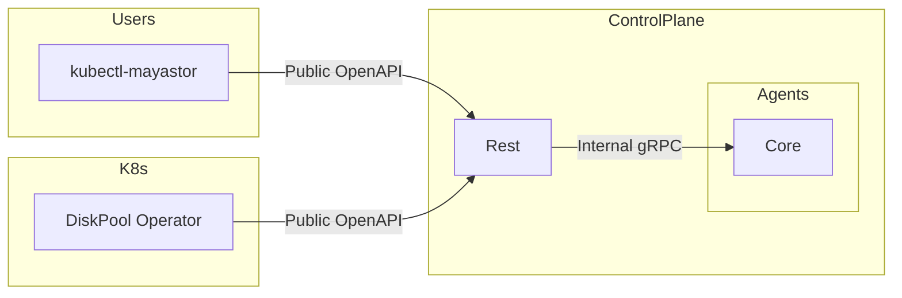

# Cordon Mayastor Pools

## Table of Contents

TODO

## Summary

This proposal aims to extend the existing Mayastor Cordon commands (currently applicable to nodes) to Pools.

## Motivation

The motivation behind this proposal is, as it says on the tin, is the need to cordon a pool when creating new resources on it is not desirable. Some examples of this are:

* When we want to drain a pool
Please note however, that this will require an OEP on its own
* When the state of a pool is dubious, and we might not want to create further replicas on it

### Goals

Extend cordon operations to pools.

### Non-Goals

Whilst cordoning a pool is a pre-requisite for draining a pool, the draining of the pool requires its own OEP and is therefore not a goal here. \
The DiskPool CR is responsible for creating and deleting a Mayastor Pool. Currently there's no mechanism to sync up between mayastor pool labels
and diskpool labels. The goal of this OEP is not to solve this issue, and therefore it will not address any CR<->ControlPlane synchronization.

## Proposal

Add a new resource (pool) to the existing cordon and uncordon kubectl-mayastor plugin subcommands:

1. kubectl-mayastor cordon pool xxxx
2. kubectl-mayastor uncordon pool xxxx

These new commands should follow the same logic of the node resource.

### User Stories

#### Story 1

As a user, I don't want any more replicas to be created on a given pool. In other words, I want to cordon this pool. \
I also reserve the option to uncordon it in the future.

#### Story 2

As a user, I want to delete a pool which is currently hosting replicas for a few volumes. There's no such functionality yet, but I know I can achieve
this by:

1. Cordon the pool
2. Scale volumes with replicas on said pool by +1 replica
3. Wait until the rebuilds complete
4. Scale the volumes back down by -1 replica

### Implementation Details/Notes/Constraints

The proposal is to extend the pool services with the cordoning operations:

1. Cordon a pool
2. Uncordon a pool

 
Let's recap the existing connections:

 

 

Adding new cordoning operations requires us to modify both the `Internal gRPC` and the `public OpenAPI`.
The DiskPool operator is responsible for managing the `DiskPool CRs` but there's currently no mechanism by which changes to the DiskPool are synced across the Control-Plane and the CR definition of the pool. \
As such we're proposing that the CR reflects only the cordon state of the pool, rather than being capable of driving it. At least for the time being.

#### Internal gRPC

TODO

#### Public OpenAPI

TODO

#### Kubectl Plugin

TODO

### Test Plan

TODO

### Risks and Mitigations

TODO

#### Mitigations

TODO

## Graduation Criteria

## Implementation History

* the `Summary` and `Motivation` sections being merged signaling owner acceptance

## Drawbacks [optional]

We're still not solving the issue of synchronizing `DiskPool CR` and `ControlPlane Pool` labels.

## Alternatives [optional]

It may be possible to manually patch the pool labels in the persistent store in such way which would prevent volumes from being created. This may require patching the volumes as well. \
We may suggest this as a WA sometimes but this is not a great solution.
