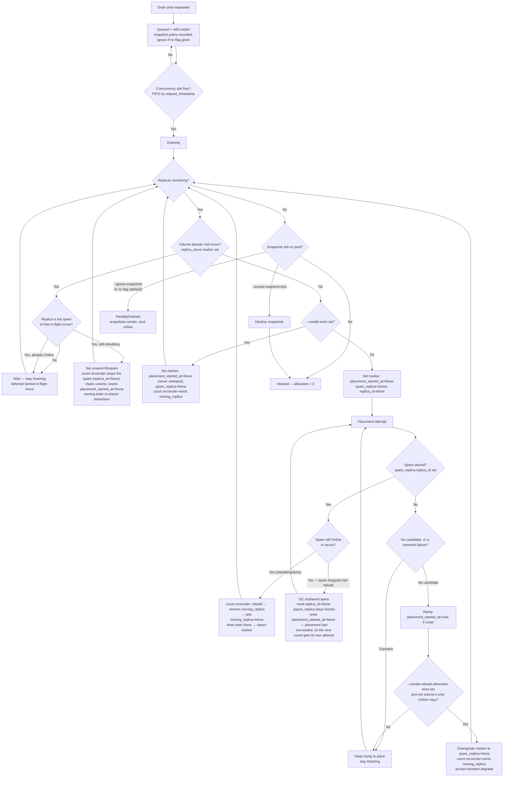
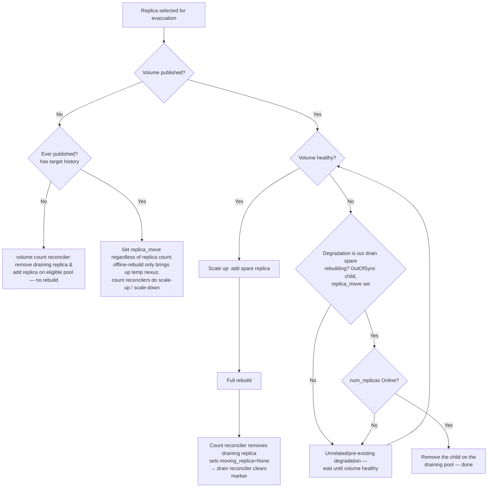

# Online Pool Drain

## Table of Contents

- [Summary](#summary)
- [Motivation](#motivation)
  - [Goals](#goals)
  - [Non-Goals](#non-goals)
- [Proposal](#proposal)
  - [User Stories](#user-stories)
  - [Implementation Details/Notes/Constraints](#implementation-detailsnotesconstraints)
- [Future Improvements](#future-improvements)
- [Testing](#testing)

## Summary

Pool Drain allows administrators to move all storage resources off a DiskPool before decommissioning
a pool or node, while the pool (and its node) stay **online** and continue serving I/O throughout.
Every volume replica residing on the pool is migrated to eligible pools while respecting topology
constraints; once the pool's replica allocation reaches zero the pool transitions to a `Drained`
state.

The feature is modeled end-to-end on the existing **node drain** and reuses the existing volume
scale-up / scale-down and replica rebuild mechanisms. Migration preserves full volume redundancy by
default by over-replicating a volume by one for the duration of each rebuild rather than the
faster-but-degrading approach of removing a replica and letting a hot-spare rebuild from a reduced
copy set. It is exposed across the stack — REST (`PUT /pools/{id}/drain`), gRPC, and
`kubectl mayastor drain pool <id>` — and driven asynchronously by dedicated reconcilers over a
persisted drain state machine, with abort support, progress visibility, a dry-run pre-flight
analysis, a cluster-wide cap on concurrent drains, an optional forced-eviction policy for replicas
that have no valid destination, and an explicit policy for snapshots left behind.

## Motivation

Today OpenEBS Mayastor supports volume scale-up, volume scale-down, and replica rebuilds, and the
control plane can **cordon** a pool (block new replicas) and **drain a node** (move volume targets
off a node). However, there is no mechanism to evacuate an entire pool — to move all existing
replicas off one pool to other pools so the pool can be retired or serviced.

This is required for administrators wishing to decommission storage, replace hardware, remove a
node, or rebalance capacity. Pool Drain automates the process while maintaining volume availability,
leaving existing rebuilds undisrupted, and preserving topology constraints.

### Goals

- Drain a pool while it stays **online** with **no data unavailability** for the volumes whose
  replicas are migrated.
- Support evacuation of every volume scenario: single-replica published, multi-replica, unpublished,
  and degraded volumes.
- Provide **abort** support to cancel a queued or in-progress drain.
- Provide **progress visibility** for a drain. This expose initial/current pool statistics and list of
  replica being migrated currently.
- Provide a **dry-run** pre-flight analysis that reports what a drain would do without mutating state.
- Rate-limit concurrent pool drains **cluster-wide** to avoid oversubscribing rebuild bandwidth.
- Rate-limit concurrent replica evacuation per pool so that one pool does not oversubscribe rebuild limit.
- Optionally **unsafe-rebuild-otherwise-evict** takes duration, we try to create a spare until the duration elapse.
  once it elapses, we destroy the replica if its not a last online replica on the volume.
- Provide **unsafe-evict** which allows user to opt-out safe over-replicating way of drain. Pools move into
  `Drained` faster. Scheduler will try to find new pools for the lost replica while volume is in Degraded state.
  Note: Unsafe evict won't remove child behorehand if its the last `Online` replica on Volume.
- Expose **`--ignore-snapshots`** to evacuate replicas only, leaving the pool's snapshots as they
  are. Allocation cannot reach zero, so the pool settles in the terminal `PartiallyDrained` state.
- Expose **`--accept-snapshot-loss`** to destroy the snapshots left on the pool once every replica has
  been evacuated, so allocation reaches zero and the pool reaches `Drained`.
- Allow updating the existing drain spec if pool is not already in `Draining` or in the terminal state (`Drained`,
  `Cancelled` or `AwaitingCleanup`)

### Non-Goals

- **Snapshot evacuation** (moving snapshots with their replicas to another pool) is out of scope for
  Phase 1. Phase 1 only moves replicas; snapshots are either left behind or destroyed per the chosen
  policy. True snapshot evacuation is deferred to Phase 2 which will commence after Phase 1 is code complete.

## Proposal

A drain request lands the pool in a persisted `Queued` state and immediately self-cordons the pool
(blocking new replicas, snapshots, and restores from landing on it). A dedicated reconciler on pool
module will promote queued pools to `Draining` in FIFO order, up to a configurable `--max-concurrent-pool-drain`.
A dedicated pool-drain reconciler then migrates every replica off draining pool up to --pool-replica-move-limit
at a time. It sets ReplicaMoveConfig in VolumeSpec, Thus triggering a Full rebuild.
When the rebuild completes, associated volume replica from the `Draining` pool is removed. When
the pool's replica allocation reaches zero, the pool transitions to `Drained` or `PartiallyDrained`
(when we have to dequeue the pool if we can't make progress on the drain procedure).

The `DrainPhase` state machine has the states:

- `Queued` — admitted, self-cordoned, awaiting a concurrency slot. The pool with the longest time
  elapsed in the queue is picked first.
- `Draining` — actively migrating replicas.
- `Drained` — replica allocation reached zero (terminal).
- `PartiallyDrained` — replicas evacuated, snapshots intentionally left behind (reported when
  allocation cannot reach zero because snapshots remain).
- `Cancelled` — a transient cleanup phase entered when a drain is cancelled. The `Drain` variant is
  **retained** (with `phase = Cancelled`) throughout cleanup — not cleared up front — so the pool stays
  discoverable and self-cordoned while the drain's changes are unwound; only once cleanup completes
  is it replaced by the restored user cordon and the `PoolDrainRecord` cleared. Unlike `Drained` this
  is not a retained terminal state (see *Cancel support*).
- `AwaitingCleanup` - When all replicas are evacuated from the volume ownership perspective, drain does
   have anything to do more. We are just waiting on replicas to be garbage collected.

**Pre-requisites:** the pool must not already be in `Draining` or any of the Terminal (`Drained`, `Cancelled`
or `AwaitingCleanup`) state.

Blocking on `Cancelled` means a fresh drain cannot start until the previous drain's cleanup has fully
torn down (`Drain` variant released), which serializes the two and prevents a new drain's `replica_move`
markers from being confused with the aborting drain's leftovers.

### User Stories

#### Story 1 — Decommission a node's storage

An administrator needs to remove a node from the cluster. This feature will be tied with node drain
feature but not in the scope of Phase 1. Administrator can drain each pool on the node with
`kubectl mayastor drain pool <id>`. Each pool's replicas are migrated to other pools elsewhere in the
cluster with full redundancy maintained throughout. They poll `kubectl mayastor get drain pool <pool-id>`
and watch the replica count fall to zero, at which point the pool reports `Drained` and the node can be safely removed.

#### Story 2 — Service/Replica a node disk

An administrator needs to remove the disk as its containeing multiple critical alerts for io errors.
This allows users to migrate all resource off of the pool while Application IO remains unaffected.

### Implementation Details/Notes/Constraints

#### Evacuation strategy: over-replicate vs fast-remove

For a multi-replica volume we could simply remove the replica from the draining pool, which would
trigger a full rebuild elsewhere instantly — pool allocation would drop quickly and the pool would
reach `Drained` fast. The drawback is that we lose a data copy and the volume runs **Degraded** for
the duration of the rebuild, which is an availability/durability regression.

Instead, drain uses a **scale-up / scale-down** technique: add a new replica on an eligible pool,
wait for its rebuild to complete, then scale down by removing the replica on the draining pool.

Because the scale-up adds a replica *above* the volume's configured replica count, the drain must be
able to tell that the extra replica is one it created. This is tracked as a managed `replica_move`
marker on the volume's runtime metadata (`VolumeSpec.metadata.runtime`), persisted across restarts
via the pool's `PoolDrainRecord` (see below), initialized when a drain-move begins — with
`moving_replica = Some(id)` — to start the full rebuild (over-replicate). Existing
replica-count-specific reconcilers need changes to cooperate with this marker.

#### Reconciler changes

Pool drain is asynchronous, carried out by reconcilers like most async operations in the core agent.
The feature adds new reconcilers and modifies a few existing ones under a single, deliberate rule:
**`hot_spare.rs` (`volume_replica_count_reconciler` / `nexus_replica_count_reconciler`) is the only
place that adds or removes a replica or a nexus child.** Those reconcilers already own child
add/remove and now additionally read the `replica_move` marker.

**New reconcilers**

- **Queue-promotion reconciler (pool module).** Scans pools in `Queued`, counts pools already
  `Draining`, and promotes in FIFO order by `request_timestamp` up to `--max-concurrent-pool-drain`.
- **Pool-drain (evacuation) reconciler.** The core per-replica loop for each `Draining` pool:
  enumerate replicas, set the per-volume single-slot `replica_move` marker through the per-pool
  `ResourceMove` admission gate, then *watch* the marker the count reconcilers drive and tear it down
  on `moving_replica → None`. It also handles the spare-dropped-mid-rebuild reset
  (`spare_replica → SpareReplica {replica_id: None}`), the `spare_replica = None` marker for `unsafe_evict`,
  and the terminal transition to `Drained`/`PartiallyDrained`. Its replica enumeration must also **classify** each
  replica: one that another drain's marker names as its `spare_replica` is not a move candidate but a
  foreign spare, handled per *The spare's own pool enters a drain* (set `unwind = Some(Respare)` while
  it is still rebuilding, otherwise defer).
- **Cancelled/cleanup reconciler.** Driven by `DrainPhase: Cancelled`, and purely an orchestrator: on
  every tick it (re-)asserts `unwind = Some(Cancelled)` on each volume's runtime `replica_move` slot —
  re-asserting rather than setting once, since the field is not persisted and must be rebuilt from
  `phase` after a restart — waits for the delegated unwind to signal completion via
  `spare_replica → None`, clears the markers, then replaces the `Drain` variant with the user's
  cordon restored from `DrainSpec.user_cordon` (dropping the self-cordon) and clears the
  `PoolDrainRecord` (see *Cancel support*).
- **Snapshot-removal reconciler (policy-driven).** Runs once a draining pool's replicas are all
  evacuated but snapshots remain — so it never races the moves — and enacts the snapshot policy:
  destroy the remaining replica-snapshots under `--accept-snapshot-loss` (pool becomes `Drained`),
  leave them under `--ignore-snapshots` (pool settles at `PartiallyDrained`).

**Modified reconcilers**

- **`volume_replica_count_reconciler` / `nexus_replica_count_reconciler` (`hot_spare.rs`).**

  (1) **Self-heal bypass:** the hot-spare reconcile currently returns early when `!policy.self_heal`;
  when a `replica_move` marker is set that early-return must be skipped, so a drain — an
  administrator-initiated evacuation, not opt-in self-healing — moves replicas regardless of the
  volume's `self_heal` policy.

  (2) **Effective count:** both reconcilers currently target `num_replicas`; while a marker is set
  they must instead target `effective_replica = num_replicas + N` (`N` derived as in *Resource model
  changes*), so the extra copy is created, attached, and rebuilt rather than pruned as "excess" by the
  `Ordering::Greater` branch (`remove_excess_replicas_from_nexus`).

  Two gates must be bypassed for a marker-driven move, for the same reason the count reconcilers
  bypass `self_heal`: the `!policy.self_heal` early return and the `offline_rebuild_enabled()` feature
  flag (`--offline-rebuild-*`) — a drain must not silently stall because a volume disabled self-heal or
  the cluster left the offline-rebuild feature off. The global `rebuild_allowed()` backpressure check is
  **kept** — drain rebuilds queue behind the same cluster-wide rebuild budget as any other.

#### Drain lifecycle and policy flags

The per-replica evacuation flow below answers "how is *one* replica moved". At the pool level, the
three policy flags (`--ignore-snapshots`, `--accept-snapshot-loss`, `--unsafe-rebuild-otherwise-evict`) operate at two
different altitudes: the snapshot policy never rejects a request — with neither flag set it defaults to
`Ignore`, exactly as `--ignore-snapshots` — and decides only the **terminal state** (`Drained` vs
`PartiallyDrained`), while `--unsafe-rebuild-otherwise-evict`
fires only at the per-replica "no eligible destination" branch. The flow chart below shows how all
three thread through the lifecycle.



#### Cancel support

There is no dedicated abort command — a user cancels a drain by uncordoning it with the drain scope
(`uncordon pool <id> --drain`), which sets `DrainPhase: Cancelled` and drives the undo of the drain's
changes on affected volumes (if any): already-evacuated replicas stay evacuated, ongoing unrelated
rebuilds are not changed, and any extra replica the drain added is unwound.

**The abort rule reduces to a single predicate — *have we already removed `moving_replica`?*** If
not, the original copy is kept and the spare (if one was ever created) is destroyed regardless of its
rebuild state — even a fully-`Online` spare is unwound, so an abort never quietly completes a move.
If `moving_replica` was already removed, the move is effectively complete and there is nothing to
unwind.

As with `Respare`, the abort/cleanup reconciler does not remove the spare child itself — it sets
`unwind = Some(Cancelled)` on each affected volume's `replica_move` marker and lets the count reconciler do
the removal, then waits for `spare_replica → None` as the completion signal before clearing the markers
and the `PoolDrainRecord` and releasing the drain's cordon.

**Releasing the cordon restores the user's cordon.** The drain's self-cordon is dropped, and the user's
cordon is **restored**, not dropped: `cordon_drain` goes from `Drain(spec)` back to
`Cordoned(spec.user_cordon)` when `user_cordon` is `Some` (including any changes the user made to it
mid-drain), and to `None` otherwise. A pool the user cordoned before draining is therefore still
cordoned after the abort, exactly as the user left it.

**Uncordoning a non Draining pool with --drain is a release, not an abort.** `uncordon pool <id> --drain` on a pool
that is already `Queued`, `Drained`, `AwaitingCleanup` or `PartiallyDrained` has nothing to unwind — every move is complete — so it
skips the `Cancelled` phase and releases the drain immediately: the user's cordon is restored as above
and the `PoolDrainRecord` is cleared. This is how a drained pool is reopened for scheduling, for example
to restore from snapshots a `PartiallyDrained` pool retained.

#### Evacuation candidates

The reconciler enumerates every replica on the draining pool and evacuates it according to the owning
volume's scenario.

**Published volume, single- or multi-replica.** Add a spare on an eligible pool, let it fully rebuild,
then remove the child on the draining pool. The volume never drops below its configured redundancy.

**Degraded volume.** The same flow, but it must not disrupt an existing rebuild or cost the volume an
`Online` copy:

- **Wait** if any child is `Degraded` or `Faulted` for an unrelated reason — do not stack a second
  rebuild on an already-degraded volume. Our own rebuilding spare is not such a reason; the
  draining-pool child may be removed as long as `num_replicas` copies are `Online`.

**Unpublished volume.** There is no live nexus to rebuild through, so the split is by **target
history**, not replica count:

- **Ever published:** the volume holds data that must be preserved, so it is evacuated **exactly like
  a published volume** and with the same policy flags — only over the temporary nexus that the existing
  offline-rebuild mechanism provides, and regardless of replica count.
- **Never published:** there is no data to rebuild, so — the only case that differs — remove the
  draining-pool child and add a replacement on an eligible pool.

**Snapshot replicas.** Snapshots cannot be migrated in Phase 1 and a moved replica leaves its snapshots
behind on the pool. by default, we will assume `Ignore` if none specified.

- `--accept-snapshot-loss` — move all replicas, then destroy the snapshots left on the pool; allocation
  reaches zero and the pool reaches `Drained`.
- `--ignore-snapshots` — move all replicas and leave the snapshots; the pool reaches `PartiallyDrained` with
  `SnapshotsRetained` as the phase reason, Pool stays online serving them, and can be uncordoned and restore
  from later. Because allocation stays non-zero, `DestroyPool` still fails (*"please drain the diskpool before
  attempting destroy"*) until the user re-drains with `--accept-snapshot-loss`.

(A volume with multiple replicas keeps its snapshot on the other replicas. The platform does support restoring volume from fewer
replica snapshots if volume restore policy is `besteffort`)

#### Unplaceable replicas and forced eviction

A replica may have **no eligible destination** — there may be no other pool with enough free space, a
matching cluster size, or a placement that satisfies the volume's topology / anti-affinity
constraints. For a `spare_replica = Some(SpareReplica { replica_id: None })` move that means the spare never gets
placed, `spare_replica` stays `Some(SpareReplica { replica_id: None })`, and the volume keeps the pool in `Draining`
indefinitely. To bound this, the user can opt into forced eviction with `--unsafe-rebuild-otherwise-evict`, a **duration**:
rebuild the spare elsewhere if a destination exists, until we elapse the specified duration. If its passed as 0,
one attempt will be made to create spare. If the attempt fails then the drain_replica is removed rightaway.

The attempt is recorded on the marker itself (`DrainConfig.placement_started_at`), so each move is
judged independently. When the reconciler begins a `spare_replica = Some` move it sets the marker with
`placement_started_at = None`; the existing volume hotspare reconciler then tries to find a pool to
place the spare, and **stamps `placement_started_at = now`.

- **Placed:** `spare_replica` is populated, its rebuild runs, and on completion `moving_replica` is
  scaled down and the marker cleared. No eviction, and nothing is ever stamped.
- **Not placed:** once `placement_started_at` is `Some` with `spare_replica` still
  `Some(SpareReplica(None))`, the replica is treated as unplaceable and is force-evicted on the next
  drain-reconciler tick if `placement_started_at` elapses `unsafe_rebuild_otherwise_evict`.

As a hard safety rule — and the **only** guard on any eviction — a replica is **never** removed when
it is the volume's last `Online` child, since that would cause data unavailability. This applies
identically to both eviction paths: forced eviction after a failed placement attempt (the
`--unsafe-rebuild-otherwise-evict` flag) and direct `unsafe_evict`. There is no additional precondition —
in particular, an eviction does **not** require that a placement candidate exist for the recreate; the
caller has already accepted a degraded (and possibly open-ended, until a destination frees up) rebuild.
By default (when neither `--unsafe-rebuild-otherwise-evict` nor `unsafe_evict` is set) the design never
degrades a volume to make progress at all: a pool with an unplaceable replica stays `Draining` until
the user either frees a destination or aborts.

**Direct unsafe eviction (`unsafe_evict`).** For power users who explicitly accept the durability
trade-off, a separate boolean option skips the safe over-replicate flow entirely and evicts replicas
**directly** — removing the child on the draining pool and letting the normal rebuild machinery
recreate it elsewhere degraded. offered as an opt-in escape hatch to drain faster or to make progress when over-replication
is undesirable. on the plugin it is exposed as a **hidden** flag — clap's `#[arg(hide = true)]`,
so it is fully functional for power users who know it but omitted from `--help` and the generated CLI docs
— rather than a build feature-gate; on the REST/gRPC API it is a normal, documented option.

#### Spare fails mid-rebuild

A `spare_replica = Some()` move can be interrupted after the spare is placed but before its rebuild
completes: the spare replica's node or pool goes down while the child is still rebuilding. Because a
rebuilding child carries **no rebuild/write log**, the nexus does not wait for it to return — it is
dropped from the nexus outright, and even if that exact replica later came back it would need a
*fresh full rebuild*, not a log-based catch-up. Critically, this is **not** a loss of redundancy: the
spare is the extra, over-replicated copy, and all `num_replicas` original copies (including `moving_replica`)
stayed `Online` throughout. Only the in-flight over-replication attempt was lost.

The move therefore recovers by **resetting the marker's `spare_replica.replica_id` to `None`** rather than
waiting on the dead child. This is the missing transition from the placed state: the reconciler
detects `spare_replica: Some(SpareReplica { replica_id: Some(id) })` while that child is no longer present/`Online`
in the nexus, and resets it — along with `placement_started_at`, since placement had succeeded here and
the fresh round is entitled to its own single attempt (see *Unplaceable replicas and forced eviction*) —
so the volume reconciler loop re-enters the placement branch and schedules
a **fresh spare — possibly on a different eligible pool** — starting a new full rebuild. No new phase is needed;
the move simply falls back to "not placed yet", and volume health keeps following the nexus status as it
would for any rebuild.

#### The spare's own pool enters a drain

A spare is placed on an eligible, uncordoned pool — but nothing stops *that* pool from being drained
afterwards. (The reverse ordering cannot happen: the self-cordon is applied at admission, i.e. already
in `Queued`, so placement never picks a pool whose drain has been requested.) Pool B's drain reconciler
then enumerates its replicas and finds one that is not a plain replica at all but pool A's in-flight
spare — recognised by the owning volume's marker carrying `spare_replica == that id`. Rather than
removing the child itself, it sets `unwind = Some(Respare)` on that marker; the count reconciler drops
the spare and resets `spare_replica.replica_id = None` (and `placement_started_at = None`), so pool A's
move re-enters its placement branch and schedules a fresh spare on another eligible pool. If we instead
waited on it, it would get evicted by pool B's drain once it came `Online` anyway — a wasted full rebuild.

#### Flow chart for evacuation



#### Dry-run

The user can set a dry-run flag on the drain request. The service runs the same candidate
selection the real drain would use for every replica and returns an analysis — total replicas,
snapshot count, degraded count, and the number of replicas with no valid destination broken down by
cause (insufficient free space vs. topology/anti-affinity constraints) — **without** queuing,
migrating any replica, or involving the reconciler.

The dry-run is purely read-only: it **does not self-cordon** the pool and leaves no state behind, so
the pool is exactly as it was when the call returns. Its result is therefore a point-in-time snapshot,
and **scheduling possibilities can change between the dry-run and the actual drain**: the cluster state
that feeds candidate selection — per-pool free capacity, node/pool cordon and online status, topology
labels, and anti-affinity placement of a volume's other replicas — is evaluated at two different
moments, and the pool is not even cordoned in between. A destination the dry-run reported as available
may be full, cordoned, or offline when the drain runs, and conversely a replica it flagged as
unschedulable may gain a valid destination if capacity frees up. The dry-run therefore gives an **idea
of the likely impact** — how many replicas would move, how many would have no valid destination and why
— not a binding plan the real drain is guaranteed to reproduce.

#### Progress visibility

A drain spans many reconciler ticks and minutes of rebuild, so users get read-only visibility via a
`GET /pools/{id}/drain` API and the `kubectl mayastor get drain pool <pool-id>` command. Progress is the
`PoolDrainRecord`'s baseline (`initial_stats`, captured once when the pool enters `Draining`) diffed against values read
live from the data plane on each query (`PoolState::current()`), which keeps the reconciler free of
progress bookkeeping.

#### Concurrency limits

Draining many pools at once would oversubscribe rebuild bandwidth and risk availability, so drains
are rate-limited cluster-wide via a configurable `--max-concurrent-pool-drain`. A request is
admitted into `Draining` only when the number of pools already `Draining` is below the limit; queued
pools are promoted in FIFO order by request timestamp, which guarantees no queued pool is starved.
The cluster-wide rebuild backpressure remains a finer second line of defense that throttles
individual rebuilds.

A second flag, `--pool-replica-move-limit`, bounds how many replicas a **single** draining pool may
be moving at once. Both are global core-agent flags applied uniformly — neither is a per-pool value
stored in the `PoolDrainRecord`. The per-pool limit is enforced against the length of that pool's
`replica_moves` vector, which is kept at or below the configured value; see the `ResourceMove`
admission gate in the concurrency section for the mechanics.

#### Resource model changes

On the pool spec, the drain does **not** get a field of its own: it is a new `Drain` variant of the
existing `cordon_drain` field's `CordonDrainState` enum, alongside the existing `Cordoned` variant.
Admitting a drain switches `cordon_drain` to `Drain(DrainSpec)` and moves the user's cordon, if any,
into `DrainSpec.user_cordon`. The variant is additive, so currently-cordoned pools deserialize
unchanged as `Cordoned(..)`, but every code path that reads the cordon must now handle both variants.

```rust
/// Enum variant encompassing data related to a cordoned or draining pool.
#[derive(Clone, Serialize, Deserialize, Debug, PartialEq)]
pub enum CordonDrainState {
    /// The pool is being cordoned.
    Cordoned(CordonedState),
    /// The pool is being drained.
    Drain(DrainSpec),
}

/// Drain spec applied on the pool.
#[derive(Clone, Serialize, Deserialize, Debug, PartialEq)]
pub struct DrainSpec {
    /// Timestamp when the drain was requested.
    pub request_timestamp: SystemTime,
    /// Drain policy applied on the pool.
    pub policy: DrainPolicy,
    /// Holds user applied cordon configs if present before starting drain.
    pub user_cordon: Option<CordonedState>,
}

/// The user's drain policy, each of which alters what the drain is permitted to do.
#[derive(Clone, Serialize, Deserialize, Debug, PartialEq, Default)]
pub struct DrainPolicy {
    /// What to do with the snapshots left on the pool once all replicas are evacuated.
    /// Defaults to `Ignore`, which leaves them in place.
    pub snapshot_policy: SnapshotPolicy,
    /// Grace period after which an unplaceable replica is force-evicted.
    /// `None` disables forced eviction entirely.
    #[serde(skip_serializing_if = "Option::is_none")]
    pub unsafe_rebuild_otherwise_evict: Option<Duration>,
    /// Skip the safe over-replicate flow and evict replicas directly.
    pub unsafe_evict: bool,
}
```

Because a draining pool carries two cordons in one variant, scheduling decisions must consult an
**`effective_cordon()`** that ORs two `CordonedState` bitmaps per resource — the user cordon
(`Cordoned(..)`, or `DrainSpec.user_cordon` while draining) and the drain's fixed self-cordon, implied
by the `Drain` variant itself. A resource is blocked if **either** bitmap blocks it. Concretely, the
drain's self-cordon blocks new `replicas`, `snapshots`, and `restores`
(nothing new should land on a pool being emptied) but deliberately leaves `import = false`: a
draining pool must still be importable so it can be brought back online after a node/engine restart
and continue serving I/O while it drains. The user cordon retains full say over imports — if the
user cordoned the pool with `import = true`, `effective_cordon().import` stays `true` and the pool
remains blocked for imports, since the OR keeps whichever field is more restrictive. So the drain
never *relaxes* a user-imposed import block; In case pool blocked on import by user cordon get Offline
mid drain gets into `PartiallyDrained` phase with phase reason set to `ImportCordoned`

**Serialisation of moves per volume (concurrency).** A volume carries **at most one**
`replica_move` at a time, and this single-slot marker is what serialises drain moves for a
volume. Before starting a move for any replica on a draining pool, the drain reconciler checks the
owning `VolumeSpec`: if `replica_move.is_some()`, a move for that volume is already in flight, so
the reconciler **defers** this replica and does not add a second marker — it retries on a later tick
once the in-flight move has cleared the marker.

**One teardown signal for every mode: `moving_replica → None`.** The marker is cleared as soon as
the count reconciler reports the replica gone from the draining pool, and this is uniform across all
three ways a move can end — there is no mode-dependent clear rule.

**Per-pool concurrency limit — the `ResourceMove` admission gate.** Without a per-pool cap a single
busy pool could enqueue moves for all its replicas at once and, since the rebuild limit is global,
starve every other pool's rebuilds — the per-volume marker does not help here because each move is on
a *different* volume.

The `ReplicaMoveRequester` field currently has only `PoolDrain` as of now. It will be extended in future. We may use
over-replication in features like capacity rebalancing, Moving volumes to a specific type of Pool or converting
volume from thick -> thin visa-versa.

```rust
pub struct VolumeRuntimeMetadata {
    // ...
    /// Configuration for the replica move operation, if any.
    replica_move: Option<ReplicaMoveRequester>,
}

/// The entity on whose behalf a replica move is being carried out, along with the move
/// configuration specific to it.
#[derive(Debug, Clone, PartialEq)]
pub enum ReplicaMoveRequester {
    /// The move was requested by a pool drain.
    PoolDrain(DrainConfig),
}

/// Configuration of a single replica move carried out as part of a pool drain.
#[derive(Serialize, Deserialize, Debug, Clone, PartialEq)]
pub struct DrainConfig {
    /// When this move first attempted to place its spare.
    pub placement_started_at: Option<SystemTime>,
    /// Id of the volume moving_replica belongs to.
    pub volume: VolumeId,
    /// Id of the pool moving_replica belongs to.
    pub pool: PoolId,
    /// Id of the moving replica. It's None when it's evacuated successfully.
    pub moving_replica: Option<ReplicaId>,
    /// Id of the spare replica created as part of drain procedure.
    pub spare_replica: Option<SpareReplica>,
    /// Why a move's over-replicated spare is being removed.
    #[serde(skip)]
    pub unwind_spare: Option<UnwindSpare>,
}

/// Spare replica reference for this drain.
#[derive(Serialize, Deserialize, Debug, Clone, PartialEq, Default)]
pub struct SpareReplica {
    /// Replica Id of the spare, if placed.
    pub replica_id: Option<ReplicaId>,
}

/// Contains the reason for unwinding a spare replica, which is used to determine how to proceed with
/// the drain procedure.
#[derive(Debug, Clone, PartialEq)]
pub enum UnwindSpare {
    /// The drain was aborted (`DrainPhase → Cancelled`): remove the spare and end the
    /// move, keeping `moving_replica` where it is.
    Cancelled,
    /// The pool hosting the still-rebuilding spare has itself entered a drain: remove
    /// the spare and let this move place a fresh one on another eligible pool.
    Respare,
}
```

```rust
/// Pool meta information.
#[derive(Serialize, Deserialize, Debug, Clone, PartialEq, Default)]
pub struct PoolPersistedMetadata {
    /// Populated when drain request is submitted.
    /// Stores states driving the drain procedure.
    #[serde(default, skip_serializing_if = "super::is_default")]
    pub drain_record: Option<PoolDrainRecord>,
}

/// Record of an in-progress pool drain, driving the drain procedure and tracking its progress.
#[derive(Serialize, Deserialize, Debug, Clone, PartialEq)]
pub struct PoolDrainRecord {
    /// Current phase of the drain state machine.
    pub phase: DrainPhase,
    /// Why pool is in the aforementioned phase.
    pub phase_reason: Option<PhaseReason>,
    /// The initial usage stats of the pool when the pool transitions into Draining state.
    pub initial_stats: Option<PoolUsage>,
    /// In-flight replica moves for this drain.
    pub replica_moves: Vec<DrainConfig>,
}

#[derive(Serialize, Deserialize, Debug, Clone, PartialEq, Default)]
pub struct PoolUsage {
    /// Number of replicas present on pool.
    pub repl_count: u64,
    /// Number of snapshots present on pool.
    pub snap_count: u64,
    /// Used capacity, in bytes.
    pub used: u64,
    /// Committed capacity, in bytes.
    /// `None` when the pool state does not report a commitment.
    pub committed: Option<u64>,
}
```

#### API and UX surface

- **REST**: `PUT /pools/{id}/drain` and `GET /pools/{id}/drain`, the former carrying the request
  options (ignore-snapshots, accept-snapshot-loss, unsafe-rebuild-otherwise-evict, unsafe-evict,
  dry-run). `PUT` returns the `Pool`, whose `meta.drain` carries the compact drain record (phase,
  reason, baseline usage and the ids of the replicas being moved). `GET` returns `PoolDrainDetail`, the
  full picture of the drain: the requested spec and policy, phase and reason, baseline versus live
  usage, and every in-flight move expanded (volume, draining replica, spare, placement start, unwind
  reason) rather than listed as replica ids — see *REST / OpenAPI model* below.
- **gRPC**: `DrainPool` and `GetDrainProgress` RPCs on the pool service, with the drain response a
  `oneof` so a dry-run returns the analysis instead of the pool; `GetDrainProgress` returns the same
  detail as the REST `GET`.
- **kubectl plugin**: `drain pool <id>` (with the flags, `unsafe-evict` among them as a hidden one) and
  `get drain pool <pool-id>`; a drain is cancelled with `uncordon pool <id> --drain`; `get pools` shows
  the drain state.
- **DiskPool CR**: no change required for the feature to function. `num_replicas` and `num_snapshots`
  are not currently on the CRD and could be surfaced on its status as an optional follow-up.

#### REST / OpenAPI model

The drain splits across the API exactly as it does internally: the **desired** drain (request +
policy) hangs off `PoolSpec` mirroring `PoolUSpec.drain_spec`, and the **observed** drain (phase +
progress) is the new `PoolDrainRecord` schema, mirroring the store's `PoolDrainRecord`.

The observed drain is exposed at two levels of detail:

- **`Pool.meta.drain`** — the compact `PoolDrainRecord`, embedded into the existing `PoolMeta` rather
  than added as another field on `Pool`. It is returned wherever a `Pool` is (`GET /pools`, `PUT
  /pools/{id}/drain`, …), so it stays small: phase, reason, baseline usage and the ids of the replicas
  currently being moved.
- **`GET /pools/{id}/drain`** — `PoolDrainDetail`, the whole picture for one pool's drain. It adds the
  requested spec and policy, live usage alongside the baseline, and each in-flight move expanded into a
  `PoolReplicaMove` (the persisted `DrainConfig`), so a user can see *why* a drain is not progressing —
  a move waiting on placement, how long it has been failing to place, or a spare being unwound.

```yaml
    Pool:
      description: Pool object, comprised of a spec and a state
      properties:
        id: ...
        spec: ...
        state: ...
        diag: ...
        meta:
          $ref: '#/components/schemas/PoolMeta'
      required:
        - id
      minProperties: 2

    PoolMeta:
      description: Pool object, comprised of a spec and a state
      properties:
        # ... existing meta fields
        drain:
          description: |-
            The pool's drain, if one has been admitted. Persists after the drain reaches a
            terminal phase as the pool's last-drain artifact, so read `phase` before treating
            a pool as actively draining.
          allOf:
            - $ref: '#/components/schemas/PoolDrainRecord'

    PoolDrainRecord:
      description: |-
        Progress of a pool drain.
      type: object
      properties:
        phase:
          $ref: '#/components/schemas/PoolDrainPhase'
        phaseReason:
          $ref: '#/components/schemas/PoolDrainPhaseReason'
        initial:
          description: |-
            Pool usage captured when the drain entered the Draining phase. Absent while the
            drain is still queued.
          allOf:
            - $ref: '#/components/schemas/PoolDrainUsage'
        movingReplicas:
          description: |-
            The replicas this drain is currently moving off the pool.
          type: array
          items:
            $ref: '#/components/schemas/ReplicaId'
      required:
        - phase
        - movingReplicas

    PoolDrainPhase:
      description: The phase of the pool drain state machine
      type: string
      enum:
        - Unknown
        - Queued
        - Draining
        - AwaitingCleanup
        - PartiallyDrained
        - Drained
        - Cancelled

    PoolDrainPhaseReason:
      description: Why the pool is in its current drain phase
      type: string
      enum:
        - Unknown
        - WaitingForSlot
        - OfflinePool
        - SingleReplicaUnsafeEviction
        - ImportCordoned
        - SnapshotsRetained

    PoolDrainUsage:
      description: Pool usage snapshot
      type: object
      properties:
        replicaCount:
          description: Number of replicas present on the pool
          type: integer
          format: uint64
        snapshotCount:
          description: Number of snapshots present on the pool
          type: integer
          format: uint64
        used:
          description: Used capacity, in bytes
          type: integer
          format: uint64
        committed:
          description: |-
            Committed capacity, in bytes
          type: integer
          format: uint64
      required:
        - replicaCount
        - snapshotCount
        - used

    PoolDrainDetail:
      description: |-
        Full view of a pool's drain.
      type: object
      properties:
        spec:
          description: The requested drain - request time, policy and the user's own cordon.
          allOf:
            - $ref: '#/components/schemas/PoolDrainSpec'
        phase:
          $ref: '#/components/schemas/PoolDrainPhase'
        phaseReason:
          $ref: '#/components/schemas/PoolDrainPhaseReason'
        statistics:
          $ref: '#/components/schemas/PoolDrainStatistics'
        replicaMoves:
          description: |-
            The moves currently in flight for this drain, bounded by
            --pool-replica-move-limit. Empty while queued and once the drain is terminal.
          type: array
          items:
            $ref: '#/components/schemas/PoolReplicaMove'
      required:
        - spec
        - phase
        - statistics
        - replicaMoves

    PoolDrainStatistics:
      description: Baseline captured when the drain entered Draining, versus live pool usage.
      type: object
      properties:
        initial:
          description: |-
            Usage captured when the drain entered the Draining phase. Absent while the drain
            is still queued.
          allOf:
            - $ref: '#/components/schemas/PoolDrainUsage'
        current:
          description: |-
            Live usage projected from the pool state. Absent when the pool has no reported
            state (node offline / not imported) - progress is then unknown, not zero.
          allOf:
            - $ref: '#/components/schemas/PoolDrainUsage'

    PoolReplicaMove:
      description: |-
        A single in-flight replica move, projecting the DrainConfig carried by the pool's
        ReplicaMoveConfig.
      type: object
      properties:
        volume:
          description: Volume this move belongs to.
          $ref: '#/components/schemas/VolumeId'
        placementStartedAt:
          description: |-
            When this move first attempted to place its spare.
          type: string
          format: date-time
        movingReplica:
          description: |-
            Replica on the draining pool. Absent once it has been removed - for an
            over-replicate move that means the move succeeded; for a direct eviction the
            move is still held open while the recreated copy rebuilds.
          allOf:
            - $ref: '#/components/schemas/ReplicaId'
        spareReplica:
          description: |-
            Present for the safe over-replicate flow (add a spare, rebuild, then scale down
            the moving replica); absent for direct eviction.
          allOf:
            - $ref: '#/components/schemas/PoolSpareReplica'
        unwind:
          description: |-
            Set while this move's spare is being torn down, naming why. Absent in steady
            state.
          allOf:
            - $ref: '#/components/schemas/PoolUnwindSpare'
      required:
        - volume

    PoolSpareReplica:
      description: |-
        The over-replicated spare of a move.
      type: object
      properties:
        replicaId:
          description: |-
            The placed spare. Absent until the spare has been placed, and absent again if it
            was dropped mid-rebuild or removed because its own pool entered a drain.
          allOf:
            - $ref: '#/components/schemas/ReplicaId'

    PoolUnwindSpare:
      description: |-
        Why an in-flight move's over-replicated spare is being removed. Cancelled - the drain was
        aborted, so the spare goes and the move ends. Respare - the pool hosting the still
        rebuilding spare has itself entered a drain, so the spare goes and this move places a
        fresh one elsewhere.
      type: string
      enum:
        - Cancelled
        - Respare

    PoolSpec:
      properties:
        cordonDrain: ...
        drainSpec:                                 # new
          description: Desired drain - the self-applied cordon plus the user-chosen policy.
          allOf:
            - $ref: '#/components/schemas/PoolDrainSpec'

    PoolDrainSpec:
      description: The drain specification for a pool
      type: object
      properties:
        requestTimestamp:
          description: Time at which the drain was requested (UTC)
          type: string
          format: date-time
        policy:
          $ref: '#/components/schemas/PoolDrainPolicy'
        userCordon:
          description: |-
            The user's own cordon, set before the drain began and restored if the drain is
            aborted. Absent when the pool was not cordoned before the drain. Gets updated
            if the user changes the cordon while the drain is in progress.
          allOf:
            - $ref: '#/components/schemas/PoolCordon'
      required:
        - requestTimestamp

    PoolDrainPolicy:
      description: The drain policy for a draining pool
      type: object
      properties:
        snapshotPolicy:
          $ref: '#/components/schemas/PoolDrainSnapshotPolicy'
        unsafeRebuildOtherwiseEvict:
          description: |-
            Grace period in seconds, after which an unplaceable replica is force-evicted.
            Absent disables forced eviction entirely.
          type: integer
          format: uint64
        unsafeEvict:
          description: Skip the safe over-replicate flow and evict replicas directly
          type: boolean
      required:
        - snapshotPolicy
        - unsafeEvict
    PoolDrainSnapshotPolicy:
      description: |-
        What the drain does with the snapshots left on the pool once all replicas are
        evacuated. Ignore leaves them in place, AcceptLoss destroys them from the pool.
      type: string
      enum:
        - Ignore
        - AcceptLoss
```

## Future Improvements

- **Allow other pools on the draining pool's node as placement candidates**: When the intent is to
  retire a single pool rather than its whole node, another pool on the *same* node is a legitimate
  destination for the over-replicated replica. Phase 1 conservatively excludes the draining pool's
  node from placement; relaxing this to permit sibling pools on the same node is deferred until
  Phase 1 is complete. It must be done carefully to respect the volume's node anti-affinity — two
  replicas of the same volume must never land on the same node.
- **Future selective-drain modes** (not in Phase 1): drain a single replica by `VolumeId`; target all
  replicas whose `VolumeSpec` matches a pattern (e.g. `thin`, topology, encryption); or target volumes
  above a size threshold (e.g. greater than 30 GiB). These would let users rebalance subsets of a
  pool rather than evacuating it entirely.
- **Limit drain initiated rebuilds**: With flaky networks rebuilds can be unstable. Since drain procedure
  depends on Full rebuild we probably should limit them as they can become bottleneck for the rebuilds
  meant to fix usual degradation.
  Possible ways:
   - Have a separate rebuild limit for drain
   - Maintain count of failed rebuilds in the ReplicaMove and backoff after certain number of failures.

## Testing
