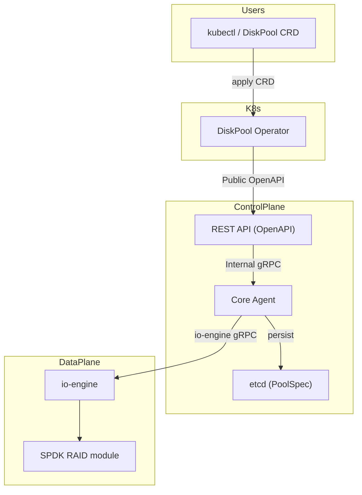
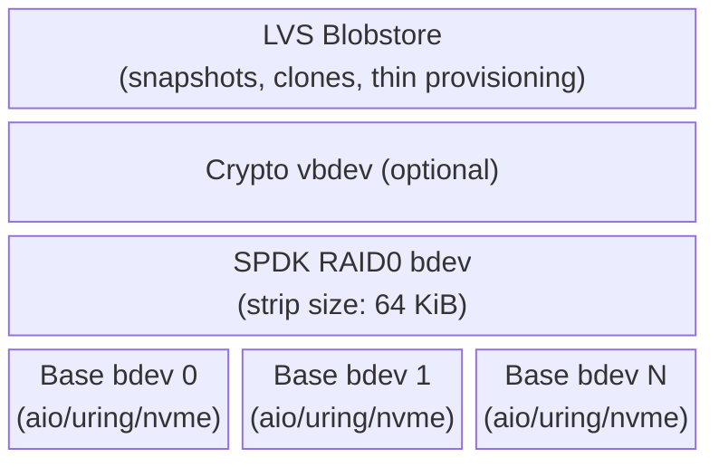

# Add Raid0 DiskPool support to OpenEBS Mayastor

## Table of Contents

- [Table of Contents](#table-of-contents)
- [Summary](#summary)
- [Motivation](#motivation)
  - [Goals](#goals)
  - [Non-Goals](#non-goals)
- [Proposal](#proposal)
  - [User Stories](#user-stories)
  - [Workflow](#workflow)
- [Implementation](#implementation)
  - [Implementation Overview](#implementation-overview)
  - [High Level Design](#high-level-design)
    - [Component Overview](#component-overview)
    - [Bdev Layer Stack](#bdev-layer-stack)
    - [RAID0 Bdev State Lifecycle](#raid0-bdev-state-lifecycle)
    - [Repository Structure and PR Order](#repository-structure-and-pr-order)
    - [DiskPool CRD Changes](#diskpool-crd-changes)
    - [Compatibility Considerations](#compatibility-considerations)
    - [Design Decisions](#design-decisions)
  - [Risks and Mitigations](#risks-and-mitigations)
- [Testing](#testing)

## Summary

This proposal adds RAID0 support to Mayastor disk pools, enabling users to combine multiple devices into single pools with aggregate capacity. The implementation leverages SPDK RAID0 functionality while preserving all existing LVS features including encryption, snapshots, and thin provisioning. This enhancement addresses current limitations where users must create separate pools per device, leading to potential sub-optimal disk space utilization across multiple small pools.

## Motivation

Mayastor currently requires separate disk pools per device, resulting in multiple small pools with potential sub-optimal disk space utilization. RAID0 support enables users to consolidate multiple devices into larger pools with improved capacity utilization.

### Goals

- Enable multi-device RAID0 pools with aggregate capacity from multiple devices
- Preserve all existing LVS features (encryption, snapshots, thin provisioning) on RAID0 pools
- Maintain backward compatibility with existing single-device pools
- Provide foundation for future RAID level support (RAID1, RAID5)

**Success Criteria:**

- Users can create RAID0 pools from multiple devices
- RAID0 pools function identically to single-device pools from user perspective
- No regressions in existing single-device functionality

### Non-Goals

- RAID0 device replacement maybe future enhancement
- Migration from existing single-device pools to RAID0
- Other RAID levels (RAID1, RAID5) - separate OEPs

## Proposal

### User Stories

1. **Story 1**: As a user, I want to create large storage pools (e.g., combining 4x 2TB devices into an 8TB pool) to support applications requiring substantial storage capacity.

### Workflow

#### Single Device Pool (Existing)

1. **Create DiskPool CRD**: Specify single device (no `poolType` needed)
2. **Apply configuration**: Controller creates pool directly on device
3. **Pool ready**: Single-device pool available

```yaml
apiVersion: openebs.io/v1beta3
kind: DiskPool
metadata:
  name: single-pool
spec:
  node: node-1
  disks:
    - /dev/nvme0n1
```

#### RAID0 Pool (New)

1. **Prepare devices**: Ensure multiple devices are available
2. **Create DiskPool CRD**: Specify multiple devices with `poolType: "raid0"`
3. **Controller validation**: Validates RAID0 requirements (min 2 devices)
4. **RAID0 creation**: io-engine creates SPDK RAID0 bdev from devices
5. **Pool creation**: LVS blobstore created on RAID0 bdev
6. **Pool ready**: RAID0 pool available as single large pool

```yaml
apiVersion: openebs.io/v1beta3
kind: DiskPool
metadata:
  name: raid0-pool
spec:
  node: node-1
  disks:
    - /dev/nvme0n1
    - /dev/nvme1n1
    - /dev/nvme2n1
  raidConfig:
    type: raid0
    config:
      stripSize: "64KiB"   # optional, default 64KiB
```

## Implementation

### Implementation Overview

**Architecture:**

- Multiple devices → SPDK RAID0 → Encryption (if enabled) → LVS blobstore
- All existing LVS features work transparently on top of the RAID bdev
- Performance optimized with single encryption layer on top of the RAID

**Configuration:**

- Add optional `raidConfig` field to existing DiskPool CRD (v1beta3)
- No CRD version bump needed — additive, backward compatible change

**Key Constraints:**

- Minimum 2 devices required for RAID0
- Single device failure fails entire pool (no degraded mode)
- No migration from existing single-device pools

### High Level Design

#### Component Overview

The RAID0 configuration flows through the existing Mayastor architecture. No new
services or reconcilers are introduced — the feature extends existing components
at each layer:



Changes per component:

- **DiskPool CRD (v1beta3)**: New optional `raidConfig` field with tagged enum serialization
- **DiskPool Operator**: Passes `raidConfig` from CRD spec through to the REST API
- **REST API / OpenAPI**: New `RaidConfig`, and `RaidInfo` schemas on pool create/response
- **Core Agent (internal gRPC)**: `PoolSpec` and `CreatePoolRequest` gain `raid_config`; `PoolState` gains `raid_info`. Validation enforced before pool creation
- **io-engine (io-engine gRPC)**: `CreatePoolRequest`, `ImportPoolRequest` gain `raid_config`; `Pool` response gains `raid_info`. Pool lifecycle handles RAID bdev creation/import/destroy
- **SPDK (via spdk-rs)**: RAID bdev module un-excluded, `raid_bdev_*` functions exposed

#### Bdev Layer Stack

RAID0 introduces a new bdev layer between the raw device bdevs and the LVS
blobstore. When encryption is also enabled, the crypto vbdev sits between the
RAID bdev and LVS:



Key properties:

- The RAID0 bdev aggregates capacity from all member bdevs. The usable capacity per member is determined by the smallest member bdev (SPDK aligns all members to the smallest).
- When member devices are resized, SPDK propagates `BDEV_EVENT_RESIZE` events through the RAID bdev. io-engine rescans each member and waits for the RAID bdev to reflect the updated aggregate capacity before growing the LVS.
- A single encryption layer covers the entire RAID (not per-device). This is also beneficial for performance — encryption operates on one bdev rather than on each member individually.
- All LVS features (snapshots, clones, thin provisioning) work transparently on top
- The RAID bdev is identified as `driver="raid"` in SPDK

#### RAID0 Bdev State Lifecycle

SPDK RAID bdevs transition through three states:

```
Configuring ──→ Online ──→ Offline
     ↑              │
     └──────────────┘
       (configure fails)
```

- **Configuring**: Initial state after creation. The RAID bdev waits for all base
  bdevs to be discovered and added. The bdev is not yet registered and not visible
  to upper layers.
- **Online**: All required base bdevs are present and operational. The RAID bdev is
  registered and available for I/O.
- **Offline**: The RAID bdev is unregistered. I/O requests are completed without
  being submitted to base bdevs.

For RAID0, SPDK requires **all** base bdevs to be operational — there is no
degraded mode. If any single member device fails or is removed,
the number of operational devices drops below the number of required devices (which
equals `num_base_bdevs` for RAID0), and SPDK immediately transitions the RAID array
to offline. This is inherent to RAID0: data is striped without redundancy, so
any missing device makes the array unreadable.

> Note: Other RAID levels behave differently — RAID1 can tolerate all-but-one
> device failures, and RAID5F can tolerate one device failure.

#### Repository Structure and PR Order

The implementation spans four repositories:

- **spdk-rs** — Expose SPDK `bdev_raid` module and `raid_bdev_*` FFI bindings.
- **mayastor-dependencies** — Add RAID protobuf messages to the io-engine gRPC proto definitions.
- **mayastor (io-engine)** — RAID bdev wrapper, LVS integration, gRPC handler updates. Depends on spdk-rs and mayastor-dependencies.
- **mayastor-control-plane** — CRD, REST API, internal gRPC, validation, etcd persistence. Depends on mayastor-dependencies.

#### DiskPool CRD Changes

The DiskPool CRD (v1beta3) gains a single new optional field `raidConfig`, using
tagged enum serialization (see [Workflow](#workflow) for YAML examples). No CRD
version bump is needed as this is an additive change.

- `raidConfig` is optional. If omitted, the pool behaves as a single-device pool.
- `raidConfig` uses tagged enum serialization: `{ "type": "raid0", "config": { "stripSize": "64KiB" } }`.
- `stripSize` is the size of the data chunk written to each member device before moving to the next (following SPDK's `strip_size_kb` naming). Note: in RAID terminology a **strip** is the chunk on a single device, while a **stripe** spans all devices in the array (stripe = strip x number of devices). The CRD and SPDK API both use **strip size**.
- `stripSize` uses the Kubernetes `Quantity` type (e.g., `"64KiB"`, `"128KiB"`). Default: `64KiB`.
- A new printcolumn `raid` displays `.spec.raidConfig.type` in `kubectl get diskpool` output.

**Validation rules:**

- RAID0 requires a minimum of 2 disks
- Strip size must be a power of 2, minimum 4 KiB
- Multiple disks without `raidConfig` are rejected
- Single disk with `raidConfig` is rejected

#### Compatibility Considerations

- **Backward compatibility**: Existing single-device pools are unaffected. The `raidConfig` field is optional and defaults to `None`.
- **etcd persistence**: `PoolSpec` in etcd gains `raid_config: Option<RaidConfig>`. Existing entries deserialize with `raid_config: None`.
- **Partial rebuild**: RAID0 pools participate in the same rebuild workflows as single-device pools. The RAID0 array is an all-or-nothing entity — if any member device fails, SPDK takes the entire RAID bdev offline (see [RAID0 Bdev State Lifecycle](#raid0-bdev-state-lifecycle)), which makes the pool and all its replicas unavailable. The control plane detects the faulted replicas and triggers rebuilds on other available pools, following the same codepath as single-device pool failures. No special handling is needed for RAID0 in the rebuild logic.
- **Pool expansion (grow)**: Supported out of the box with SPDK. When member devices are resized, io-engine rescans each member bdev and waits for the RAID bdev to reflect the new aggregate capacity before growing the LVS.
- **Performance stats**: RAID0 pools report stats through the same mechanisms. The RAID bdev aggregates I/O across members transparently.

#### Other Design Decisions

- **No new reconcilers or services**: RAID0 pools are managed through the existing pool lifecycle. The DiskPool operator, pool reconciler, and volume scheduler treat RAID0 pools identically to single-device pools. The RAID configuration is passed through as data; the only new logic is validation at pool creation time.

### Risks and Mitigations

**Risk**: Any single device failure destroys entire pool (inherent RAID0 behavior)

**Mitigations:**

1. **Clear Documentation**: Explicitly document RAID0 failure characteristics and appropriate use cases to ensure users understand the trade-offs
2. **Device Health Monitoring**: Ensure existing device monitoring works properly with RAID0 pools to provide early warning of potential failures

Note: SPDK supports device replacement capabilities that could be added as a future enhancement to provide additional mitigation options.

## Testing

### Test Plan

#### io-engine Unit/Integration Tests

- RAID0 bdev create and destroy lifecycle
- RAID0 bdev properties: capacity equals sum of members, correct block size, driver is `"raid"`
- I/O on RAID0 bdev: write, read, verify data integrity
- Re-open: destroy and recreate RAID bdev, verify data persists
- Error handling: missing children, duplicate names

#### Control Plane Integration Tests

- Create RAID0 pool via REST API, verify pool state includes `raid_info`
- CRD-to-REST translation: single disk (no RAID), multi-disk RAID0, strip size conversion
- Validation: reject single disk with `raidConfig`, reject multi-disk without `raidConfig`

#### End-to-End Tests

- RAID0 pool creation with multiple devices
- Volume creation, publish, I/O on RAID0-backed pool
- Pool import after io-engine restart
- Pool expansion (grow) with RAID0
- Single-device pools continue working unchanged
