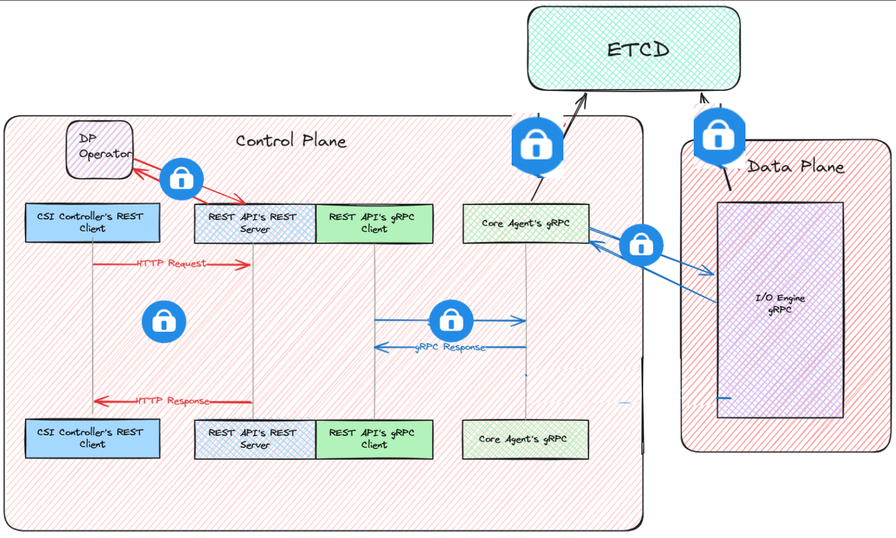

# Enable TLS in Mayastor

## Table of Contents

* [Summary](#summary)
* [Motivation](#motivation)
  * [Goals](#goals)
  * [Non-Goals](#non-goals)
* [Proposal](#proposal)
  * [User Stories](#user-stories)
    * [Story 1](#story-1)
    * [Story 2](#story-2)
  * [Implementation Details/Notes/Constraints](#implementation-detailsnotesconstraints)
    * [Discoverable images](#discoverable-images)
      * [Regex Explanation](#regex-explanation)
    * [Expose Images](#expose-images)
    * [Non-Discoverable/Runtime images](#non-discoverableruntime-images)
  * [Test Plan](#test-plan)
  * [Risks and Mitigations](#risks-and-mitigations)
    * [Mitigations](#mitigations)
* [Graduation Criteria](#graduation-criteria)
* [Implementation History](#implementation-history)
* [Drawbacks [optional]](#drawbacks-optional)
* [Alternatives [optional]](#alternatives-optional)

## Summary

This proposal aims to add TLS communication between the components of Mayastor

## Motivation

Security

### Goals

1. Create TLS switch

1. Install Cert-Manager

1. Generate a Self signed certs

1. Ensure each component is configured to have appropriate certs if tls is enabled. See diagram below.
    * will need help identifying how to secure comms with etcd.

1. Update Mayastor components to use the generated certificates


## Proposal

The proposal is to add cert-manager to mayastor to automate the creation of certificates.  Also, values.yaml file will be updated to include an enable tls switch boolean.  Certificates will be created with mayastor certificate resources. This will include a CA certificate which will be used to sign the certificates for rest-api, core-agent and io-engine.  These certificates will be mounted into each deployment/daemonset and distributed as well to each client.

### User Stories

#### Story 1

As a user, I want to ensure that my data is securely transmitted between Mayastor components so that I can trust the integrity and confidentiality of my data during storage operations.

#### Story 2

As a user, I want to not have to worry about certificate creation or management.

### Implementation Details/Notes/Constraints

#### Cert Manager

Cert-manager installation shall be done using [helm charts][certManagerHelmCharts]

* Should there be discussion about drawbacks of depending on cert-manager or other strategies?

#### Certificate Flow

##### Example of certificate deployment with cert-manager

1. With cert-manager installed we will use certificate and issuer resources to create root certificate

```yaml
{{- if .Values.base.tls.enabled }}
apiVersion: cert-manager.io/v1
kind: Issuer
metadata:
  name: selfsigned-issuer
  namespace: {{ .Release.Namespace }}
spec:
  selfSigned: {}
---
apiVersion: cert-manager.io/v1
kind: Certificate
metadata:
  name: root-ca
  namespace: {{ .Release.Namespace }}
spec:
  isCA: true
  duration: 175200h #20 years
  commonName: root-ca
  secretName: ca-root-cert
  issuerRef:
    name: selfsigned-issuer
    kind: Issuer
    group: cert-manager.io
---
# use this issuer to create other certs
apiVersion: cert-manager.io/v1
kind: Issuer
metadata:
  name: ca-issuer
  namespace: {{ .Release.Namespace }}
spec:
  ca:
    secretName: ca-root-cert
```

In this example:

* The `root-ca` certificate is created with `isCA: true`, making it a root certificate.

* The `selfsigned-issuer` is used to issue the root certificate.

* An `Issuer` named `ca-issuer` is created, which uses the `ca-root-cert` secret containing the root certificate.

1. Use above to sign below, See issuerRef field.

```yaml
{{- if .Values.base.tls.enabled }}
apiVersion: cert-manager.io/v1
kind: Certificate
metadata:
  name: rest-api-server
  namespace: {{ .Release.Namespace }}
spec:
  duration: 175200h
  isCA: false
  dnsNames:
    - {{ .Release.Name }}-api-rest.{{ .Release.Namespace }}.svc
    - {{ .Release.Name }}-api-rest.{{ .Release.Namespace }}.svc.cluster.local
    - {{ .Release.Name }}-api-rest
  issuerRef:
    name: ca-issuer
    kind: Issuer
  secretName: rest-api-server-cert
{{- end }}
```

In this example:

* The `rest-api-server` certificate is created and signed by the `ca-issuer`, which uses the root certificate.

* The `isCA` field is set to `false`, indicating that this is not a CA certificate.

> **_NOTE:_** We will utilize the secrets created to volumeMount certs on appropriate deployment or daemonset.

#### HTTP as default

Components should be implemented in such a way that they will communicate using HTTP if tls is not enabled and HTTPS if tls is enabled.

#### etcd

Will need direction on how to implement tls between etcd and it's communication partners

### Test Plan

We should validate the communications are secure, ensuring they are and that certicates can be rotated safely.  Would like to discuss actual implementation of tests for these changes.

### Risks and Mitigations

Mayastor being upgraded to new version with TLS enabled may not be straightforward.

#### Mitigations

We should aim to automate as much of possible.
Make use of automated tests.

## Graduation Criteria

[certManagerHelmCharts]: https://cert-manager.io/docs/installation/helm/