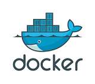
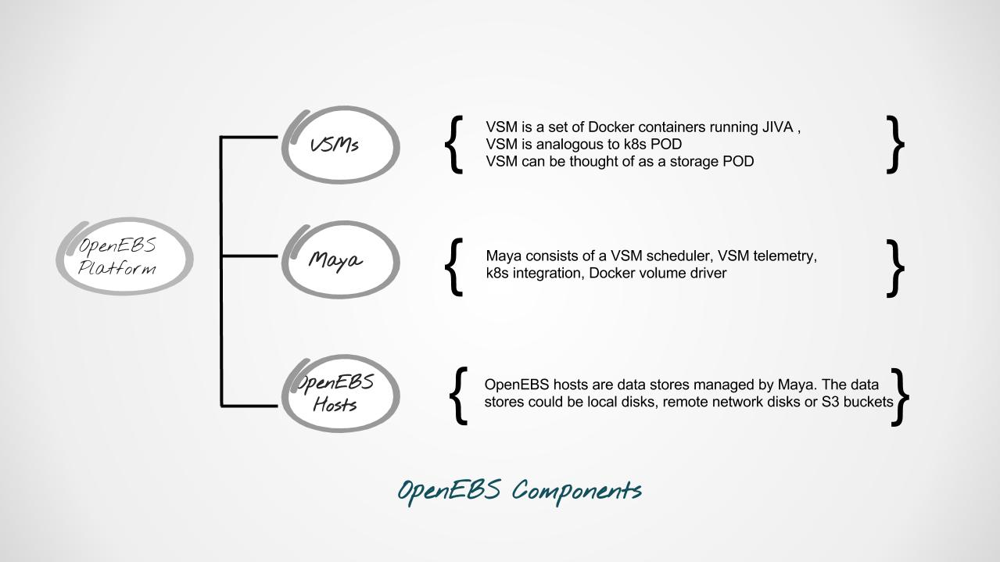
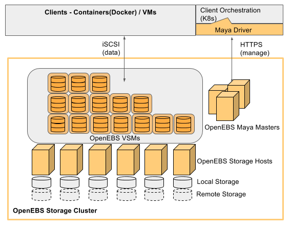

#Introduction to OpenEBS

OpenEBS is a storage platform, written in GoLang, to deliver persistent block storage for container eco system. The storage itself is containerized through a storage POD concept called VSM or "Virtual Storage Machine". VSMs are scheduled and managed using an orchestrator engine called "Maya". VSMs are fully isolated user space storage engines that present the block storage at the front end through iSCSI, NBD or TCMU protocol and consume raw storage from a local OpenEBS host or remote storage.  

#Start with the best tools available
OpenEBS uses the best available infrastructure libraries underneath. Jiva (means "life" in Sanskrit) is the core software that runs inside the storage container. The core functionalities of Jiva include 
- Block storage protocol (iSCSI/TCMU/NBD)
- Replication
- Snapshotting
- Caching to NVMe
- Encryption 
- Backup/Restore
- QoS 
Jiva inherits majority of its capabilities from Rancher Longhorn (https://github.com/rancher/longhorn). QoS, Caching, Backup/Restore capabilities are being added to Jiva.

Use | Library |  Logo     | Usage
------- | ---------------- | ---------- | ---------:
Containerization  | Docker |   | Dockerized images are pushed onto docker hub
Jiva  | Rancher Longhorn        |        | Multiple Jiva containers make a VSM
Scheduler   | Nomad |       | Nomad library forms the core of Maya scheduler
Networking   | Flannel |       | Flannel library is used without its config db
Automation   | Terraform |       | Terraform compatible
Automation   | Ansible |       | Terraform compatible
Orchestration integration   | Kubernetes |       | VSMs are scheduled from k8s

#Maya makes the storage deployment programmable
Maya is designed to have developer friendly interfaces to configure, deploy and manage the storage platform. Maya provides the configuration through YAML files and automation is made possible through ansible and/or terraform

#Components of OpenEBS platform

#Architectural overview

#Jiva overview

#Maya overview

