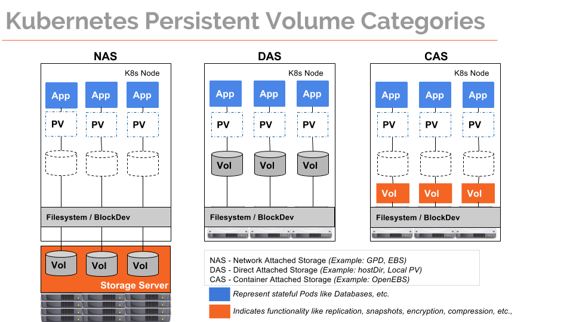
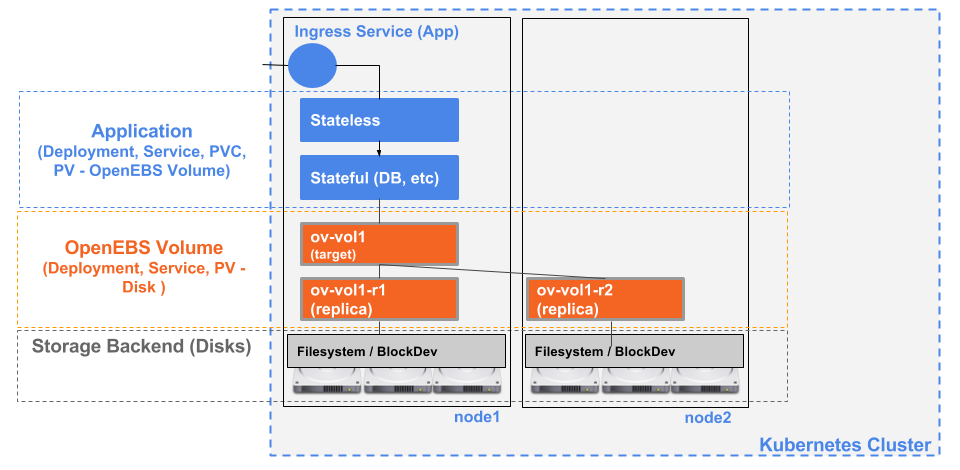

.. _Getting-Started:

OpenEBS Introduction
====================
OpenEBS is a cloud native storage solution built with the goal of providing containerized storage for containers. Using OpenEBS, a developer can seamlessly get the persistent storage for stateful applications with ease, much of which is automated, while using the popular orchestration platforms such as Kubernetes.

OpenEBS is Container Attached Storage(CAS) - which combines the best of DAS and NAS Storage Solutions.

At the outset, OpenEBS provides you with:

* A *simple to use* storage solution (simpler than using local storage volumes) for your persistent applications, 
* And includes benefits of external storage like snapshots, backup, compression etc. 
* Allows you to run Stateful Applications in Kubernetes on any node (any cloud or any on-premise server), any storage (disks attached to servers). Avoid Storage Vendor lock-in!

OpenEBS is Containerized Storage Solution that can be orchestrated by any Container Orchestrators, however - the current versions support orchestration using Kubernetes. To understand how to use OpenEBS with Kubernetes, we highly recommend that you familiarize with `Kubernetes Storage Concepts`_, specifically:

.. _Kubernetes Storage Concepts: https://kubernetes.io/docs/concepts/storage/persistent-volumes/

* Persistent Volumes and Persistent Volume Claims
* Dynamic Volume Provisioner
* Storage Classes

A typical stateful application using OpenEBS is as follows:

OpenEBS Volume comprises of Pods that are managed by Kubernetes itself, and each application gets its own storage controller which provides you with benefits like:

* managing the storage with the same tools that you use to manage kuberentes objects (like *kubectl*)
* scaling up/down replica's as they are deployments with node/pod affinity constraints
* extending the manageability via namespaces/RBAC to storage

You can try out OpenEBS on your Kubernetes Cluster using the `Quick Start Guide`_. 
 
.. _Quick Start Guide: ./quick_install.html

If you are new to Kubernetes, here are some guides that can help you setup Kubernetes and install OpenEBS:

    `Minikube`_
          .. _Minikube: http://openebs.readthedocs.io/en/latest/install/dev_solutions.html#minikube
    `Baremetal`_
          .. _Baremetal: http://openebs.readthedocs.io/en/latest/install/on_premise_solutions.html#running-the-setup-on-ubuntu-16-04
    `Amazon EC2`_
          .. _Amazon EC2: http://openebs.readthedocs.io/en/latest/install/cloud_solutions.html#amazon-cloud
    `GKE`_
          .. _GKE: http://openebs.readthedocs.io/en/latest/install/cloud_solutions.html#google-cloud      
    `OpenShift`_
          .. _OpenShift: http://openebs.readthedocs.io/en/latest/install/openshift.html      

Once OpenEBS is installed on your Kubernetes Cluster, you can start using it by specifying OpenEBS Storage Classes in your PVCs. Example:
::
   ..
   kind: PersistentVolumeClaim
   apiVersion: v1
   metadata:
     name: stateful-app-vol-claim
   spec:
     storageClassName: openebs-standard
     accessModes:
       - ReadWriteOnce
     resources:
       requests:
         storage: 50G
    ..

By default, the volume data will be saved under `/var/openebs`. OpenEBS provides the flexibility to change this default location as well as provide options to organize your deployment to use different locations depending the application/namespace. This flexibilty is provided via Custom Resources called - Storage Pools and Volume Policies that tie into Kubernetes Storage Class. 

Ready to try some stateful application with OpenEBS, follow some of the examples:

    `MySQL`_
          .. _MySQL: http://openebs.readthedocs.io/en/latest/Usecases/percona_db.html#percona-db
    `Jenkins`_
          .. _Jenkins: http://openebs.readthedocs.io/en/latest/Usecases/jenkins.html#jenkins

Learn more by joining us on Slack http://slack.openebs.io/. Feel free to come and ask any questions. Go to `Slack OpenEBS Community`_. 
                   
                    .. _Slack OpenEBS Community: https://openebs-community.slack.com/messages/C3NPGQ6G3/.

**See Also:**

Changelog_
          .. _Changelog: http://openebs.readthedocs.io/en/latest/release_notes/releasenotes.html

