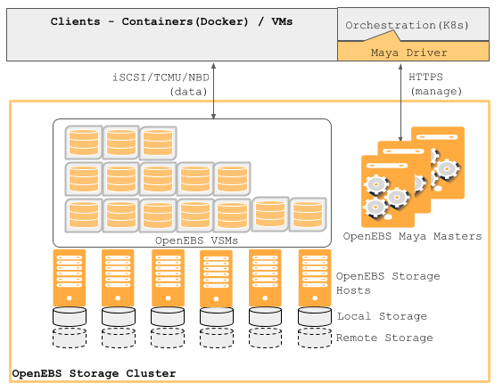

.. _getting_started:

***************
Overview
***************

.. _installing-docdir:

Introduction to OpenEBS
=============================

OpenEBS is a storage platform, written in GoLang, to deliver persistent block storage for container eco system. The storage itself is containerized through a storage POD concept called VSM or "Virtual Storage Machine". VSMs are scheduled and managed using an orchestrator engine called "Maya". VSMs are fully isolated user space storage engines that present the block storage at the front end through iSCSI, NBD or TCMU protocol and consume raw storage from a local OpenEBS host or remote storage.

.. _fetching-the-data:

Components and architecture
============================

Components
-----------

OpenEBS platform contains three major components::

  Storage PODs or VSMs
  An orchestration engine or VSM Scheduler called Maya
  The OpenEBS hosts that provide the data store from either local disks or remote disks

.. image:: _static/basic.png

Architecture
-------------

Maya is the orchestration engine that schedules the VSMs among OpenEBS hosts as needed. Maya driver (Docker Volume Driver for Maya) plays an important role in achieving the smooth flow of provisioning of VSMs and attaining the application consistent snapshots. The data is kept in more than one copy among the OpenEBS hosts through a backend network replication, thus achieving the necessary redundancy. VSMs expose the iSCSI interface currently.

The backend data store for Jiva containers come either through locally managed disks or through remotely managed network disks. The intelligent caching along with the lazy read indexing capability makes it possible to treat remote S3 storage also as the backing data store (Refer to the Roadmap: TBD)

Tools and Storage
==================

Built with the best tools
--------------------------

OpenEBS uses the best available infrastructure libraries underneath. Jiva (means "life" in Sanskrit) is the core software that runs inside the storage container. The core functionalities of Jiva include - Block storage protocol (iSCSI/TCMU/NBD) - Replication - Snapshotting - Caching to NVMe - Encryption - Backup/Restore - QoS Jiva inherits majority of its capabilities from Rancher Longhorn (https://github.com/rancher/longhorn). QoS, Caching, Backup/Restore capabilities are being added to Jiva.

Programmable storage
----------------------

Maya is designed to have developer friendly interfaces to configure, deploy and manage the storage platform. Maya provides the configuration through YAML files and automation is made possible through ansible and/or terraform

.. image:: _static/storage.png