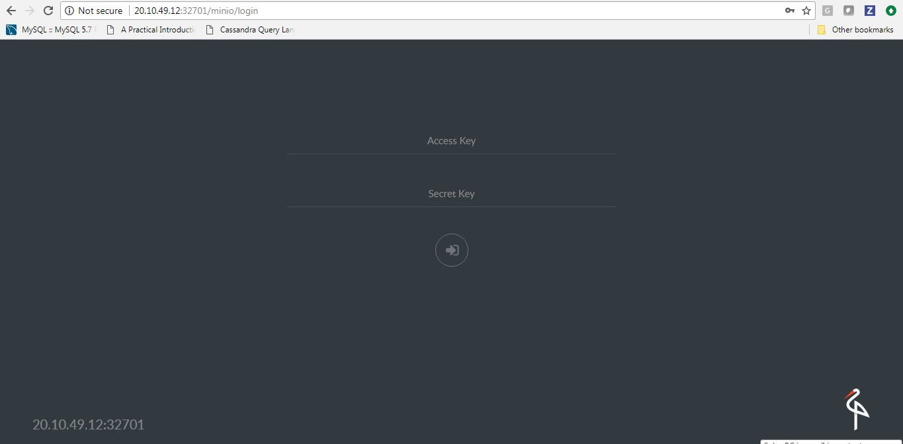
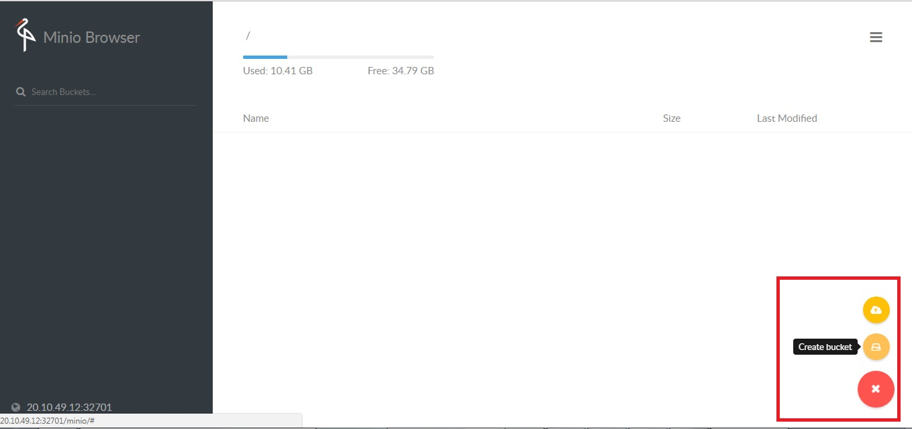

 ## STEPS TO SETUP MINIO SERVER WITH OPENEBS STORAGE

- Refer to https://docs.minio.io/ to learn about minio 

- Verify that the OpenEBS operator (maya-apiserver, openebs-proviosioner) is running on the 
  cluster. 

- Apply the minio deployment spec

  ```
  test@Master:~/minio$ kubectl apply -f minio.yaml
  deployment "minio-deployment" created
  persistentvolumeclaim "minio-pv-claim" created
  service "minio-service" created
  test@Master:~/minio$
  ```

- Verify that the minio deployment & service are running successfully with OpenEBS PV

  ```
  test@Master:~/minio$ kubectl get pods
  NAME                                                             READY     STATUS    RESTARTS   AGE
  maya-apiserver-5d5944b47c-fbnjh                                  1/1       Running   0          4d
  minio-deployment-5c44fc754-tqmgb                                 1/1       Running   0          51s
  openebs-provisioner-6b8df9746c-gj4gk                             1/1       Running   0          4d
  pvc-a99c0535-30ac-11e8-9309-000c298ff5fc-ctrl-6dd84dd9c7-xnmqc   2/2       Running   0          51s
  pvc-a99c0535-30ac-11e8-9309-000c298ff5fc-rep-844cddb54-cxndb     1/1       Running   0          51s
  pvc-a99c0535-30ac-11e8-9309-000c298ff5fc-rep-844cddb54-qmpj4     1/1       Running   0          51s

  test@Master:~/minio$ kubectl get svc
  NAME                                                TYPE        CLUSTER-IP      EXTERNAL-IP   PORT(S)             AGE
  kubernetes                                          ClusterIP   10.96.0.1       <none>        443/TCP             38d
  maya-apiserver-service                              ClusterIP   10.103.166.8    <none>        5656/TCP            4d
  minio-service                                       NodePort    10.109.28.237   <none>        9000:32701/TCP      8s
  pvc-a99c0535-30ac-11e8-9309-000c298ff5fc-ctrl-svc   ClusterIP   10.108.61.141   <none>        3260/TCP,9501/TCP   8s
  ```

- Use the minio UI to upload some data on the OpenEBS PV and verify that the operation is successful
  
  - On a browser, navigate to the IP address of any of the nodes in the cluster, at the exposed port 
  (32701 in the example above) and login using the default credentials *Access Key: minio, Secret key: minio123*

  

  - Minio has similar functionality to S3: file uploads, creating buckets, and storing other data. 

    In this step, use the icon at *bottom-right* of the screen to create a bucket & perform a file-upload 

  
  
  

  - Verify that the file-upload is successful 

  

  
   
  
